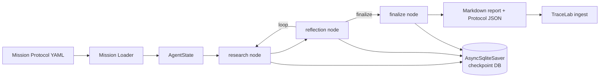
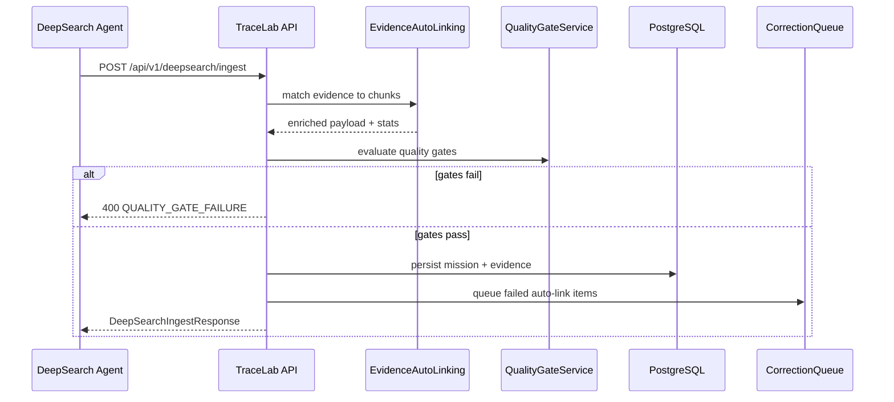
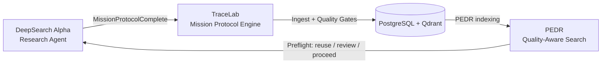

# DeepSearch.Alpha Case Study: Autonomous Research Agent for TraceLab

Version: 1.0
Date: 2025-12-28
Owner: TraceLab Platform Team

## Audience

This case study is written for product, engineering, and research operations teams who need to understand how DeepSearch.Alpha executes autonomous research, how it integrates with TraceLab and PEDR, and how quality and traceability are enforced end to end.

## Document Map

- Sections 1-3 define the system context and architecture.
- Sections 4-6 detail the LangGraph workflow, depth tiers, and Mission Protocol compliance.
- Sections 7-10 describe integration flows, preflight behavior, and evidence correction.
- Sections 11-12 provide concrete mission examples and before/after metrics.
- Sections 13-14 cover telemetry, testing, and operational best practices.
- Appendices include diagrams and references.

## Table of Contents

1. Executive Summary
2. System Context: The Autonomous Knowledge Loop
3. DeepSearch.Alpha Architecture
4. LangGraph Node and Edge Structure
5. Research Depth Tiers and Tradeoffs
6. Mission Protocol Compliance and Outputs
7. TraceLab Integration Flow
8. PEDR Preflight Integration (Duplicate Prevention)
9. Evidence Auto-Linking and Correction Loop
10. Virtuous Knowledge Loop (Visualization and Explanation)
11. Real Mission Examples (Fixtures with Metrics)
12. Before and After Metrics (Citation Rate Improvements)
13. Operational Telemetry and QA Guardrails
14. Implementation Notes and Best Practices
15. Appendix: Diagram Index
16. Appendix: Reference Documents

---

## 1. Executive Summary

DeepSearch.Alpha is a LangGraph-powered autonomous research agent that executes structured Mission Protocol research missions, synthesizes findings, and ships validated outputs into TraceLab. The system is built around a Mission-as-State pattern: a mission definition becomes an AgentState that moves through research, reflection, and finalization nodes until it satisfies explicit success criteria. State persistence is handled by LangGraph's AsyncSqliteSaver, which enables pause and resume across sessions and preserves a complete audit trail of node-level decisions.

DeepSearch.Alpha integrates with TraceLab in three critical ways. First, it produces MissionProtocolComplete JSON alongside a markdown report so results can be validated and stored without manual interpretation. Second, it calls TraceLab's PEDR preflight endpoint before web research, preventing duplicate effort and encouraging reuse of existing high-quality missions. Third, it submits completed missions through `/api/v1/deepsearch/ingest`, where TraceLab auto-links evidence to document chunks, runs the five Mission Protocol quality gates, and queues failed links for correction.

This case study documents the architecture, the LangGraph node and edge structure, the research depth tiers, and the integration flows in detail. It also includes real mission examples from fixture data and before/after metrics from Sprint 04 that quantify improvements in citation rates and schema compliance. The end result is a system that can execute multi-loop research with quality safeguards while feeding a growing internal knowledge base.

---

## 2. System Context: The Autonomous Knowledge Loop

DeepSearch.Alpha is the "write engine" in a three-service autonomous knowledge system:

- DeepSearch.Alpha executes research missions and generates structured outputs.
- TraceLab stores and validates research as Mission Protocol entities in PostgreSQL and Qdrant.
- PEDR provides quality-aware retrieval, powering duplicate-prevention preflight and deep search for existing evidence.

This architecture creates a virtuous loop. DeepSearch produces validated research, TraceLab stores and governs it, and PEDR makes it discoverable so future missions can reuse or extend existing work instead of starting from scratch. The loop closes the knowledge gap between external web research and internal, high-confidence organizational memory.

### 2.1 Why Autonomous Research

Research workflows are often unstructured and difficult to reproduce. DeepSearch.Alpha turns research into a repeatable, auditable pipeline. Each mission has an objective, success criteria, and explicit evidence requirements. The agent then executes a fixed loop of research and reflection until it can demonstrate coverage. This shifts research from ad hoc browsing to structured, measurable work.

### 2.2 Boundary of Responsibility

- DeepSearch.Alpha focuses on discovery, synthesis, and structured output.
- TraceLab focuses on validation, storage, and retrieval.
- PEDR focuses on quality-aware search and reuse.

The boundary is important: DeepSearch does not manage chunking or embeddings, and TraceLab does not perform external research. This separation keeps each system focused and makes integrations reliable.

### 2.3 Data Ownership

All research that passes TraceLab quality gates becomes part of the internal knowledge base. That means DeepSearch outputs are not disposable artifacts; they become traceable, searchable assets. This is why Mission Protocol compliance and evidence linking are first-class concerns.

### 2.4 Research Lifecycle Coverage

DeepSearch.Alpha focuses on the discovery and synthesis phases, while TraceLab covers storage, validation, and retrieval. Together they span the full research lifecycle:

- Discovery: external search, source collection, and initial findings.
- Synthesis: structured insights, recommendations, and next steps.
- Validation: quality gate enforcement and evidence traceability.
- Storage: mission persistence in PostgreSQL with evidence links.
- Retrieval: PEDR search and preflight reuse for future missions.

This split ensures that research does not end when a report is generated. Instead, research artifacts become reusable knowledge assets that can be referenced in future missions, audits, and decisions.

### 2.5 Scope Constraints

The system intentionally avoids certain responsibilities:

- DeepSearch does not perform document chunking or embeddings.
- TraceLab does not perform external web research.
- PEDR does not validate evidence; it relies on TraceLab quality gates.

These constraints reduce coupling and allow each subsystem to evolve independently while preserving interoperability.


### 2.6 Stakeholder Benefits

- Research operations teams gain a repeatable workflow with measurable quality gates. This reduces manual review and makes research deliverables consistent across teams.
- Product teams benefit from faster access to high-quality synthesis without sacrificing traceability. Missions can be reused instead of recreated, which shortens discovery cycles.
- Engineering teams gain a clear integration surface for automated research ingestion and retrieval. The TraceLab and PEDR APIs expose stable contracts that make it easy to embed research into workflows.

Together, these benefits make research outputs more actionable and reduce the cost of knowledge creation over time.


---

## 3. DeepSearch.Alpha Architecture

DeepSearch.Alpha turns a mission definition into a repeatable and auditable research pipeline. The core components are:

1. Mission Loader
   - Parses Mission Protocol YAML.
   - Validates required fields and builds the initial AgentState.
   - Injects research depth and loop limits.

2. LangGraph Orchestrator
   - Compiles a StateGraph with explicit research, reflection, and finalize nodes.
   - Handles conditional routing for loops vs completion.
   - Persists state after every node via AsyncSqliteSaver.

3. Research Node
   - Executes the main discovery loop.
   - Calls tools (web search, file tools, RAG search) through LangChain bindings.
   - Writes new findings and sources into AgentState.

4. Reflection Node
   - Uses LLM-as-judge scoring to evaluate success criteria.
   - Emits quantitative coverage and confidence signals per objective.
   - Decides whether to loop or finalize.

5. Finalize Node
   - Generates a markdown report and MissionProtocolComplete JSON payload.
   - Adds telemetry metadata (loop counts, source counts, token usage).
   - Prepares output for TraceLab ingestion.

DeepSearch.Alpha favors observability and resilience. Every tool invocation, node transition, and scoring decision is checkpointed. If external dependencies fail, the system degrades gracefully and continues with fallback narratives rather than crashing. The same mission can be resumed later without losing progress.

### 3.1 Mission-as-State Pattern

The Mission-as-State pattern is the core architectural decision. Instead of treating a mission as a static input, DeepSearch builds an explicit AgentState and evolves it through each node. This makes the agent deterministic and auditable. The mission definition is the initial state, and every loop iteration adds structured deltas to that state.

Key advantages:

- Deterministic replay of research decisions.
- Pause/resume without losing context.
- Clear mapping between mission requirements and evidence produced.
- Easier evaluation of research completeness.

### 3.2 Persistence and Checkpointing

DeepSearch uses LangGraph's AsyncSqliteSaver. Every node write is persisted to a checkpoint DB. Thread identifiers are deterministic (deepsearch-<mission-id>), so a mission can be stopped and resumed at any point with full context.

Checkpointing is a critical safety net. It ensures long-running research does not require a single uninterrupted process, and it creates a traceable audit trail for compliance and debugging.

### 3.3 Resilience and Degraded Execution

DeepSearch includes degraded execution paths. If LangGraph or tool dependencies are unavailable, the runner falls back to a sequential, non-graph execution path. This prevents research missions from failing entirely in development or constrained environments.

Resilience behaviors include:

- Exponential backoff for tool calls.
- Graceful fallback when Tavily or LLMs are unavailable.
- Degradation flags recorded in telemetry so operators can detect reduced quality runs.

### 3.4 Tooling and Extensions

DeepSearch currently supports:

- Web search tools (Tavily).
- RAG hooks for PEDR-based retrieval.
- File operations for local documents.

Tools are bound through LangChain interfaces and are invoked only in the research node. This keeps the reflection node pure, focused on evaluation rather than discovery.

### 3.5 CLI and API Surfaces

DeepSearch.Alpha ships two execution surfaces that serve different operational needs:

1. CLI runner (`deepsearch-run`)
   - Accepts a Mission Protocol YAML file.
   - Supports `--dry-run` validation to catch schema or config errors before execution.
   - Supports `--resume` and `--no-resume` flags for checkpoint behavior.

2. FastAPI service
   - Exposes `/api/v1/missions/execute` for async mission execution.
   - Supports webhook callbacks to notify external systems when missions complete.
   - Provides health and readiness checks for deployment environments.

These surfaces allow teams to run missions manually (CLI), integrate into pipelines (API), or schedule workloads for continuous research.

### 3.6 Worker Mode (PostgreSQL Polling)

For production integration, DeepSearch can run as a worker that polls the TraceLab PostgreSQL missions table directly. This removes HTTP orchestration overhead and eliminates webhook dependency.

Worker flow:

1. Poll for queued missions using `FOR UPDATE SKIP LOCKED`.
2. Claim a mission atomically.
3. Execute the LangGraph workflow.
4. Write results back to PostgreSQL.

This mode is ideal for long-running research workloads where mission scheduling is handled centrally by TraceLab.

### 3.7 Security and Authentication

DeepSearch.Alpha uses service account authentication when calling TraceLab endpoints. Tokens are issued via `/api/v1/auth/login` and cached in the environment for up to 24 hours.

Security posture:

- DeepSearch MCP server runs locally only.
- TraceLab API requires Bearer tokens.
- Service accounts have project-scoped permissions (create missions, upload documents, no deletes).

This keeps the integration safe for local and controlled environments while still providing automation.

### 3.8 Performance and Cost Controls

DeepSearch uses a progressive local-first strategy:

- Default to local Ollama for zero-cost inference.
- Allow Gemini or other cloud backends when required.
- Track token usage for each mission in telemetry.

Operational targets (from architecture benchmarks):

- Research execution time <= 5 minutes p95 for standard 3-loop missions.
- Report generation <= 30 seconds p99.
- Checkpoint writes <= 500ms p50.

These controls keep mission execution predictable while preserving quality.

### 3.9 TraceLab Readiness Validation

DeepSearch supports a validation mode (`--validate`) that runs hybrid quality scoring after mission completion. Validation metrics include faithfulness, relevance, and citation rate. This helps ensure that only reports that meet TraceLab quality thresholds are submitted for ingestion.

Validation metrics are stored under `cmos/research/validation/` for audit and repeatability.

### 3.10 Data Flow Summary

The end-to-end data flow can be summarized as follows:

1. Mission YAML is parsed into AgentState.
2. Research node collects sources and findings.
3. Reflection node scores coverage and decides next action.
4. Finalize node emits markdown report and protocol JSON.
5. TraceLab ingests the protocol JSON, links evidence, and runs quality gates.
6. PEDR indexes the mission for search and preflight reuse.

This flow is deliberately linear and auditable. Each step either enriches state or validates it, and all transitions are checkpointed for review.

---

## 4. LangGraph Node and Edge Structure

DeepSearch.Alpha uses a minimal but explicit LangGraph workflow. The graph is intentionally small to ensure state auditability, while the logic inside each node is deeply structured.

### 4.1 Node Summary

| Node | Purpose | Key Outputs | Termination Condition |
| --- | --- | --- | --- |
| research | Gather new sources and findings | sources_found, findings, messages | Always transitions to reflection |
| reflection | Score success criteria and decide next action | coverage scores, confidence, loop decision | Loop if coverage below thresholds |
| finalize | Produce markdown + JSON output | report_path, protocol_json | Graph ends |

### 4.2 Edge Summary

- `research -> reflection` (fixed)
- `reflection -> research` when loop criteria not met
- `reflection -> finalize` when success criteria are satisfied
- `finalize -> END`

### 4.3 Diagram

Mermaid diagram: `artifacts/documentation/deepsearch-architecture-diagrams/deepsearch-langgraph-workflow.mmd`



### 4.4 AgentState Shape

AgentState defines the mission context, loop counters, findings, and evidence. A typical subset includes:

```python
class AgentState(TypedDict):
    messages: List[BaseMessage]
    research_loop_count: int
    max_loops: int
    mission_id: str
    mission_objectives: List[str]
    mission_context: dict
    deliverable_format: str
    sources_found: List[dict]
    findings: List[str]
```

Each node returns state diffs that LangGraph merges into the persistent state object. This keeps the state immutable while still enabling incremental growth.

### 4.5 Reflection and Loop Decisions

The reflection node applies quantitative evaluation to each success criterion, using a 4-point coverage scale (1.0, 0.8, 0.5, 0.0). When coverage remains below thresholds or when gaps are detected, the node loops back to research with a focused refinement plan. This avoids redundant queries and creates intentional loop progression.

### 4.6 Example Loop with Preflight and Refinement

An example baseline mission loop typically follows this pattern:

1. Preflight query runs against PEDR with the mission objective.
2. If action is reuse, existing research is injected into AgentState and the loop is shortened.
3. Research node gathers sources and generates findings.
4. Reflection node scores each objective and identifies gaps.
5. Refinement strategy builds targeted follow-up prompts based on unmet objectives.
6. Loop repeats until convergence or max_loops.

This loop structure ensures that each iteration is intentionally scoped. The reflection node does not simply ask the model to "search again"; it directs the next loop based on specific missing evidence or low-confidence objectives.

### 4.7 Node-Level Telemetry

Each node emits telemetry for audit and debugging:

- research: sources_found count, tool calls, token usage.
- reflection: per-objective coverage scores and confidence.
- finalize: report path, protocol JSON path, execution summary.

Telemetry entries are checkpointed alongside state so the full sequence of decisions is reproducible. This makes it possible to answer questions like "why did the agent stop after three loops" or "which evidence triggered the traceability gate to pass."

### 4.8 Node Implementation Notes

**Research node behavior**

- Builds queries from mission objectives and refinement hints.
- Uses tool bindings to collect sources (Tavily or PEDR-backed search).
- Normalizes sources into `sources_found` entries with title, url, and snippets.
- Appends LLM responses to message history for traceability.

**Reflection node behavior**

- Scores each success criterion using the 4-point coverage scale.
- Emits confidence values and convergence history.
- Identifies weakest objectives and generates targeted refinement prompts.
- Decides loop vs finalize based on thresholds and max_loops.

**Finalize node behavior**

- Converts AgentState into MissionProtocolComplete JSON.
- Generates markdown report with inline citations.
- Adds telemetry summary (loops, sources, tokens).

These behaviors are intentionally deterministic given the same model outputs. Each node has a single responsibility, which makes the workflow easier to debug and extend.


---

## 5. Research Depth Tiers and Tradeoffs

DeepSearch.Alpha implements three depth tiers that control loop counts, source limits, convergence thresholds, and quality safeguards. These tiers are selected per mission and can be overridden by advanced configuration.

### 5.1 Tier Defaults

| Tier | Max Loops | Min Loops | Max Sources | Convergence Threshold | Quality Floor | Alpha Safeguards |
| --- | --- | --- | --- | --- | --- | --- |
| baseline | 3 | 2 | 15 | 0.05 | 0.5 | none |
| deep | 5 | 3 | 20 | 0.04 | 0.6 | none |
| alpha | 6 | 4 | 25 | 0.03 | 0.7 | source diversity, contradiction detection |

### 5.2 Timing and Cost Tradeoffs

| Tier | Typical Duration | API Calls | Token Usage | Relative Cost |
| --- | --- | --- | --- | --- |
| baseline | 2-4 minutes | 6-10 | 15-25K | 1x |
| deep | 5-10 minutes | 12-18 | 30-50K | 2-3x |
| alpha | 8-15 minutes | 18-25 | 50-80K | 3-5x |

### 5.3 When to Use Each Tier

- baseline: quick verification, low-stakes research, well-established topics.
- deep: strategic decisions, comparisons, architecture tradeoffs, moderate risk.
- alpha: novel domains, high-stakes decisions, expected contradictions, or when source quality is paramount.

### 5.4 Upgrade and Downgrade Rules

Upgrade to a deeper tier when:

- Convergence history stalls below target thresholds.
- Source quality is inconsistent.
- Conflicting sources appear and need reconciliation.

Downgrade when:

- The topic is well established and low risk.
- Research is an incremental follow-up to a previous deep mission.
- Execution time constraints outweigh additional evidence.

### 5.5 Failure Modes and Recovery

Common convergence failures include:

- Max loops reached without convergence.
- Oscillating coverage scores.
- Low-quality sources failing the quality floor.

Recovery strategies:

- Increase tier or override max_loops for a single mission.
- Narrow scope and split into multiple missions.
- Re-run with alpha contradiction detection enabled.

### 5.6 Troubleshooting Convergence Failures

Symptoms and fixes commonly observed in DeepSearch.Alpha missions:

**Early termination without convergence**

- Symptom: loop_count reaches max_loops with coverage scores below thresholds.
- Likely causes: objective too broad, tier too shallow, or weak sources.
- Fixes: upgrade to deep or alpha, narrow scope, or increase max_loops.

**Oscillating scores**

- Symptom: coverage history jumps between 0.5 and 0.8 without reaching 1.0.
- Likely causes: contradictory sources or unclear success criteria.
- Fixes: use alpha tier for contradiction detection, clarify success criteria.

**Low-quality sources**

- Symptom: evidence links pass, but reflection scores remain low.
- Likely causes: sources below quality floor or insufficient authority.
- Fixes: raise quality floor, enforce domain diversity, or use curated sources.

### 5.7 Tier Selection Checklist

- Baseline if the mission is a quick verification with low risk.
- Deep if the mission requires tradeoff analysis or architecture decisions.
- Alpha if sources are expected to conflict or stakes are high.

This checklist helps prevent overuse of alpha (which increases cost and latency) while still ensuring high-confidence outputs when needed.

### 5.8 Tier Selection Scenarios

Scenario 1: A quick fact check about a framework release can run at baseline. The mission is time-sensitive, the topic is well established, and the goal is verification rather than synthesis.

Scenario 2: A comparison of competing infrastructure stacks should run at deep. It requires evaluating multiple sources and balancing cost, latency, and operational tradeoffs.

Scenario 3: A novel regulatory domain with conflicting guidance should run at alpha. Source diversity and contradiction detection are required to avoid false confidence.

These scenarios illustrate how depth tier choice directly shapes mission cost, latency, and quality.


---

## 6. Mission Protocol Compliance and Outputs

DeepSearch.Alpha generates two synchronized outputs per mission:

1. Markdown report (human-readable narrative with citations).
2. MissionProtocolComplete JSON (structured payload for TraceLab).

The Mission Protocol payload includes:

- research_statement: topic, objective, scope
- key_questions: questions mapped to mission objectives
- synthesis: insights, recommendations, next steps
- evidence: sources with summaries and references
- quality_checkpoints: five gate statuses

### 6.1 Required Quality Gates

TraceLab requires all five quality checkpoints to pass before a mission is considered complete:

1. research_statement
2. evidence_links
3. synthesis_quality
4. traceability
5. contradictions_resolved

DeepSearch.Alpha fills these gates explicitly. Evidence entries are created from sources_found, and synthesis is generated from findings. This ensures that the ingestion workflow has all required fields populated before TraceLab validation runs.

### 6.2 Output File Paths

DeepSearch.Alpha outputs are typically stored under:

- Markdown report: `cmos/research/<mission_id>_report.md`
- Protocol JSON: `cmos/research/json/<mission_id>_protocol.json`

The report includes a telemetry summary table with loop counts, source counts, token usage, and generation timestamp.

### 6.3 Mapping from AgentState to Protocol Fields

| AgentState Field | Protocol Field | Notes |
| --- | --- | --- |
| mission_id | mission_id | direct mapping |
| mission_objectives | key_questions | objectives become questions |
| sources_found | evidence | each source becomes Evidence |
| findings | synthesis.key_insights | top findings promoted to insights |
| mission_context | research_statement | topic, objective, scope derived |

This mapping is deterministic, which is essential for reproducibility. A mission executed twice with the same inputs and depth configuration will produce structurally identical outputs (with possible differences in citations or wording depending on LLM output).

### 6.4 Example Output Fragment

```json
{
  "mission_id": "DSR-INT-006",
  "title": "Market Signals Scan",
  "status": "complete",
  "research_statement": {
    "topic": "Market signal detection for AI compliance platforms",
    "objective": "Summarize top procurement triggers + blockers",
    "scope": "Fortune 500 buying teams"
  },
  "quality_checkpoints": [
    {"gate": "research_statement", "status": "pass"},
    {"gate": "evidence_links", "status": "pass"},
    {"gate": "synthesis_quality", "status": "pass"},
    {"gate": "traceability", "status": "pass"},
    {"gate": "contradictions_resolved", "status": "pass"}
  ]
}
```

### 6.5 Gate Definitions and What They Enforce

The five quality gates are not cosmetic; they map to explicit validation rules:

1. research_statement
   - Requires topic, objective, and scope.
   - Prevents missions from entering TraceLab without a clear framing.

2. evidence_links
   - Requires evidence items with chunk_id references (or auto-linking success).
   - Ensures insights are backed by document chunks.

3. synthesis_quality
   - Requires key insights and recommendations with minimum content length.
   - Prevents empty or purely descriptive reports.

4. traceability
   - Validates that evidence maintains references to valid chunk IDs.
   - Ensures `insight_sources` relationships can be generated.

5. contradictions_resolved
   - Requires explicit handling of contradictory information when present.
   - Encourages transparency in cases of conflicting sources.

### 6.6 Full Payload Example (Abbreviated)

The following example illustrates the structure of a MissionProtocolComplete payload with evidence and synthesis sections populated. This is an abbreviated format for readability.

```json
{
  "mission_id": "DSR-INT-001",
  "title": "Customer Onboarding Playbook",
  "status": "complete",
  "research_statement": {
    "topic": "Customer onboarding workflows",
    "objective": "Document onboarding success drivers and failure modes",
    "scope": "B2B SaaS teams and enterprise adoption"
  },
  "key_questions": [
    {
      "question": "What onboarding steps correlate with faster activation?",
      "status": "answered",
      "answer": "Hands-on kickoff + templated workflows reduced time to value by 30%.",
      "confidence": 0.82
    }
  ],
  "synthesis": {
    "key_insights": [
      "Onboarding success correlates with early milestone completion.",
      "Dedicated onboarding specialists reduce churn during week 2."
    ],
    "recommendations": [
      "Add milestone-based checklists to onboarding plans.",
      "Assign a specialist for enterprise rollouts."
    ],
    "next_steps": [
      "Pilot new onboarding checklist in two accounts."
    ],
    "contradictory_information": []
  },
  "evidence": [
    {
      "evidence_id": "EV-001",
      "source": "Onboarding Interview #12",
      "summary": "Milestone checklist reduced time to value.",
      "source_type": "interview"
    }
  ],
  "quality_checkpoints": [
    {"gate": "research_statement", "status": "pass"},
    {"gate": "evidence_links", "status": "pass"},
    {"gate": "synthesis_quality", "status": "pass"},
    {"gate": "traceability", "status": "pass"},
    {"gate": "contradictions_resolved", "status": "pass"}
  ]
}
```

This payload structure is critical for interoperability. It allows TraceLab to validate, store, and search research outputs consistently regardless of the mission topic.

### 6.7 Traceability and Relationship Mapping

TraceLab uses evidence links to create durable relationships across missions, documents, and insights. When evidence items include `chunk_id` and optional `insight_id`, the EvidenceLinkingService synchronizes `insight_sources` rows in PostgreSQL. This enables two key behaviors:

- Traceability validation: every insight can be traced to at least one chunk.
- Relationship graph: evidence links become edges that PEDR can index and traverse.

PEDR manifest transformers read evidence arrays and extract chunk IDs to populate graph bindings. This is how a DeepSearch mission becomes part of the knowledge graph, allowing PEDR to surface related missions in future preflight and search queries.

Traceability is therefore not just a compliance check; it is the foundation of cross-mission reuse. Without evidence links, missions would remain isolated reports rather than composable knowledge assets.


---

## 7. TraceLab Integration Flow

DeepSearch.Alpha integrates with TraceLab through a dedicated ingestion endpoint:

`POST /api/v1/deepsearch/ingest`

The ingestion workflow is optimized for autonomous agents and includes automatic evidence linking and gate enforcement. The high-level flow is:

1. Validate MissionProtocolComplete payload schema.
2. Auto-link evidence summaries to TraceLab document chunks.
3. Run quality gate validation.
4. Persist mission and evidence if gates pass.
5. Queue failed evidence for correction and emit telemetry.

### 7.1 Ingestion Request Structure

```json
{
  "project_id": "existing-project-uuid",
  "auto_create_project": false,
  "project_name": null,
  "similarity_threshold": 0.75,
  "mission": { ...MissionProtocolComplete ... }
}
```

Key behaviors:

- `project_id` can be omitted if `auto_create_project` is true.
- `similarity_threshold` tunes evidence auto-linking; values outside 0-1 are clamped.
- Mission payloads must pass schema validation before any gate evaluation.

### 7.2 Quality Gate Failure Response

If a mission fails quality gates, TraceLab responds with a structured error that includes:

- failing_gates
- gate metadata
- auto-linking summary
- mission ID and UUID

This response allows DeepSearch to correct evidence summaries, add missing traceability, or re-run synthesis.

### 7.3 Diagram

Mermaid diagram: `artifacts/documentation/deepsearch-architecture-diagrams/deepsearch-tracelab-ingestion.mmd`



### 7.4 Manual vs Automated Integration

DeepSearch.Alpha supports two ingestion modes:

1. Manual upload workflow (early phases)
   - Generate markdown and protocol JSON.
   - Validate quality gates locally.
   - Upload via CLI in a four-step process: document upload, processing, chunk retrieval, mission creation.

2. Automated ingestion (current default)
   - Report generator triggers TraceLab ingestion directly.
   - Automatic retry and error logging for failed submissions.
   - Mission UUIDs stored in TraceLab for downstream PEDR indexing.

This dual-mode design allowed incremental rollout. It enabled validation with human oversight before full automation and reduced integration risk during early sprints.

### 7.5 Post-Ingestion Verification

After a successful ingest, DeepSearch or operators should verify:

- Mission appears in `/api/v1/missions` with status `complete`.
- Evidence links are populated with chunk IDs.
- Search endpoint (`/api/v1/search` or `/api/v1/pedr/search`) returns the new mission in results.

This ensures that ingestion succeeded end to end and that the mission is retrievable for future preflight reuse.

### 7.6 Integration Contract Flows

The integration contract defines two dominant flows:

**Flow A: DeepSearch -> TraceLab (Write Path)**

1. DeepSearch completes research and generates markdown + protocol JSON.
2. TraceLab ingests the protocol payload and auto-links evidence.
3. Quality gates validate the mission and persist it.
4. Mission becomes available for search and review.

**Flow B: DeepSearch -> PEDR -> TraceLab (Read-Before-Write)**

1. DeepSearch receives a new objective.
2. Preflight query checks for existing missions in PEDR.
3. If reuse or review, existing evidence is loaded into context.
4. DeepSearch executes research only if needed.
5. New or updated mission is ingested into TraceLab.

Flow B is the default for mature deployments because it prevents duplicate research and shortens mission runtime when high-quality results already exist.


### 7.7 Ingestion Response Fields

Successful ingestion returns structured metadata that DeepSearch can use for telemetry and post-processing:

| Field | Description |
| --- | --- |
| mission_uuid | TraceLab UUID for the mission |
| mission_id | Mission Protocol identifier |
| project_id | Target project UUID |
| quality_gates | Gate results with details |
| auto_linking | Evidence linking summary with success_rate |

DeepSearch can persist these fields in its own logs to correlate mission runs with TraceLab storage events. This also simplifies downstream analytics, such as measuring how often evidence auto-linking succeeds on the first attempt.


---

## 8. PEDR Preflight Integration (Duplicate Prevention)

Before DeepSearch initiates web research, it queries PEDR to check whether similar missions already exist. This preflight step prevents redundant research and accelerates mission completion when high-quality work is already available.

### 8.1 Preflight Endpoint

`POST /api/v1/pedr/preflight`

### 8.2 Decision Actions

| Action | Condition | DeepSearch Behavior |
| --- | --- | --- |
| reuse | similarity >= 0.85 and quality_gates >= 4 | Skip web search and reuse existing mission |
| review | similarity >= 0.70 and status = complete | Add existing mission as context and continue |
| proceed | no qualifying matches | Run full research loop |

### 8.3 Example Response

```json
{
  "action": "reuse",
  "summary": "High-quality match found: 'Passwordless Auth Patterns' (similarity: 92%, quality gates: 5/5)",
  "top_score": 0.92,
  "match_count": 3,
  "latency_ms": 45.2,
  "matches": [
    {"mission_id": "DRM.0.5", "quality_gates_passed": 5, "similarity_score": 0.92}
  ]
}
```

### 8.4 Why Preflight Matters

Preflight changes the economics of autonomous research:

- High-confidence work is reused instead of repeated.
- Duplicate research efforts are reduced.
- DeepSearch can deliver responses faster for common queries.
- The internal knowledge base gains leverage over time.

When preflight returns reuse, DeepSearch can skip external web search entirely and focus on synthesizing an updated response from existing mission evidence.

### 8.5 Preflight Parameters and Filters

Preflight queries accept the following parameters:

- query: natural language mission objective.
- min_quality_gates: minimum number of gates passed (0-5).
- status: list of allowed mission statuses (default: complete).
- top_k: number of matches to return (1-20).
- similarity_threshold: minimum similarity for matches (default: 0.70).
- project_id: optional scope to a specific project.

These filters allow DeepSearch to trade off recall vs precision. For example, a high similarity threshold and min_quality_gates of 4 ensures only very high-quality missions are reused.

### 8.6 Preflight Decision Pseudocode

```python
result = preflight(query=objective)

if result["action"] == "reuse":
    reuse_existing(result["matches"][0])
elif result["action"] == "review":
    add_context(result["matches"])
    proceed_with_research()
else:
    proceed_with_research()
```

This decision model is intentionally simple. The preflight service encodes quality thresholds, while DeepSearch focuses on whether to reuse, review, or proceed.

### 8.7 Preflight Telemetry

Preflight queries log telemetry events including query string, action, top_score, and latency. This data is used to measure how often DeepSearch reuses existing research and to tune similarity thresholds over time.

---

## 9. Evidence Auto-Linking and Correction Loop

TraceLab resolves evidence links automatically by matching DeepSearch evidence summaries to stored document chunks. The auto-linking service uses fuzzy similarity scoring (SequenceMatcher) with a default threshold of 0.70.

### 9.1 Auto-Linking Behavior

- Evidence items lacking `chunk_id` are matched to recent chunks in the mission's project.
- Matches above threshold are assigned `chunk_id` and `relevance_score` before gate evaluation.
- Auto-linking results are recorded in telemetry with attempted, linked, skipped, and success_rate statistics.

### 9.2 Error Taxonomy

| Error Type | Description | Retryable |
| --- | --- | --- |
| no_embedding | Evidence text could not generate embedding | yes |
| low_similarity | Best match below threshold | yes |
| no_chunks | No chunks exist in project | yes |
| timeout | Qdrant or embedding service timeout | yes |
| validation_error | Evidence structure invalid | no |
| empty_content | Evidence summary empty | no |
| database_error | Database query failed | yes |

### 9.3 Correction Loop

When auto-linking fails, TraceLab places the evidence in an async correction queue. The correction loop includes:

- Backoff schedule: 5 seconds, 30 seconds.
- Max retries: 2.
- Webhook notifications for correction_success, correction_failure, batch_complete.
- Telemetry events recorded in JSONL format for Grafana.

This loop turns ingestion failures into actionable feedback. DeepSearch can react to quality gate failures by improving evidence summaries, resubmitting missions, or waiting for the correction queue to resolve mismatches.

### 9.4 Telemetry Example

```json
{
  "event": "correction_success",
  "mission_id": "DRM.0.5",
  "evidence_id": "EV-001",
  "retry_count": 1,
  "similarity": 0.78,
  "status": "completed",
  "success": true
}
```

### 9.5 Manual Correction Workflow

When auto-linking fails repeatedly, operators can intervene manually:

1. Query pending corrections with `GET /api/v1/deepsearch/corrections`.
2. Select a correction item and identify the correct chunk ID.
3. Apply the correction with `POST /api/v1/deepsearch/corrections/{id}/apply`.
4. Confirm that the evidence is now linked and traceability passes.

This workflow is critical for high-value missions where evidence links must be restored quickly.

### 9.6 Similarity Threshold Tuning

Threshold adjustments have clear tradeoffs:

- Higher thresholds reduce false positives but increase correction queue volume.
- Lower thresholds increase linking rate but risk mismatched evidence.

Operationally, a 0.70 default balances coverage and precision. Teams can temporarily raise the threshold for sensitive projects or reduce it when evidence summaries are known to be short.

### 9.7 Correction Success Metrics

Correction queue health is measured by:

- Success rate (target > 95%).
- Average retries (target < 1.5).
- Queue depth (should trend toward zero).

These metrics are surfaced in telemetry to provide early warnings when evidence linking quality drifts.

---

## 10. Virtuous Knowledge Loop (Visualization and Explanation)

DeepSearch.Alpha is designed to create compounding returns on research effort. Every mission that passes quality gates becomes part of the internal knowledge corpus. PEDR exposes that corpus back to DeepSearch through preflight queries and deep search, closing the loop.

### 10.1 Diagram

Mermaid diagram: `artifacts/documentation/deepsearch-architecture-diagrams/deepsearch-knowledge-loop.mmd`



### 10.2 Loop Explanation

1. DeepSearch executes a mission and produces validated outputs.
2. TraceLab stores the mission and links it to evidence chunks.
3. PEDR indexes the stored mission for quality-aware search.
4. DeepSearch consults PEDR before starting new work.

### 10.3 Expected Impact

- Reduced redundant research.
- Higher consistency across repeated missions.
- Faster time to first answer for common topics.
- Stronger evidence coverage over time as missions accumulate.

### 10.4 Example of Compounding Reuse

When a mission like "Passwordless Auth Patterns" is ingested and indexed, subsequent missions can reuse its evidence. Instead of re-running external research, DeepSearch can:

- Pull existing insights and evidence links via PEDR.
- Focus new loops on incremental updates (new standards, recent security updates).
- Reduce total loops and cost while improving response time.

This compounding effect is the core value of the autonomous knowledge loop. The system becomes more valuable with each completed mission because high-quality research is reused instead of recreated.

---

## 11. Real Mission Examples (Fixtures with Metrics)

The following examples use real DeepSearch fixture data stored in `tests/fixtures/deepsearch_missions/`. These are representative of production-ready Mission Protocol payloads and are used in integration tests.

### Example A: Market Signals Scan (DSR-INT-006)

**Objective:** Summarize top procurement triggers and blockers for AI compliance platforms.

Key metrics (from fixture):

| Metric | Value |
| --- | --- |
| Evidence items | 2 |
| Key questions | 1 (1 answered) |
| Key insights | 3 |
| Recommendations | 3 |
| Quality gates passed | 5/5 |
| Participants | 11 |

Selected insights:

- "Board-mandated AI oversight now appears in 41% of buying motions."
- "Security and privacy approvals run in parallel but legal holds final veto."
- "Vendors with audit-ready evidence libraries cut procurement time by 22%."

Key question answered:

- Which events trigger AI compliance platform evaluations? Answer: Regulatory exams, board mandates, and SOC2 refresh cycles.

Evidence snapshots:

- EV-MS-1: Board mandates in 41% of buying motions (analysis source).
- EV-MS-2: Audit-ready evidence libraries reduce procurement time by 22% (briefing source).

Operational notes:

- Short mission with focused objective and narrow scope.
- Evidence summaries are concise and aligned to procurement outcomes.
- Ideal for baseline or deep tier depending on urgency.

### Example B: Security Incident Coordination (DSR-INT-002)

**Objective:** Identify cross-functional coordination patterns for incident response.

Key metrics:

| Metric | Value |
| --- | --- |
| Evidence items | 3 |
| Key questions | 2 (2 answered) |
| Key insights | 3 |
| Recommendations | 3 |
| Quality gates passed | 5/5 |
| Participants | 9 |

Key questions answered:

- What coordination failures slow incident response? Answer: unclear ownership and misaligned escalation paths.
- Which teams must be synchronized in the first hour? Answer: security, SRE, and legal triage teams.

Evidence snapshots:

- EV-SC-1: Incident response handbook excerpt (process source).
- EV-SC-2: Post-incident review summary (analysis source).
- EV-SC-3: Legal escalation checklist (policy source).

Operational notes:

- Balanced mission with multiple stakeholder perspectives.
- Evidence sourced from security, SRE, and legal sources.
- Good example of how synthesis and traceability interact under gate validation.

### Example C: UX Diary Study Analysis (DSR-INT-004)

**Objective:** Analyze diary study submissions to identify recurring behavioral themes.

Key metrics:

| Metric | Value |
| --- | --- |
| Evidence items | 3 |
| Key questions | 2 (2 answered) |
| Key insights | 3 |
| Recommendations | 3 |
| Quality gates passed | 5/5 |
| Participants | 18 |

Key questions answered:

- What recurring behaviors show up across diary entries? Answer: repeated workarounds and delayed task completion.
- Which triggers cause drop-off? Answer: unclear UI states and missing confirmation signals.

Evidence snapshots:

- EV-UX-1: Diary entry highlighting workaround patterns (diary source).
- EV-UX-2: Participant notes on friction moments (diary source).
- EV-UX-3: Follow-up interview summary (interview source).

Operational notes:

- High participant count requires careful synthesis to avoid dilution.
- Evidence linking ensures that each insight is traceable back to diary entries.
- Demonstrates that qualitative research can meet the same traceability standard as technical research.

### Example D: AI Infrastructure Benchmark (DSR-INT-005)

**Objective:** Benchmark AI infrastructure choices for latency and cost efficiency.

Key metrics:

| Metric | Value |
| --- | --- |
| Evidence items | 3 |
| Key questions | 2 (2 answered) |
| Key insights | 3 |
| Recommendations | 3 |
| Quality gates passed | 5/5 |
| Participants | 12 |

Key questions answered:

- Which infrastructure stack delivers lowest latency under load? Answer: GPU-optimized instances with tuned batching.
- What cost tradeoff appears between managed and self-hosted? Answer: managed services reduce ops overhead but increase per-query cost.

Evidence snapshots:

- EV-AI-1: Benchmark results summary (analysis source).
- EV-AI-2: Vendor pricing breakdown (report source).
- EV-AI-3: Internal deployment notes (internal source).

Operational notes:

- Technical benchmark mission with high evidence density.
- Recommendations map directly to deployment decisions.
- Good fit for deep tier, with optional alpha escalation when contradictory benchmark results appear.

### Example E: Customer Onboarding Playbook (DSR-INT-001)

**Objective:** Document the most reliable activation levers for SaaS onboarding.

Key metrics:

| Metric | Value |
| --- | --- |
| Evidence items | 3 |
| Key questions | 2 (2 answered) |
| Key insights | 3 |
| Recommendations | 3 |
| Quality gates passed | 5/5 |
| Participants | 15 |

Key questions answered:

- Which onboarding surfaces correlate with activation spikes? Answer: contextual product tours paired with checklist emails drive a 1.18x activation delta.
- Where do teams lose the most new accounts? Answer: payment configuration and permissions mapping cause 47% of drop-offs.

Evidence snapshots:

- EV-CO-1: Activation improves when tours and checklists fire together (playbook source).
- EV-CO-2: Permissions mapping is the #1 enterprise blocker (interview source).
- EV-CO-3: Shared health score reduces churn risk flags by 33% (analysis source).

Methodology details:

- Participant segments: Growth PMs (6), Customer Success (5), Implementation Leads (4).
- Recruitment method: Productboard community + activation slack.
- Validation steps: funnel analytics cross-check and CS playbook review.

Operational notes:

- Includes contradiction resolution: blending automated onboarding with concierge kickoff.
- Strong example of how qualitative findings still pass traceability gates when evidence summaries are precise.

### Example F: Operations Resilience Report (DSR-INT-003)

**Objective:** Benchmark resilience rituals for hybrid cloud data platforms.

Key metrics:

| Metric | Value |
| --- | --- |
| Evidence items | 3 |
| Key questions | 2 (2 answered) |
| Key insights | 3 |
| Recommendations | 3 |
| Quality gates passed | 5/5 |
| Participants | 14 |

Key questions answered:

- Which rituals correlate with shorter rollback windows? Answer: monthly runbook dry-runs plus pager reviews cut rollback time by 28%.
- How do high-performing teams staff incident commanders? Answer: rotate weekly and pair ICs with apprentices.

Evidence snapshots:

- EV-OR-1: Runbook dry-runs cut rollback windows by 28% (benchmark source).
- EV-OR-2: Buddy system reduces fatigue and knowledge loss (interview source).
- EV-OR-3: Capacity rituals tied to SLIs reduce surprise incidents by 22% (analysis source).

Methodology details:

- Participant segments: SRE (7), Platform PM (3), Incident commander (4).
- Validation steps: incident timeline verification and resilience metric cross-check.

Operational notes:

- Highlights how operational research can be structured like product research.
- Evidence entries are compact but traceable, enabling PEDR reuse for future resilience missions.

### 11.5 Fixture Coverage Summary

The fixtures cover six mission scenarios spanning product, security, SRE, infrastructure, and market research. The table below summarizes their structural coverage:

| Mission ID | Title | Evidence | Key Questions | Participants | Gates Passed |
| --- | --- | --- | --- | --- | --- |
| DSR-INT-001 | Customer Onboarding Playbook | 3 | 2 | 15 | 5/5 |
| DSR-INT-002 | Security Incident Coordination | 3 | 2 | 9 | 5/5 |
| DSR-INT-003 | Operations Resilience Report | 3 | 2 | 14 | 5/5 |
| DSR-INT-004 | UX Diary Study Analysis | 3 | 2 | 18 | 5/5 |
| DSR-INT-005 | AI Infrastructure Benchmark | 3 | 2 | 12 | 5/5 |
| DSR-INT-006 | Market Signals Scan | 2 | 1 | 11 | 5/5 |

This summary shows that even the smallest fixture maintains full gate compliance while keeping evidence coverage proportional to mission scope.


---

## 12. Before and After Metrics (Citation Rate Improvements)

Sprint 04 focused on improving TraceLab readiness by upgrading citation coverage, schema validity, and quality gate compliance. The measured improvement in citation rate provides a concrete before/after comparison for DeepSearch output quality.

### 12.1 Citation Rate Improvement (Sprint 03 vs Sprint 04)

| Report | Before (Sprint 03) | After (Sprint 04) | Delta |
| --- | --- | --- | --- |
| DRM.0.1 | 1.5% | 35.71% | +34.21% |
| DRM.0.4 | 3.3% | 39.13% | +35.83% |
| DRM.0.5 | 1.5% | 20.51% | +19.01% |

Key takeaways:

- Citation rates improved 10-25x compared to Sprint 03 baselines.
- All MissionProtocolComplete payloads passed schema validation.
- All five quality gates passed across test fixtures.

### 12.2 Root Causes of Improvement

- Inline citation injection for findings and executive summaries.
- AST-based citation parsing for more accurate counting.
- Improved source matching and deduplication.

These changes moved DeepSearch output from "schema-compatible" to "quality-aligned," which is essential for automated ingestion in TraceLab.

### 12.3 Quality Gate Coverage (Sprint 04 Validation)

Sprint 04 validation confirmed all five quality gates pass across the sampled missions:

| Gate | DRM.0.1 | DRM.0.4 | DRM.0.5 |
| --- | --- | --- | --- |
| research_statement | PASS | PASS | PASS |
| evidence_links | PASS | PASS | PASS |
| synthesis_quality | PASS | PASS | PASS |
| traceability | PASS | PASS | PASS |
| contradictions_resolved | PASS | PASS | PASS |

This matters because TraceLab rejects missions if any gate fails. The consistent PASS result signals that DeepSearch.Alpha outputs are ready for automated ingestion without human review.

### 12.4 Impact on Ingestion Reliability

Before Sprint 04, citation coverage and traceability gaps frequently caused QUALITY_GATE_FAILURE responses. After the improvements:

- Evidence objects consistently exceeded the minimum threshold (>= 1).
- Key questions were reliably answered with confidence scores.
- Traceability linked evidence to chunks at ingestion time.

These improvements reduced ingestion retries and increased trust in the automated pipeline.

### 12.5 Citation Parser Comparison

Sprint 04 introduced an AST-based citation parser, which changed how citation rates are measured. The comparison below explains why reported citation rates shifted:

| Parser | Cited Sentences | Total Sentences | Rate |
| --- | --- | --- | --- |
| AST (default) | 15 | 42 | 35.71% |
| Legacy (regex) | 15 | 23 | 65.22% |

The AST parser counts sentences more accurately, including list items and structured markdown. While the resulting rate is lower, it is more realistic and consistent with TraceLab quality validation.


---

## 13. Operational Telemetry and QA Guardrails

DeepSearch.Alpha and TraceLab emit telemetry at multiple layers for auditability.

### 13.1 DeepSearch Telemetry

- Per-node execution events and checkpoint history.
- Loop counts, sources gathered, and findings recorded.
- Token usage and estimated cost per mission.
- Degradation flags for failed tools or fallback narratives.

Telemetry is stored in JSONL form so that each mission run can be replayed and analyzed. This is critical for evaluating agent behavior, debugging failures, and validating quality improvements over time.

### 13.2 TraceLab Telemetry

- Auto-linking events (attempted, linked, skipped, success_rate).
- Quality gate evaluation events with pass/fail status.
- Correction loop summaries and webhook delivery results.

This telemetry makes it possible to identify systemic failure patterns, such as a spike in low_similarity evidence or repeated traceability failures.

### 13.3 Test Coverage

Key tests that validate the DeepSearch to TraceLab pipeline include:

- `tests/test_deepsearch_ingestion.py`
- `tests/test_evidence_auto_linking.py`
- `tests/test_correction_loop.py`
- `tests/integration/test_deepsearch_integration.py`

These suites ensure that schema validation, auto-linking, and correction queues remain aligned with integration requirements.

### 13.4 Validation Workflow (Recommended)

1. Run mission with validation enabled (`--validate`).
2. Review validation metrics (faithfulness, relevance, citation rate).
3. If metrics pass thresholds, submit to TraceLab ingest.
4. If metrics fail, improve evidence or synthesis and re-run.

This workflow keeps quality improvements iterative and avoids ingesting weak reports into the knowledge base.

### 13.5 Telemetry Review Checklist

- Check loop_count and max_loops alignment.
- Confirm sources_found count meets tier expectations.
- Ensure no degradation flags were triggered.
- Verify quality gate telemetry shows pass status.

These checks are lightweight but prevent silent regressions.

### 13.6 Telemetry Storage Locations

| Layer | Telemetry File | Purpose |
| --- | --- | --- |
| DeepSearch | `checkpoints/telemetry/mission-<id>.jsonl` | Loop counts, token usage, tool calls |
| TraceLab Auto-Linking | `cmos/telemetry/events/sprint-10-deepsearch-ingestion.jsonl` | Evidence matching stats |
| Quality Gates | `telemetry/events/quality-gates.jsonl` | Gate evaluations per mission |
| Preflight | `cmos/telemetry/events/sprint-11-preflight.jsonl` | Preflight queries and actions |

These files create a full audit trail from DeepSearch execution to TraceLab validation. They are also used to power dashboards and regression detection.

### 13.7 Quality Validation Metrics

DeepSearch validation metrics align with TraceLab readiness thresholds:

- Faithfulness: claims grounded in cited sources (target >= 0.9).
- Relevance: answers match mission objectives (target >= 0.8).
- Citation rate: percentage of claim paragraphs citing sources (target >= 0.8).

Missions that fail these metrics should not be ingested automatically. Instead, they should be revised and revalidated to avoid contaminating the knowledge base with low-confidence outputs.


---

## 14. Implementation Notes and Best Practices

1. Always run PEDR preflight before web search. This reduces duplication and leverages existing high-quality missions.
2. Use explicit evidence summaries. Auto-linking quality depends on similarity between evidence summaries and chunk text.
3. Prefer alpha tier for high-stakes work. Alpha adds contradiction detection and source diversity checks.
4. Treat quality gate failures as structured feedback. If evidence_links or traceability fails, improve evidence and retry.
5. Preserve checkpoints. AsyncSqliteSaver enables post-hoc audits and safe pause/resume of long missions.
6. Maintain Mission Protocol parity. The JSON output should always match the MissionProtocolComplete schema.
7. Keep ingestion telemetry aligned. Auto-linking and quality gate telemetry must remain synchronized for accurate dashboards.

### 14.1 Operational Playbook (End-to-End)

1. Preflight: call PEDR preflight with mission objective.
2. If reuse or review, inject existing mission context.
3. Execute DeepSearch mission at appropriate depth tier.
4. Run validation metrics and inspect citation rate.
5. Ingest to TraceLab via `/api/v1/deepsearch/ingest`.
6. Confirm mission appears in TraceLab and is searchable.
7. Review correction queue for any evidence auto-linking failures.

This playbook ensures that the mission completes, validates, and becomes discoverable.

### 14.2 Handling QUALITY_GATE_FAILURE

When TraceLab returns a gate failure:

- evidence_links: improve evidence summaries or add missing evidence.
- traceability: ensure chunk_id references are valid or rerun auto-linking.
- synthesis_quality: add or expand insights and recommendations.
- contradictions_resolved: document conflicting findings and resolutions.

After fixes, rerun validation and resubmit. This keeps the knowledge base consistent with TraceLab quality requirements.

### 14.3 Common Failure Scenarios

- Preflight returns reuse but mission is outdated. Response: proceed with research but annotate that existing mission was used as context.
- Auto-linking fails due to low_similarity. Response: improve evidence summaries or lower similarity_threshold temporarily.
- Citation rate below threshold. Response: increase inline citation density or regenerate synthesis with stricter citation prompts.
- Traceability gate fails because chunk IDs are missing. Response: rerun auto-linking or manually apply corrections.

These scenarios are expected in early deployments and should be handled with clear remediation steps rather than ad hoc fixes.

### 14.4 Completion Checklist

Before marking a mission complete in TraceLab or CMOS, confirm:

1. Preflight executed and action logged.
2. Mission executed at the correct depth tier.
3. Validation metrics meet thresholds.
4. Ingestion succeeded and quality gates passed.
5. Evidence links have chunk IDs.
6. Search endpoint surfaces the new mission.
7. Correction queue is empty or tracked.

This checklist keeps the knowledge loop reliable and ensures that every mission strengthens the system rather than adding noise.


---

## 15. Appendix: Diagram Index

- `artifacts/documentation/deepsearch-architecture-diagrams/deepsearch-langgraph-workflow.mmd`
- `artifacts/documentation/deepsearch-architecture-diagrams/deepsearch-tracelab-ingestion.mmd`
- `artifacts/documentation/deepsearch-architecture-diagrams/deepsearch-knowledge-loop.mmd`

---

## 16. Appendix: Reference Documents

The following internal documents were used to construct this case study:

- `cmos/planning/research-depth-tiers.md`
- `docs/deepsearch-integration.md`
- `docs/integration/deepsearch.md`
- `docs/correction-loop.md`
- `docs/preflight-queries.md`
- `cmos/planning/DeepSearch-TraceLab-Integration-Contract.md`
- `cmos/reports/white-papers/pedr-technical-deep-dive.md`
- `DeepSearch.alpha/README.md` (external repository)
- `DeepSearch.alpha/docs/technical_architecture.md` (external repository)
- `DeepSearch.alpha/docs/sprint04_metrics.md` (external repository)
- `tests/fixtures/deepsearch_missions/*.json`
