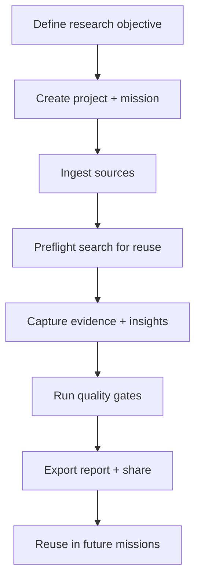
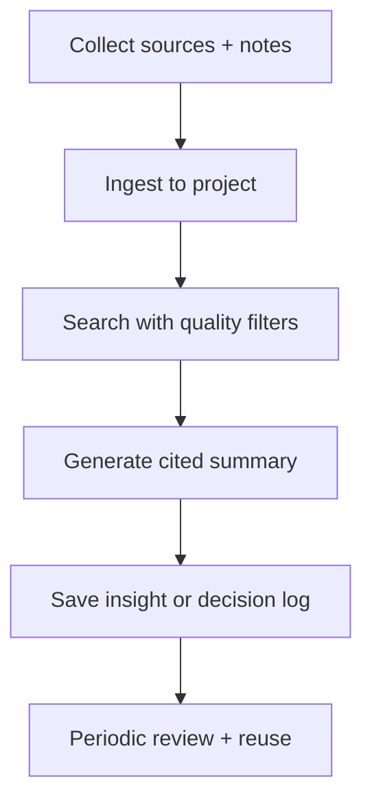
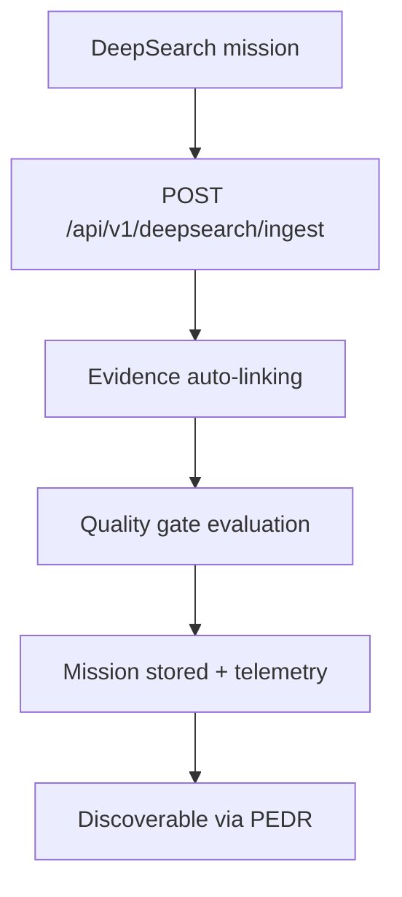

# TraceLab Use Case Documentation

Version: 1.0
Date: 2025-12-28
Status: Draft
Audience: UX research teams, personal knowledge base users, and automation/agent operators

## Purpose
This document summarizes TraceLab use cases for two primary audiences and connects them to practical workflows, example projects, and DeepSearch automation. It is a companion to the detailed workflow guides:

- UX researcher guide: `artifacts/documentation/ux-researcher-workflow-guide.md`
- Personal knowledge base guide: `artifacts/documentation/personal-knowledge-base-guide.md`

## Use Case Overview

| Audience | Primary goals | Typical outputs | Core TraceLab features |
| --- | --- | --- | --- |
| UX Researchers | Turn raw research into validated, reusable insight | Evidence-linked reports, synthesis summaries, reusable insights | Mission Protocol, evidence linking, quality gates, PEDR search, RAG with citations |
| Personal Knowledge Base Users | Build a trusted library for recall and decision-making | Cited summaries, decision logs, curated knowledge capsules | Projects, document ingestion, PEDR search, RAG with citations, preflight checks |

## Common Workflow Building Blocks
- **Projects** organize a research stream or personal topic area.
- **Document ingestion** converts PDFs/notes/reports into chunked, searchable assets.
- **Mission Protocol** captures objectives, key questions, evidence, and synthesis.
- **Evidence linking** ties insights to specific source chunks.
- **Quality gates** enforce completeness before a mission is marked complete.
- **PEDR search** ranks results by relevance + quality for reliable reuse.
- **RAG with citations** generates summaries with traceable sources.
- **Exports** produce Markdown/PDF outputs for review or sharing.

## Workflow Diagrams

### UX research workflow (high level)

### Personal knowledge workflow (high level)

### DeepSearch ingestion loop

## UX Researcher Use Cases

### 1) Multi-study synthesis
- **Goal**: Combine findings across studies without losing traceability.
- **Workflow**: Ingest study documents -> run PEDR search -> attach evidence -> synthesize -> export.
- **Outcome**: A single mission with evidence-backed insights and gate status.

### 2) Rapid validation / preflight check
- **Goal**: Avoid duplicate research.
- **Workflow**: Run preflight queries (`docs/preflight-queries.md`) -> review prior missions -> decide reuse vs new study.
- **Outcome**: Clear reuse recommendation and saved search trail.

### 3) Stakeholder reporting
- **Goal**: Deliver decisions with evidence provenance.
- **Workflow**: Capture insights with citations -> verify quality gates -> export Markdown/PDF report.
- **Outcome**: Shareable report with traceable sources.

## Personal Knowledge Base Use Cases

### 1) Topic research library
- **Goal**: Curate a trusted set of sources for a topic.
- **Workflow**: Ingest articles/notes -> search with PEDR -> generate cited summary -> save as mission.
- **Outcome**: A reusable knowledge capsule with citations.

### 2) Decision log
- **Goal**: Maintain a traceable record of decisions.
- **Workflow**: Capture notes -> link evidence -> summarize decision rationale -> search later by context.
- **Outcome**: Searchable decisions with supporting evidence.

### 3) Learning sprints
- **Goal**: Organize learning over time.
- **Workflow**: Create a project for a learning theme -> capture sources weekly -> synthesize monthly.
- **Outcome**: Periodic synthesis reports that compound over time.

## Example Projects (Practical Scenarios)

1. **Onboarding friction study**
   - Sources: interview transcripts, support tickets, analytics notes.
   - Outputs: evidence-linked insights, stakeholder report, reusable recommendations.

2. **Competitive landscape scan**
   - Sources: product docs, reviews, analyst reports.
   - Outputs: cited summary, capability matrix, reuse-ready mission.

3. **Personal policy tracker**
   - Sources: regulatory PDFs, memos, news briefings.
   - Outputs: decision log, cited summaries, monthly synthesis.

4. **Product discovery archive**
   - Sources: product notes, research readouts, roadmap rationale.
   - Outputs: searchable evidence map for future planning cycles.

## Quick Start Summaries

### UX researchers (15-30 minutes)
1. Create a project for your study.
2. Upload and process source documents.
3. Create a mission with objectives + key questions.
4. Use PEDR search to gather evidence.
5. Link evidence, write synthesis, run gates, and export.

### Personal knowledge users (10-20 minutes)
1. Create a project for a topic or domain.
2. Upload your notes and references.
3. Run a PEDR search to validate sources.
4. Generate a cited summary and save it.
5. Schedule a weekly review to reuse results.

## Feature Capability Matrix (with Examples)

| Capability | UX Research Example | Personal Knowledge Example | Automation Example |
| --- | --- | --- | --- |
| Mission Protocol | Study objective + key questions | Reading project scope | DeepSearch mission payload |
| Evidence linking | Interview quote -> insight | Note excerpt -> decision | Auto-link evidence on ingest |
| Quality gates | Ensure synthesis is complete | Flag weak or missing evidence | Block incomplete mission payloads |
| PEDR search | Find validated prior studies | Find most reliable notes | Preflight reuse search |
| Graph context | Expand related studies | Traverse related topics | Add context to RAG prompts |
| RAG with citations | Summarize findings for stakeholders | Recall a decision with citations | Generate cited brief for reuse |
| Exports | Report for leadership review | Personal knowledge capsule | Automated report delivery |
| Telemetry | Audit research completeness | Track ingestion coverage | Auto-linking + gate status logs |

## DeepSearch Integration (Automated Research)
TraceLab supports direct ingestion of DeepSearch missions via `POST /api/v1/deepsearch/ingest`. The endpoint validates Mission Protocol completeness, runs quality gates, and auto-links evidence before persisting the mission. Details are in `docs/deepsearch-integration.md`.

Recommended usage:
- Use DeepSearch for broad discovery or competitive scans.
- Ingest completed missions into TraceLab for validation and reuse.
- Run PEDR preflight queries before launching follow-on research.

## References
- Workflow reference: `docs/workflows.md`
- DeepSearch integration: `docs/deepsearch-integration.md`
- Preflight queries: `docs/preflight-queries.md`
- TraceLab white paper: `cmos/reports/white-papers/tracelab-white-paper.md`
