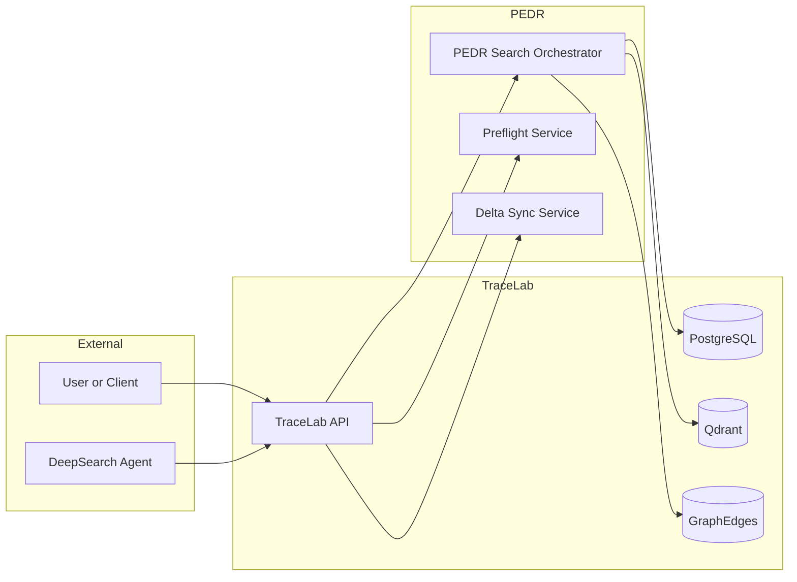
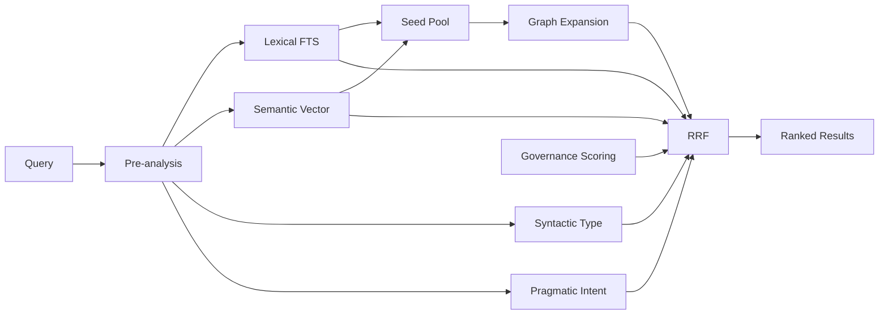
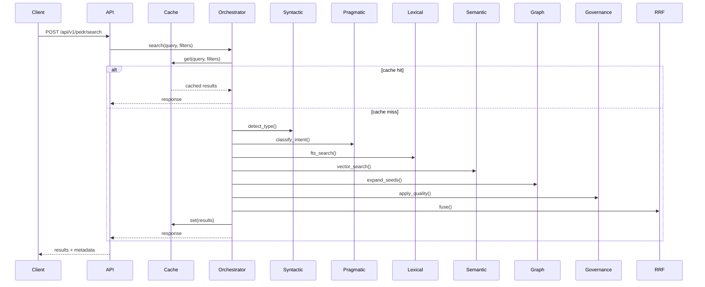
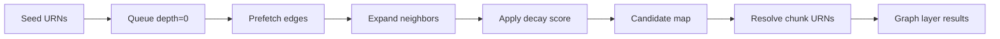
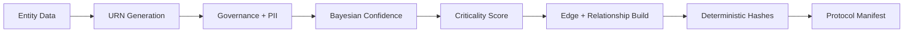
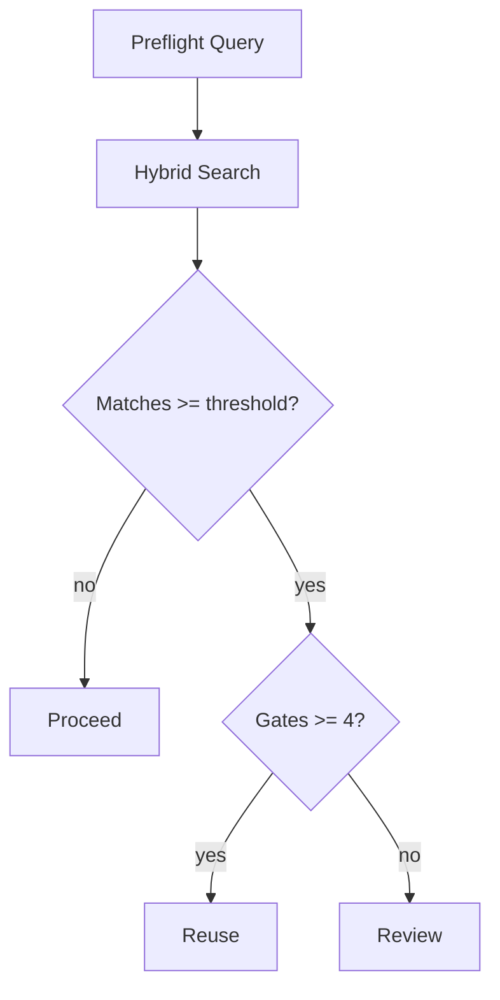
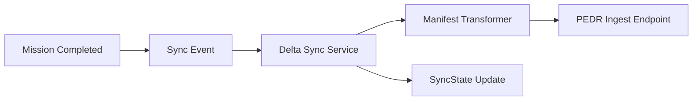

# PEDR Technical Deep Dive - 6-Layer Hybrid Search Architecture
Version: 1.0
Date: 2025-12-27
Status: Draft for internal review
Audience: Search engineers, backend engineers, platform engineers, and research tooling developers

## Table of Contents
- [Executive Summary](#executive-summary)
- [PEDR Design Goals and Constraints](#pedr-design-goals-and-constraints)
- [Scope and Non-Goals](#scope-and-non-goals)
- [System Context and Integration Points](#system-context-and-integration-points)
- [Architecture Overview](#architecture-overview)
- [Search Orchestration Lifecycle](#search-orchestration-lifecycle)
- [API Contract and Parameter Surface](#api-contract-and-parameter-surface)
- [Layer 1: Lexical Retrieval (FTS)](#layer-1-lexical-retrieval-fts)
- [Layer 2: Semantic Retrieval (Qdrant)](#layer-2-semantic-retrieval-qdrant)
- [Hybrid Rerank Mode](#hybrid-rerank-mode)
- [Layer 3: Syntactic Layer (Type Detection and Boosting)](#layer-3-syntactic-layer-type-detection-and-boosting)
- [Layer 4: Pragmatic Layer (Intent Classification)](#layer-4-pragmatic-layer-intent-classification)
- [Layer 5: Governance Layer (Quality Scoring and PII)](#layer-5-governance-layer-quality-scoring-and-pii)
- [Mission Protocol Alignment](#mission-protocol-alignment)
- [Layer 6: Graph Layer (Relationship Expansion)](#layer-6-graph-layer-relationship-expansion)
- [Reciprocal Rank Fusion (RRF)](#reciprocal-rank-fusion-rrf)
- [End-to-End Query Walkthrough](#end-to-end-query-walkthrough)
- [Result Enrichment and Output Metadata](#result-enrichment-and-output-metadata)
- [Semantic Protocol Integration](#semantic-protocol-integration)
- [Preflight Query System](#preflight-query-system)
- [Delta Sync Mechanism (TraceLab to PEDR)](#delta-sync-mechanism-tracelab-to-pedr)
- [Performance Characteristics and Latency Targets](#performance-characteristics-and-latency-targets)
- [Configuration and Tuning Guide](#configuration-and-tuning-guide)
- [Operational Tuning Scenarios](#operational-tuning-scenarios)
- [Telemetry and Observability](#telemetry-and-observability)
- [Failure Modes and Safeguards](#failure-modes-and-safeguards)
- [Security and Compliance Considerations](#security-and-compliance-considerations)
- [Testing and Guardrails](#testing-and-guardrails)
- [Appendix A: Diagram Sources](#appendix-a-diagram-sources)
- [Appendix B: Code References](#appendix-b-code-references)
- [Appendix C: Glossary and Acronyms](#appendix-c-glossary-and-acronyms)
- [Appendix D: Reference Docs](#appendix-d-reference-docs)

---

## Executive Summary

Protocol-Enhanced Deep Research (PEDR) is TraceLab's unified search architecture. It replaces single-mode retrieval with a six-layer stack that fuses lexical, semantic, syntactic, pragmatic, governance, and graph results using Reciprocal Rank Fusion (RRF). The goal is not just high recall, but high trust. PEDR prioritizes results that are well sourced, quality gated, and semantically aligned with the query intent.

PEDR is implemented as a first-class service in the TraceLab API. It shares the same data stores and mission protocol contracts, but adds a purpose-built orchestration layer. The orchestration uses parallel retrieval, typed boosting, intent analysis, and optional graph traversal to derive a final ranking that is robust to noise and aligned with research quality.

This document is a deep technical dive intended for engineers who need to extend, tune, or audit the PEDR stack. It details the six layers, the fusion algorithm, the semantic protocol integration, the preflight duplicate-prevention system, and the delta sync mechanism that keeps PEDR indexes aligned with TraceLab data.

It includes algorithmic formulas, configuration tables, and end-to-end walkthroughs to make PEDR behavior explicit, reproducible, and traceable to key modules.

---

## PEDR Design Goals and Constraints

PEDR design is guided by several non-negotiable constraints derived from TraceLab's mission protocol.

1. Evidence and quality awareness
   - Results must respect quality gates and governance metadata.
   - Mission status and validation state should influence ranking and filtering.

2. Multi-layer retrieval, not a single model
   - Lexical precision, semantic recall, and structural signals are all needed.
   - Layer isolation enables independent tuning and replacement.

3. Deterministic and explainable ranking
   - RRF uses ranks instead of raw scores to stabilize output.
   - Outputs include layer ranks and scores for auditability.

4. Latency targets suitable for interactive use
   - Sub-200ms hybrid mode and sub-300ms full mode are preferred.
   - Cache hits should return in single-digit milliseconds.

5. Protocol compatibility
   - URNs, semantic protocol manifests, and graph edges must be consistent across ingest, search, and telemetry.
   - PEDR must remain aligned with TraceLab mission protocol and governance rules.

---

## Scope and Non-Goals

### In Scope

- PEDR search orchestration and runtime flow.
- Layer algorithms and scoring logic.
- Semantic Protocol integration (URNs, manifests, edges, hashing).
- Preflight and delta sync mechanisms.
- Performance characteristics and tuning knobs.

### Out of Scope

- DeepSearch agent internals (covered by DeepSearch.Alpha case study).
- UI or frontend rendering of PEDR results.
- Mission Protocol schema design (covered by mission protocol docs).

---

## System Context and Integration Points

PEDR operates inside the TraceLab ecosystem and is called from both human interfaces and autonomous agents. It depends on the same storage and mission protocol infrastructure, but adds a dedicated search orchestration pipeline.

Key integration points:

- TraceLab API: Pedr search endpoints (`/api/v1/pedr/search` and `/api/v1/pedr/preflight`).
- PostgreSQL: Documents, missions, quality gates, graph edges, and mission protocol metadata.
- Qdrant: Vector search index for semantic retrieval.
- Semantic Protocol: URN generation, manifest metadata, and relationship graph.
- DeepSearch: External agent that uses preflight queries and provides new mission payloads.

### System Context Diagram

Source: `artifacts/documentation/pedr-architecture-diagrams/pedr-system-context.mmd`



### Data Model Touchpoints

PEDR interacts with several core TraceLab tables and models:

- `Document` and `DocumentChunk`: raw content and chunk metadata.
- `Mission`: mission protocol payloads, status, quality gates.
- `GraphEdge`: materialized edges used by the L6 graph layer.
- `SyncState`: delta sync cursors for PEDR catalog alignment.

These models provide the metadata required for quality scoring, graph traversal, and protocol manifest construction.

### Ownership and Sources of Truth

- PostgreSQL is the source of truth for runtime data used by PEDR search.
- SQLite (CMOS) is the source of truth for mission orchestration and session telemetry.
- PEDR reads from PostgreSQL and does not mutate it during search operations.
---

## Architecture Overview

PEDR combines six layers of retrieval and scoring, then merges results with RRF. The architecture intentionally splits pre-analysis, retrieval, scoring, and fusion to keep tuning isolated and transparent.

### High-Level Pipeline

Source: `artifacts/documentation/pedr-architecture-diagrams/pedr-6-layer-pipeline.mmd`



### Layer Responsibilities

- Lexical: PostgreSQL full-text search, fast keyword retrieval.
- Semantic: Qdrant vector search for meaning and paraphrase matching.
- Syntactic: Type detection and type-specific boosting (mission, document, insight, chunk).
- Pragmatic: Intent classification (search, create, update, delete, execute) and intent-based boosts.
- Governance: Quality gate scoring and PII filtering to enforce research integrity.
- Graph: Relationship traversal to expand context and pull related artifacts.

### Layer Interaction Matrix

| Layer | Inputs | Outputs | Dependencies |
|-------|--------|---------|--------------|
| Lexical | Query text, filters | Ranked chunks, scores | PostgreSQL FTS |
| Semantic | Query embedding, filters | Ranked chunks, scores | Qdrant |
| Syntactic | Query text | Type filters, boosts | Regex patterns |
| Pragmatic | Query text | Intent, boosts | Regex patterns |
| Governance | Mission metadata | Quality score, filters | Mission protocol data |
| Graph | Seed URNs | Expanded candidates | GraphEdge table |

### Interaction Notes

- Syntactic and pragmatic layers run before retrieval but can modify scoring after retrieval.
- Governance filtering is applied before fusion so low-quality results do not enter RRF.
- Graph expansion depends on lexical and semantic seeds, which makes it sensitive to retrieval configuration.
- RRF is the only step that sees all layer outputs simultaneously, making it the primary location for cross-layer stabilization.
All layers emit normalized outputs that are fused by RRF with configurable weights.

---

## Search Orchestration Lifecycle

PEDR is orchestrated by `app/services/pedr/search_orchestrator.py`. The flow is deterministic and modular:

1. Cache lookup
   - Deterministic cache key built from query and full filter set.
   - Cache hit short-circuits the pipeline and returns stored results.

2. Pre-analysis
   - Syntactic layer detects element types from query phrasing.
   - Pragmatic layer classifies intent for boost routing.

3. Parallel retrieval
   - Lexical FTS and semantic Qdrant retrieval run in parallel.
   - The output pools are oversized (`top_k_per_layer`) to improve fusion stability.

4. Optional graph expansion
   - Top results from lexical and semantic layers become seeds.
   - BFS traversal expands candidate set through GraphEdge relationships.

5. Governance scoring
   - Quality gates, status, and PII flags enrich results and filter if required.

6. Fusion
   - Weighted RRF merges ranked lists into a unified ranking.

7. Response assembly
   - Results are annotated with metadata (layer ranks, scores, confidence, criticality).
   - Timings for each layer are returned for observability.

### Cache Key Composition

The cache key includes:

- normalized query text
- `top_k`
- filters (`project_id`, `document_id`, tags, dates)
- graph settings (`graph_depth`, `graph_decay`, `graph_edge_types`)
- `include_embeddings` flag

This prevents cache collisions across different layer configurations and ensures governance filters are respected.

### Cache Invalidation

Cache invalidation happens in two ways:

1. Time-based TTL expiration (default 300 seconds).
2. Event-based invalidation on graph edge changes (`GraphEdge` insert/update/delete).

Document updates also trigger invalidation via service handlers, preventing stale search results.

### Layer Ordering Rationale

Syntactic and pragmatic analysis are intentionally executed before retrieval. They are inexpensive and allow the system to set filters and boosts early, which prevents unnecessary work in downstream layers. Governance scoring is applied after retrieval so the system can evaluate only candidates in the retrieved pool, reducing database load while still enforcing quality gates.

### Orchestration Sequence

Source: `artifacts/documentation/pedr-architecture-diagrams/pedr-orchestrator-sequence.mmd`



### Pseudocode Summary

```python
config = merge_config(overrides)
cache_key = build_key(query, filters, config)

cached = cache.get(cache_key)
if cached:
    return cached

syntactic = syntactic_service.create_filters(query)
pragmatic = pragmatic_service.create_filters(query)

lexical = lexical_search(query, filters)
semantic = semantic_search(query, filters)

if config.enable_graph:
    graph = graph_layer.expand_from_results(seeds=lexical+semantic)

governed = quality_service.apply(lexical + semantic)

fused = rrf.fuse([lexical, semantic, syntactic, pragmatic, governance, graph])

cache.set(cache_key, fused)
return fused
```

---

## API Contract and Parameter Surface

PEDR exposes its primary search capabilities via `POST /api/v1/pedr/search`. The contract is intentionally verbose so clients can tune layer behavior without code changes.

### Core Request Parameters

| Parameter | Type | Description |
|-----------|------|-------------|
| `query` | string | Required query string |
| `top_k` | int | Number of results to return |
| `project_id` | UUID | Filter by project |
| `document_id` | UUID | Filter by document |

### Content Filters

| Parameter | Type | Description |
|-----------|------|-------------|
| `source_type` | string | Filter by source type (interview, survey, etc.) |
| `source_origin` | string | `upload`, `synthesized`, `imported` |
| `document_types` | list[string] | Filter by document MIME types |
| `source_types` | list[string] | Filter by source types |
| `date_from` | date | Documents from this date |
| `date_to` | date | Documents until this date |
| `tags` | list[string] | Tag filter (OR semantics) |

### PEDR-Specific Parameters

| Parameter | Type | Description |
|-----------|------|-------------|
| `element_type` | string | Single element type (mission, document, insight, chunk) |
| `element_types` | list[string] | Multi-type filter |
| `auto_detect_type` | bool | Enable auto type detection |
| `type_boost_enabled` | bool | Enable type-based boosts |
| `intent_boost_enabled` | bool | Enable intent-based boosts |
| `min_quality_gates` | int | Minimum passing gates |
| `status_filters` | list[string] | Allowed mission statuses |
| `allow_pii` | bool | Include PII flagged results |

### Layer Control Parameters

| Parameter | Type | Description |
|-----------|------|-------------|
| `enable_lexical` | bool | Toggle lexical layer |
| `enable_semantic` | bool | Toggle semantic layer |
| `enable_syntactic` | bool | Toggle syntactic layer |
| `enable_pragmatic` | bool | Toggle pragmatic layer |
| `enable_governance` | bool | Toggle governance layer |
| `enable_graph` | bool | Toggle graph layer |
| `layer_weights` | object | Override RRF weights per layer |

### Weight Normalization

When graph is enabled, PEDR rescales base weights:

```text
scaled_weight = base_weight * (1 - graph_weight)
```

The graph weight is then inserted and the set is normalized to sum to 1.0. This maintains relative balance between lexical, semantic, syntactic, pragmatic, and governance layers while allowing the graph layer to contribute a fixed share.

### Graph Layer Parameters

| Parameter | Type | Description |
|-----------|------|-------------|
| `graph_weight` | float | Graph layer weight in RRF |
| `graph_depth` | int | BFS traversal depth (1-5) |
| `graph_decay` | float | Score decay per hop |
| `graph_edge_types` | list[string] | Edge type filter |
| `graph_top_k_seeds` | int | Seeds from lexical + semantic |

### Example Request

```json
{
  "query": "usability findings about onboarding friction",
  "top_k": 10,
  "project_id": "uuid-123",
  "min_quality_gates": 4,
  "status_filters": ["complete"],
  "enable_graph": true,
  "graph_depth": 2,
  "graph_decay": 0.7
}
```

### Response Schema Highlights

Results include both content and PEDR metadata. Example fields:

- `rrf_score`, `rrf_rank`
- `layer_ranks`, `layer_scores`
- `element_type`, `query_intent`
- `quality_score`, `quality_gates_passed`
- `urn`, `confidence`, `criticality`

The response `metadata` block includes timings, layer weights, and cache stats.

### Response Metadata Fields

| Field | Description |
|-------|-------------|
| `layers_used` | Layers that participated in fusion |
| `layer_weights` | Effective weights after normalization |
| `timings` | Per-layer latency breakdown |
| `graph_enabled` | Whether graph expansion ran |
| `graph_candidates_expanded` | Count of expanded graph candidates |
| `total_candidates` | Unique candidates fused |
| `result_count` | Final result count |
| `cache_hit` | Cache hit indicator |
| `cache_stats` | Cache hit/miss stats (if enabled) |

### Response Example (Truncated)

```json
{
  "results": [
    {
      "chunk_id": "uuid-1",
      "rrf_score": 0.0123,
      "rrf_rank": 1,
      "layer_ranks": {"lexical": 2, "semantic": 1, "graph": 4},
      "quality_score": 1.25,
      "urn": "urn:research:chunk:uuid-chunk-3",
      "element_type": "finding"
    }
  ],
  "metadata": {
    "query": "onboarding friction",
    "layers_used": ["lexical", "semantic", "graph"],
    "timings": {"lexical_ms": 42.1, "semantic_ms": 88.2, "total_ms": 156.4},
    "cache_hit": false
  }
}
```

---

## Layer 1: Lexical Retrieval (FTS)

The lexical layer is a fast keyword retrieval path backed by PostgreSQL full-text search. It anchors PEDR with deterministic, low-latency recall for exact term matches.

### Data Source

- `document_chunks.content_tsv` (GIN indexed tsvector)
- Query construction via `websearch_to_tsquery` for natural keyword syntax.

### Scoring

- `ts_rank_cd` yields a normalized rank for matching documents.
- Scores are treated as layer-local and later fused by RRF.

### Typical Usage

- Exact phrase queries
- Identifiers, domain keywords, proper nouns
- Lower latency requirements

### Implementation Reference

- `app/services/hybrid_search.py` (keyword search in hybrid mode)
- `alembic/versions/006_add_fulltext_search.py` for GIN index

### Notes

- Typical latency target: <50ms for FTS retrieval.
- Lexical results are oversampled (`top_k_per_layer`) to stabilize fusion.

### Query Construction Details

Lexical search uses PostgreSQL `websearch_to_tsquery` to interpret human-style query syntax. This allows operators like quotes and boolean modifiers without requiring a custom parser. The query is evaluated against the `content_tsv` GIN index, which is generated from document chunk content using `to_tsvector('english', coalesce(content, ''))`.

### Filter Integration

Lexical retrieval honors the same filters as semantic retrieval:

- `project_id`, `document_id`
- `source_type`, `source_origin`
- `document_types`, `source_types`
- `date_from`, `date_to`, `tags`

Filters are applied at the SQL layer to avoid post-processing overhead.

### Output Payload

Lexical results are returned as chunk records with the following fields used downstream:

- `chunk_id`, `document_id`, `chunk_index`
- `content`
- `score` and `combined_score` (layer-local)

These fields are later overwritten by RRF metadata but remain in the payload for auditability.

---

## Layer 2: Semantic Retrieval (Qdrant)

The semantic layer uses vector similarity to retrieve conceptually related content, even when wording diverges.

### Data Source

- Qdrant collection with HNSW indexing.
- Query embeddings generated via `EmbeddingService`.

### Configuration Highlights

- `hnsw_ef` default is 64 in production tuning.
- `ef_search` tuned for full recall at low latency (decision log).

### Typical Usage

- Abstract concepts and paraphrases
- Exploratory research queries
- Fuzzy match against broader corpus

### Implementation Reference

- `app/services/retrieval_service.py`
- `app/services/qdrant_service.py`

### Notes

- Typical latency target: <100ms.
- Semantic layer is the highest-weight default layer (0.35).

### Embedding Generation

Query embeddings are generated once per request and reused for semantic search and hybrid rerank. The embedding service uses the same model family as document chunk ingestion to keep vector space consistent. This is critical because RRF assumes that rank positions are meaningful, even if scores are not directly comparable.

### HNSW Tuning

HNSW parameters are tuned for a balance of recall and latency. Decision logs set `ef_search` at 64 for full recall at low latency. Operators can override via request parameters for controlled benchmarking.

### Filter Application

Semantic retrieval supports project, document, and source filters at the vector query layer. This avoids pulling vectors outside the target scope and keeps result sets aligned with governance constraints.

### Output Payload

Semantic results include:

- `chunk_id`, `document_id`, `chunk_index`
- `content`
- `score` and `combined_score`
- `embedding` (optional, when `include_embeddings=true`)

These fields form the base candidate pool before quality scoring and RRF fusion.

---

## Hybrid Rerank Mode

Hybrid rerank is a latency-optimized mode that combines lexical candidate retrieval with semantic reranking. It is implemented in `app/services/pedr/hybrid_rerank.py` and exposed through PEDR's `rerank_mode` control.

### Two-Stage Flow

1. Stage 1 (FTS candidates)
   - PostgreSQL full-text search retrieves a candidate pool.
   - Typical candidate pool sizes: 50 to 200 (tunable).

2. Stage 2 (Semantic rerank)
   - A query embedding is generated once.
   - Candidates are reranked via vector similarity.
   - The top-k subset is returned.

### Latency Characteristics

- Stage 1: <100ms for FTS retrieval.
- Stage 2: <200ms for embedding + rerank.
- Combined target: <300ms.

### Fallback Behavior

If FTS returns no candidates, the reranker falls back to full semantic search to avoid empty results. This guards against strict keyword mismatches.

### Rerank Algorithm (Simplified)

```python
candidates = fts_search(query, limit=candidate_pool)
if not candidates:
    return semantic_search(query, top_k)

embedding = embed(query)
reranked = rerank_by_similarity(embedding, candidates)
return reranked[:top_k]
```

### Tuning Notes

- Increase `candidate_pool` to improve recall (higher latency).
- Decrease `candidate_pool` for faster responses (lower recall).
- Hybrid rerank is most effective when FTS quality is high for the domain.

### Implementation Reference

- `app/services/pedr/hybrid_rerank.py`
- `docs/hybrid-search.md`

---

## Layer 3: Syntactic Layer (Type Detection and Boosting)

The syntactic layer adds structural awareness by detecting the expected entity type (mission, document, insight, chunk) from the query phrasing.

### Detection Mechanism

- Regex-based pattern matching with confidence scores.
- Confidence threshold defaults to 0.5.
- Signals are stored for telemetry and debugging.

Example pattern (mission detection):

```text
\bmission(s)?\b, \bobjectives?\b, \bsuccess criteria\b
```

### Boosting

If the detected or requested element type matches a result, the layer applies a multiplier to the combined score.

Default boost weights:

- mission: 0.15
- document: 0.12
- insight: 0.15
- chunk: 0.10

### Type Inference Rules

When explicit element metadata is missing, the syntactic layer infers types using available fields:

- `mission_id` + `objective` or `success_criteria` -> mission
- `insight_id` or `insight_type` -> insight
- `document_id` + `chunk_id` -> chunk
- `document_id` + `file_type` -> document

These inference rules ensure consistent type boosts even for partially populated payloads.

### Filter Mode vs Boost Mode

The syntactic layer can either boost matching types or filter out non-matching types. By default, it boosts and preserves the full set. Filter mode is explicitly enabled when the client intends to narrow to a single element type.

### Metadata Emitted

The following fields are added to results:

- `element_type`
- `element_type_match`
- `type_boost`

### Implementation Reference

- `app/services/pedr/syntactic.py`

### Notes

- The syntactic layer does not remove results by default. It boosts or filters based on `filter_mode`.
- Element type inference uses metadata (mission_id, document_id, insight_id, chunk_index).

---

## Layer 4: Pragmatic Layer (Intent Classification)

The pragmatic layer classifies the user's intent (search, create, update, delete, execute) and optionally boosts results that align with the intent.

### Detection Mechanism

- Regex-based pattern matching similar to syntactic layer.
- Default confidence threshold is 0.5.
- If no pattern matches, intent defaults to `search`.

### Intent Boosts

Boosts are applied by element type to align with intent:

- Search intent boosts insights and research artifacts.
- Execute intent boosts missions.
- Update/delete intent boosts mutable entities (missions, documents).

### Routing Hints

The pragmatic layer emits `route_to_search` and `route_to_action_handler` flags. These flags are not currently used to short-circuit PEDR, but they are used for telemetry and are designed to support future action routing (for example, auto-starting a mission or creating a report).

### Example Classification

Query: "synthesize findings from the onboarding study"

- intent: execute
- confidence: high
- intent_boost_enabled: true

This causes mission-linked results to receive a boost relative to raw chunks.

### Implementation Reference

- `app/services/pedr/pragmatic.py`

### Notes

- The pragmatic layer returns routing hints but currently defaults to search output.
- Intent metadata is included in response for auditing (`query_intent`).

---

## Layer 5: Governance Layer (Quality Scoring and PII)

The governance layer enforces TraceLab quality gates and PII handling. It is the primary mechanism that makes PEDR quality-aware.

### Quality Gate Model

Five gates are evaluated for each mission:

1. research_statement
2. evidence_links
3. synthesis_quality
4. traceability
5. contradictions_resolved

### Quality Score Formula

```text
base_score = passed_gates / 5
status_boost = {
  complete: 0.20,
  review: 0.10,
  in_progress: 0.05,
  draft: 0.00
}
validation_boost = 0.05 if all gates validated
quality_score = clamp(base_score * (1 + status_boost + validation_boost), 0.10, 1.50)
```

The final multiplier is applied to each chunk's combined score, producing a quality-aware rank.

### PII Detection and Filtering

PII flags are determined by:

- Governance fields (`pii`, `pii_handling`, `piiHandling`).
- Mission tags containing `pii`, `privacy`, or `redaction`.

Filters supported:

- `min_quality_gates`
- `status_filters`
- `allow_pii`

### Gate Extraction Logic

Quality gates are sourced from `Mission.quality_gates` when available. If missing, the service falls back to `mission_data.quality_checkpoints`. This ensures older mission payloads are still scored consistently.

### Status and Validation

Status is normalized to lowercase and mapped to a fixed boost table. Validation is inferred from gate-level `validated` fields. A fully validated mission receives a +0.05 boost on top of the status boost.

### Metadata Fields Added

The governance layer adds the following fields to each result:

- `quality_score`
- `quality_base_score`
- `quality_boost`
- `quality_status`
- `quality_gates_passed`
- `quality_gates_total`
- `quality_validated`
- `quality_mission_id`
- `quality_pii_flagged`

### Quality Scoring Example

If a mission passes 4 of 5 gates and is `complete`:

```text
base_score = 4 / 5 = 0.8
boost = 0.20 (complete) + 0.05 (validated) = 0.25
final = clamp(0.8 * (1 + 0.25), 0.10, 1.50) = 1.0
```

This results in a 1.0 multiplier, while a fully validated mission with 5 gates would score 1.25 or higher depending on boosts.

### Implementation Reference

- `app/services/pedr/quality_scoring.py`
- `docs/quality-aware-search.md`

---

## Mission Protocol Alignment

PEDR assumes Mission Protocol compliance. The mission payload is the source for both quality gating and semantic protocol manifest creation. This section summarizes how PEDR uses mission protocol fields.

### Core Mission Fields Used

| Mission Field | PEDR Usage |
|-------------|------------|
| `mission_id` / `missionId` | URN generation and provenance |
| `research_statement.objective` | Manifest purpose and semantic features |
| `status` | Quality boost and governance impact |
| `quality_gates` | Gate scoring and validation flags |
| `evidence` | Relationship edges and provenance |
| `tags` | PII detection and semantic features |

### Quality Gate Inputs

Mission protocol stores gate results as structured checkpoints. PEDR normalizes these gates into a fixed five-gate schema so that older missions remain comparable with new ones.

### Provenance and Traceability

Evidence links (`chunk_id` references) are transformed into `references` edges in the semantic protocol. This allows the graph layer to traverse from missions to underlying evidence and back to related artifacts.

### Status Normalization

Mission status is normalized to lowercase and mapped to a quality boost table. Unknown statuses default to no boost, preventing accidental inflation of ranking scores.

---

## Layer 6: Graph Layer (Relationship Expansion)

The graph layer expands results through explicit and implicit relationships represented as URN-based edges. It is optional but enables context expansion beyond lexical or semantic matches.

### Data Model

Graph edges are stored in the `graph_edges` table with URN endpoints.

- `from_urn`, `to_urn` identify the relationship.
- `edge_type` enumerates relationship semantics (belongs_to, references, derived_from, etc).
- `direction` supports directional relationships.

Reference: `app/models/graph_edge.py`

### Graph Traversal Algorithm

The graph layer performs BFS traversal with score decay:

```text
candidate_score = seed_score * (graph_decay ** depth)
```

Traversal steps:

1. Seed selection from top lexical + semantic results.
2. URN resolution for chunk_id or document_id + chunk_index.
3. BFS expansion up to `graph_depth`.
4. Decay scoring by depth and retain best score per candidate.
5. Resolve chunk URNs to chunk_id for RRF compatibility.

### Seed Selection Strategy

Seeds are derived from the top k results of lexical and semantic layers. The orchestrator interleaves these results and uses `graph_top_k_seeds` to prevent a single modality from dominating the graph expansion.

### URN Resolution and Normalization

The graph layer prefers explicit URNs embedded in the retrieval results. When URNs are missing, it constructs them from `document_id` and `chunk_index` using `URNGenerator.for_chunk`. When only `chunk_id` is available, it performs a lookup to resolve `document_id` and `chunk_index`.

### Adjacency Caching

Graph traversal uses a local adjacency cache to minimize repeated database hits. Edges are prefetched in batches of 200 URNs, with cache hit/miss stats emitted in the layer metadata.

### Edge Types

Common edge types include:

- belongs_to
- contains
- references
- derived_from
- evidence
- related_to
- binds_to
- part_of
- sibling_of

The `graph_edge_types` filter allows selecting only a subset for traversal.

### Edge Materialization

Edges come from two sources:

1. Explicit edges in Semantic Protocol manifests.
2. Implicit edges derived from relational FK relationships.

Materialization is handled by `EdgeMaterializationService`, which upserts edges into `graph_edges` with deduplication based on `(from_urn, to_urn, edge_type, direction)`.

### Graph Scoring Example

If a seed has score 0.9, depth is 2, and `graph_decay` is 0.7:

```text
candidate_score = 0.9 * (0.7 ** 2) = 0.441
```

This score is emitted as the graph layer `score` and is later fused via RRF.

### Default Configurations

- `graph_depth`: 1 (configurable 1-5)
- `graph_decay`: 0.7
- `graph_top_k_seeds`: 5
- `max_candidates`: 100
- `graph_weight`: 0.08 (scaled when enabled)

### Graph Layer Diagram

Source: `artifacts/documentation/pedr-architecture-diagrams/pedr-graph-layer-bfs.mmd`



### Implementation Reference

- `app/services/pedr/graph_layer.py`
- `app/services/pedr/edge_materialization.py`
- `docs/architecture/PEDR-search.md`

---

## Reciprocal Rank Fusion (RRF)

RRF combines ranked lists from each layer into a unified ranking without requiring score normalization. PEDR uses a weighted RRF variant that scales each layer by a configured weight.

### Formula

```text
RRF(d) = sum_i (w_i / (k + rank_i(d)))
```

Where:

- `w_i` is the weight of layer i.
- `rank_i(d)` is the 1-indexed rank of document d in layer i.
- `k` is a constant (default 60).

### Default Layer Weights

Base weights (when graph is disabled):

- lexical: 0.25
- semantic: 0.35
- syntactic: 0.15
- pragmatic: 0.10
- governance: 0.15

When graph is enabled, base weights are scaled by `(1 - graph_weight)` and then normalized, with the graph layer added at `graph_weight`.

### Implementation Reference

- `app/services/pedr/fusion.py`
- `app/services/pedr/search_orchestrator.py`

### Output Metadata

Each fused result includes:

- `rrf_score`
- `rrf_rank`
- `layer_ranks`
- `layer_scores`
- `contributing_layers`

### Example Calculation

For a document appearing at rank 1 in semantic and rank 5 in lexical, with `k=60` and weights 0.35 and 0.25:

```text
RRF = (0.35 / (60 + 1)) + (0.25 / (60 + 5))
    = 0.35 / 61 + 0.25 / 65
    = 0.00574 + 0.00385
    = 0.00959
```

This illustrates why RRF is stable across layers: score magnitudes are small and comparable, while relative ordering remains clear.

### Thresholding

RRF supports a minimum score threshold to drop very weak candidates. PEDR defaults to no minimum (`min_score=0.0`), but the threshold can be raised in downstream consumers to enforce stricter result quality when latency or recall is less important.

### Telemetry

Fusion telemetry includes:

- Layer contribution counts (how many results each layer contributes)
- Multi-layer contribution rate (results present in >1 layer)
- RRF score distribution (min, max, p50, p90)

---

## End-to-End Query Walkthrough

This section illustrates how a single query moves through the PEDR pipeline. The goal is to show how layer outputs combine into a final, quality-aware ranking.

### Example Query

`"onboarding friction insights from enterprise trials"`

### Step 1: Pre-analysis

- Syntactic layer detects "insights" with high confidence.
- Pragmatic layer classifies intent as `search`.
- Result: element type boosts enabled for insights.

### Step 2: Lexical Retrieval

FTS returns exact phrase matches, prioritizing chunks that include "onboarding" and "friction". These results are fast but narrow.

### Step 3: Semantic Retrieval

Qdrant returns semantically related chunks, such as "activation bottlenecks" or "trial conversion drop-off", even if "friction" is not present.

### Step 4: Governance Scoring

Chunks linked to complete missions with 5/5 quality gates receive a multiplier, while draft missions remain closer to their base scores.

### Step 5: Graph Expansion (Optional)

If enabled, the graph layer expands from top lexical and semantic seeds, pulling in related insights or missions connected by `derived_from` or `references` edges.

### Step 6: RRF Fusion

Results are fused into a single ranking. A chunk appearing in both lexical and semantic lists will typically outrank a chunk that appears in only one list.

### Example Fusion Table (Simplified)

| Chunk | Lexical Rank | Semantic Rank | Graph Rank | RRF Score |
|-------|--------------|---------------|------------|-----------|
| A | 1 | 3 | - | 0.0088 |
| B | 4 | 1 | 2 | 0.0101 |
| C | - | 2 | 1 | 0.0067 |

Chunk B wins because it appears across multiple layers, even though it is not ranked first in any single layer.

### Step 7: Response Metadata

The response includes `layer_ranks`, `quality_score`, and timing breakdowns, allowing clients to explain why specific results surfaced.

---

## Result Enrichment and Output Metadata

PEDR does more than return ranked chunks. Each result is enriched with metadata that explains why it surfaced, how it was scored, and how it relates to the semantic protocol.

### Result Fields

The `PEDRSearchResult` schema includes:

- Core identifiers: `chunk_id`, `document_id`, `project_id`
- RRF fields: `rrf_score`, `rrf_rank`, `layer_ranks`, `layer_scores`
- Semantic protocol fields: `urn`, `confidence`, `criticality`
- Layer annotations: `element_type`, `query_intent`
- Governance metadata: `quality_score`, `quality_status`, `quality_gates_passed`
- Source metadata: `chunk_index`, `source_type`, `source_origin`

For compatibility, `score` and `combined_score` are set to the RRF score.

### Optional Enrichment

- `embedding`: returned when `include_embeddings=true` for downstream RAG compression.
- `related_entities`: populated by API adapters when graph relationships are requested.

### Metadata Block

The response `metadata` block provides:

- Intent detection outputs (`intent`, `intent_confidence`)
- Type detection outputs (`detected_type`, `type_confidence`)
- Effective layer weights and layers used
- Timing breakdowns for each layer
- Cache stats when enabled

This metadata is critical for debugging, observability, and client-side explanation.

---

## Semantic Protocol Integration

PEDR is tightly coupled with the Semantic Protocol, which provides structured identity, governance metadata, and graph relationships for research artifacts.

### URN Format

All entities are identified using URNs:

```text
urn:research:{entity_type}:{entity_id}@{version}
```

Examples:

- `urn:research:mission:B12.1`
- `urn:research:chunk:document-uuid-chunk-3@3.3.0`

### Manifest Structure

A protocol manifest includes:

- Element metadata (type, role, intent, criticality)
- Semantic features (purpose, tags, vector)
- Governance metadata (piiHandling, businessImpact, userVisibility)
- Relationships and edges
- Deterministic hashes and signature

### Protocol Versioning

The current implementation targets Semantic Protocol v3.3.0. URNs can optionally include version suffixes, and manifest hashes include both node and graph shapes to support stable signatures across updates.

### Edge Direction and Weighting

Edges support three directions (`out`, `in`, `bidirectional`) and a weight between 0.0 and 1.0. This allows the graph layer to respect asymmetric relationships (for example, `part_of` or `belongs_to`) while still retaining optional weighting metadata for future traversal tuning.

### Manifest Transformer Field Mapping

The ManifestTransformer bridges TraceLab mission payloads to PEDR manifests. Key field mappings:

| TraceLab Field | PEDR Field | Notes |
|---------------|-----------|-------|
| `mission_data.missionId` | `urn` | Prefixed with `urn:research:mission:` |
| `research_statement.objective` | `purpose` | Truncated to 500 chars |
| `mission_data.name` | `description` | Title or fallback to mission id |
| Quality gates + status | `governance_impact` | 1-10 impact score |
| `governance.pii` | `governance_pii` | Boolean |
| Evidence chunks | `bindings.references` | URN list |

This mapping preserves mission protocol semantics while enabling PEDR graph indexing and governance scoring.

### Confidence Scoring (Bayesian)

The Semantic Protocol uses Bayesian log-odds updates based on evidence factors:

```text
log_odds = log(prior / (1 - prior)) + sum(log(likelihood_i))
confidence = exp(log_odds) / (1 + exp(log_odds))
```

Default prior: 0.4

Evidence factors include:

- has_purpose
- has_type
- has_governance
- has_requires
- has_provides
- has_quality_gates
- has_evidence
- has_synthesis

### Semantic Vector Generation

Semantic vectors are generated using a lightweight TF-IDF style approach over purpose, description, and tags. The vector is stored in the manifest as a list of `{term, weight}` entries. This vector is not used directly for retrieval in PEDR but is preserved for protocol completeness and potential downstream analysis.

### Criticality Scoring

Criticality is a weighted blend of impact, visibility, PII, and blast radius:

```text
criticality = (impact * 0.4) + (visibility * 0.2) + (pii * 0.3) + (blast_radius * 0.1)
```

Values are normalized to 0.0-1.0.

### Deterministic Hashes

Manifests are hashed using FNV-1a (64-bit):

- `node_hash`: stable node shape
- `graph_hash`: stable edge shape
- `text_hash`: canonical embedding text
- `sig_hash`: combined node + graph hash

The hash pipeline uses canonical JSON serialization to ensure consistent ordering across environments.

### Manifest Example (Truncated)

```json
{
  "urn": "urn:research:mission:B12.1",
  "version": "3.3.0",
  "element": {"type": "research.mission", "intent": "Read", "criticality": 0.62},
  "semantics": {"purpose": "Benchmark PEDR latency", "tags": ["pedr", "benchmark"]},
  "governance": {"piiHandling": false, "businessImpact": 7, "userVisibility": 1.0},
  "relationships": {"references": ["urn:research:chunk:abc"], "edges": []},
  "__sig": "fnv1a64-acde...f1"
}
```

This payload is what PEDR ingests into its protocol catalog and is the basis for graph edge materialization.

### Semantic Protocol Diagram

Source: `artifacts/documentation/pedr-architecture-diagrams/pedr-semantic-protocol.mmd`



### Implementation Reference

- `app/services/pedr/semantic_protocol.py`
- `app/services/pedr/manifest_transformer.py`
- `app/services/pedr/edge_materialization.py`

---

## Preflight Query System

The preflight system prevents duplicate research by checking existing high-quality work before launching new missions.

### Endpoint

`POST /api/v1/pedr/preflight`

### Decision Logic

- `reuse`: similarity >= 0.85 and quality gates >= 4
- `review`: similarity >= 0.70 and status complete
- `proceed`: no qualifying matches

### Algorithm Summary

1. Run hybrid search with `top_k * 2` candidates.
2. Filter results by similarity threshold and mission metadata.
3. Group results by mission UUID to avoid duplicates.
4. Return recommendation with top matches and summary.

### Example Request and Response

```json
{
  "query": "passwordless authentication patterns",
  "min_quality_gates": 4,
  "status": ["complete"],
  "top_k": 5,
  "similarity_threshold": 0.70
}
```

```json
{
  "action": "reuse",
  "summary": "High-quality match found: 'Passwordless Auth Patterns' (similarity: 92%, quality gates: 5/5). Recommend reusing existing research.",
  "top_score": 0.92,
  "match_count": 1,
  "latency_ms": 45.2,
  "matches": [
    {
      "mission_id": "DRM.0.5",
      "title": "Passwordless Auth Patterns",
      "status": "complete",
      "quality_gates_passed": 5,
      "similarity_score": 0.92
    }
  ]
}
```

### Preflight Decision Diagram

Source: `artifacts/documentation/pedr-architecture-diagrams/pedr-preflight-decision.mmd`



### Telemetry

Preflight events are logged to:

- `cmos/telemetry/events/sprint-11-preflight.jsonl`

Each telemetry event records:

- `query`, `action`, `top_score`
- `match_count`, `latency_ms`
- `min_quality_gates`, `status_filters`
- `agent` identifier (from `X-Agent-ID` header)

### Match Object Fields

Each match includes:

- `mission_id`, `mission_uuid`
- `title`, `objective`, `status`
- `quality_gates_passed`, `quality_gates_total`
- `similarity_score`
- `key_insights` (top 3)

### Implementation Reference

- `app/services/pedr/preflight.py`
- `app/api/v1/pedr_preflight.py`
- `docs/preflight-queries.md`

---

## Delta Sync Mechanism (TraceLab to PEDR)

PEDR uses a delta sync mechanism to keep its catalog aligned with TraceLab data. Sync is event-driven but also supports full rebuilds.

### Architecture

Source: `artifacts/documentation/pedr-architecture-diagrams/pedr-delta-sync.mmd`



### Key Components

- `SyncState` tracks last sync timestamps for each entity type.
- `DeltaSyncService` detects updates using `updated_at`.
- `ManifestTransformer` creates PEDR manifests with governance metadata.
- Batch ingestion uses configurable batch sizes (default 100).

### Sync Modes

- Delta: only entities updated since `last_sync_at`.
- Full: re-sync all entities of a type.

### Step-by-Step Flow

1. Load last sync state from `sync_states`.
2. Query missions/documents/insights with `updated_at > last_sync_at`.
3. Transform each entity into a PEDR manifest.
4. Ingest manifests in batches (default 100).
5. Update sync state with newest `updated_at` cursor.
6. Emit telemetry event with counts and duration.

### Parity Checks

`DeltaSyncService.check_parity` compares local counts with PEDR catalog counts and reports discrepancies. This is used after full rebuilds or when data drift is suspected.

### Error Handling

- Retry with exponential backoff (max retries: 3).
- Failed entities are logged for manual review.

### CLI Operations

Common operational commands:

```bash
# Delta sync (incremental)
python -m app.cli.pedr sync --delta

# Full sync
python -m app.cli.pedr sync --full

# Dry run (transform only)
python -m app.cli.pedr sync --dry-run

# Check parity
python -m app.cli.pedr parity
```

### Implementation Reference

- `app/services/pedr/delta_sync.py`
- `app/services/pedr/manifest_transformer.py`
- `docs/pedr-sync.md`

---

## Performance Characteristics and Latency Targets

PEDR performance targets are informed by production telemetry and internal benchmarks.

### Latency Targets (Typical)

| Component | Target Latency |
|----------|----------------|
| Lexical FTS | <50ms |
| Semantic Vector | <100ms |
| Hybrid Rerank (FTS + rerank) | <200ms |
| Full PEDR (all layers) | 100-300ms |
| Cache hit | <10ms |

### Graph Layer Benchmarks

From `docs/pedr-search.md` and `cmos/telemetry/events/sprint-25-graph-baseline.json`:

| Depth | Latency (ms) | Candidates |
|------|--------------|------------|
| 1 | 21.95 | 500 |
| 2 | 41.73 | 1000 |
| 3 | 280.66 | 1000 |

### Complexity Notes

Graph traversal cost grows with both depth and branching factor. Depth 1 and 2 are typically safe for interactive use, while depth 3 should be reserved for batch or offline analysis. When enabling graph expansion in production, monitor `graph_candidates_expanded` and `graph_ms` to avoid hidden latency spikes.

### Cache Performance

- Cache TTL: 300 seconds
- LRU size: 1000 entries
- Typical cache hit latency: <10ms

Cache hit rate should be monitored alongside latency. A low hit rate often signals high query diversity or overly granular cache keys, while a rising hit rate indicates that common queries are being reused effectively.

### Notes

- Graph expansion is optional and should be enabled selectively.
- Hybrid rerank is the preferred mode for latency-sensitive queries.

### Timing Breakdown in Responses

PEDR returns per-layer timings in the response metadata. Typical timing fields include:

- `lexical_ms`, `semantic_ms`, `graph_ms`
- `syntactic_ms`, `pragmatic_ms`, `governance_ms`
- `fusion_ms`, `total_ms`

These timings are critical for identifying bottlenecks and for validating that layer toggles produce expected latency reductions.

---

## Configuration and Tuning Guide

### Core PEDR Parameters

| Parameter | Default | Description |
|-----------|---------|-------------|
| `rrf_k` | 60 | RRF constant for rank smoothing |
| `top_k_per_layer` | 20 | Oversampling per layer |
| `graph_weight` | 0.08 | Graph layer weight in RRF |
| `graph_depth` | 1 | Max BFS depth |
| `graph_decay` | 0.7 | Decay factor per hop |
| `graph_top_k_seeds` | 5 | Seeds from lexical + semantic |

### Layer Enablement

| Layer | Default | Toggle |
|-------|---------|--------|
| Lexical | enabled | `enable_lexical` |
| Semantic | enabled | `enable_semantic` |
| Syntactic | enabled | `enable_syntactic` |
| Pragmatic | enabled | `enable_pragmatic` |
| Governance | enabled | `enable_governance` |
| Graph | disabled | `enable_graph` |

### Quality Filters

| Filter | Description |
|--------|-------------|
| `min_quality_gates` | Minimum passing gates required |
| `status_filters` | Allowed mission statuses |
| `allow_pii` | Include PII flagged results |

### Preflight Thresholds

| Threshold | Value |
|-----------|-------|
| Reuse similarity | 0.85 |
| Reuse min gates | 4 |
| Review similarity | 0.70 |

### Cache Settings

| Parameter | Default |
|-----------|---------|
| `pedr_cache_enabled` | True |
| `pedr_cache_ttl_seconds` | 300 |
| `pedr_cache_max_size` | 1000 |

---

## Operational Tuning Scenarios

PEDR can be tuned for different operational goals without changing core code. The scenarios below outline typical parameter adjustments.

### Scenario 1: Latency-Critical UX

Goal: Minimize latency for interactive search.

- Use hybrid rerank mode.
- Disable graph expansion (`enable_graph=false`).
- Reduce `top_k_per_layer` if load is high.
- Keep cache enabled and warm common queries.

### Scenario 2: Quality-Critical Research Review

Goal: Prioritize only high-quality, validated research.

- Set `min_quality_gates=4` or `5`.
- Filter `status_filters=["complete"]`.
- Keep governance layer enabled.
- Optionally increase `graph_weight` to surface related evidence.

### Scenario 3: Exploratory Discovery

Goal: Broaden recall to uncover adjacent insights.

- Enable graph expansion with `graph_depth=2`.
- Increase `graph_top_k_seeds` to 8-10.
- Use default layer weights to keep semantic dominance.

### Scenario 4: Agent Preflight Checks

Goal: Prevent duplicate research.

- Use preflight endpoint with `similarity_threshold=0.70`.
- Require 4+ quality gates.
- Limit `top_k` to 5 for fast evaluation.

### Scenario 5: Debugging and Auditing

Goal: Trace scoring rationale and diagnose regressions.

- Enable `include_embeddings` when needed.
- Inspect `layer_ranks`, `layer_scores`, and timings.
- Capture telemetry before and after configuration changes.

### Scenario 6: High-Volume Corpus Scaling

Goal: Maintain stable latency as corpus size grows.

- Reduce `top_k_per_layer` and limit `top_k` to keep candidate pools manageable.
- Disable `include_embeddings` unless strictly required.
- Keep graph expansion off for interactive queries; enable only for targeted follow-ups.
- Use cache statistics to identify and pre-warm common queries.

---

## Telemetry and Observability

PEDR emits structured telemetry for tracing, analysis, and regression detection.

### Core Telemetry Streams

- Graph layer telemetry: `cmos/telemetry/events/sprint-26-graph-telemetry.jsonl`
- Preflight telemetry: `cmos/telemetry/events/sprint-11-preflight.jsonl`
- Delta sync telemetry: `cmos/telemetry/events/sprint-11-pedr-sync.jsonl`

### Metrics Captured

- Layer timing breakdowns
- Cache hit/miss rate
- Graph candidate counts and depth stats
- RRF score distribution
- Preflight recommendation outcomes

### Telemetry Controls

- Graph telemetry can be toggled with `PEDR_GRAPH_TELEMETRY_ENABLED`.
- Cache stats are surfaced via the response metadata when enabled.
- Telemetry JSONL files are append-only and designed for downstream analysis.

---

## Failure Modes and Safeguards

PEDR includes multiple safeguards to maintain reliability and quality:

1. Cache invalidation
   - Invalidation on document changes to avoid stale results.

2. Graph expansion limits
   - `max_candidates` and `graph_depth` prevent runaway traversal.

3. Quality-aware filtering
   - Low-quality or unvalidated missions can be filtered out.

4. Hybrid rerank fallback
   - If FTS returns no candidates, semantic search is used instead.

5. Deterministic hashing
   - Semantic protocol hashes ensure stable identities and cache behavior.

---

## Security and Compliance Considerations

PEDR inherits TraceLab security controls and adds governance-aware search filtering. The primary compliance goal is to prevent low-quality or sensitive content from surfacing in search results without explicit operator intent.

### PII Handling

- PII flags originate from mission governance metadata and tags.
- `allow_pii=false` removes PII-flagged results at the governance layer.
- PII flags are preserved in result metadata for auditability.
### Access and Authentication

PEDR search endpoints are protected by TraceLab authentication middleware. Preflight requests require valid tokens and optionally record agent identifiers via `X-Agent-ID`.

### Data Integrity

Semantic protocol hashes provide deterministic identity and reduce the risk of inconsistent graph edges. This helps detect drift in protocol manifests and supports reproducible search results.

### Telemetry Hygiene

Telemetry logs record query metadata and timing, but should not emit sensitive content. Operators should review telemetry pipelines for redaction policies before exporting logs.

### Redaction and Governance Alignment

TraceLab ingestion includes PII detection and redaction services. When documents are ingested, PII-related flags and tags propagate into mission metadata and are exposed in PEDR governance filters. PEDR does not perform redaction itself, but it uses governance metadata to prevent sensitive content from surfacing when `allow_pii` is false.

---

## Testing and Guardrails

PEDR relies on a mix of unit, integration, and performance tests to preserve correctness across layers.

### Unit Coverage

- `tests/test_pedr_syntactic.py` for type detection and boosts.
- `tests/test_pedr_pragmatic.py` for intent classification.
- `tests/test_pedr_preflight.py` for reuse/review/proceed decisions.
- `tests/test_graph_layer.py` for BFS traversal behavior.

### Integration Coverage

- `tests/integration/test_graph_search.py` for graph layer integration.
- `tests/integration/test_rag_pipeline.py` for retrieval + fusion flows.
- `tests/test_pedr_search_api.py` for API contract validation.

### Guardrails

- Mission protocol quality gates are enforced before boosting.
- Cache invalidation hooks prevent stale results after document updates.
- Graph traversal caps prevent runaway expansion.

When making changes to PEDR logic, run targeted tests for the modified layer and validate telemetry output for timing regressions.

---

## Appendix A: Diagram Sources

- `artifacts/documentation/pedr-architecture-diagrams/pedr-system-context.mmd`
- `artifacts/documentation/pedr-architecture-diagrams/pedr-6-layer-pipeline.mmd`
- `artifacts/documentation/pedr-architecture-diagrams/pedr-orchestrator-sequence.mmd`
- `artifacts/documentation/pedr-architecture-diagrams/pedr-graph-layer-bfs.mmd`
- `artifacts/documentation/pedr-architecture-diagrams/pedr-preflight-decision.mmd`
- `artifacts/documentation/pedr-architecture-diagrams/pedr-delta-sync.mmd`
- `artifacts/documentation/pedr-architecture-diagrams/pedr-semantic-protocol.mmd`

---

## Appendix B: Code References

- `app/services/pedr/search_orchestrator.py`
- `app/services/pedr/fusion.py`
- `app/services/pedr/graph_layer.py`
- `app/services/pedr/quality_scoring.py`
- `app/services/pedr/syntactic.py`
- `app/services/pedr/pragmatic.py`
- `app/services/pedr/semantic_protocol.py`
- `app/services/pedr/preflight.py`
- `app/services/pedr/delta_sync.py`
- `app/services/pedr/manifest_transformer.py`
- `app/models/graph_edge.py`

---

## Appendix C: Glossary and Acronyms

- PEDR: Protocol-Enhanced Deep Research
- RRF: Reciprocal Rank Fusion
- FTS: Full-Text Search
- URN: Uniform Resource Name
- HNSW: Hierarchical Navigable Small World index
- PII: Personally Identifiable Information

---

## Appendix D: Reference Docs

- `docs/architecture/PEDR-search.md`
- `docs/pedr-search.md`
- `docs/quality-aware-search.md`
- `docs/preflight-queries.md`
- `docs/pedr-sync.md`
- `cmos/planning/PEDR-docs/protocol-enhanced-deep-research/PROTOCOL_ARCHITECTURE_GUIDE.md`
