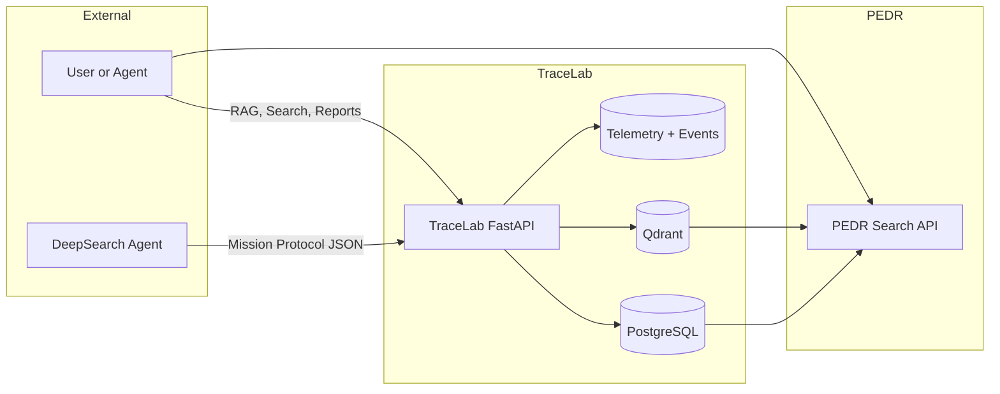
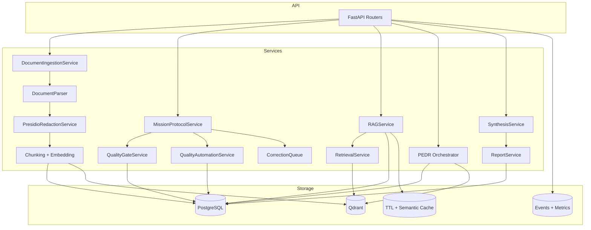
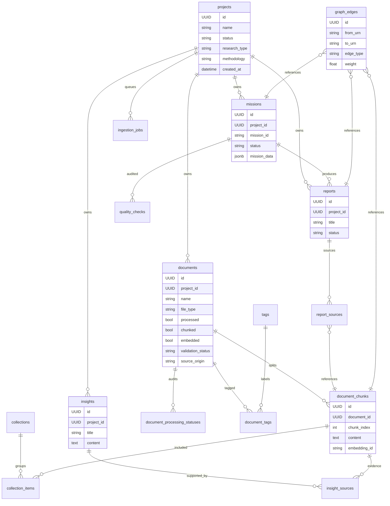
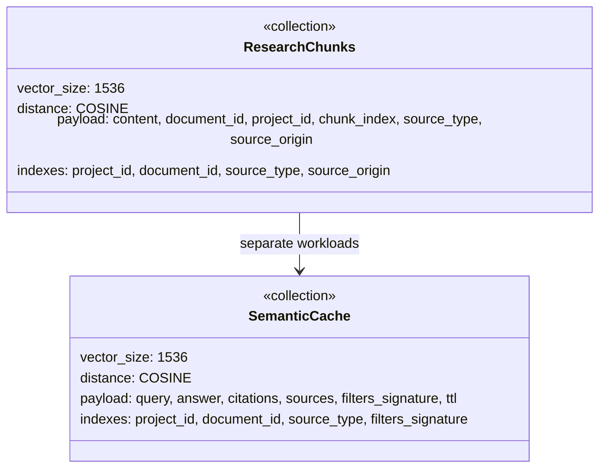
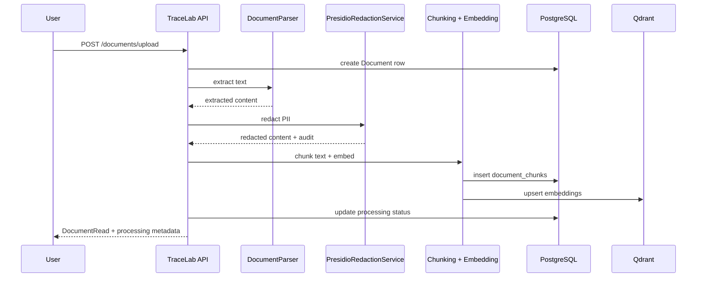
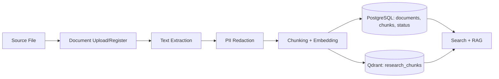
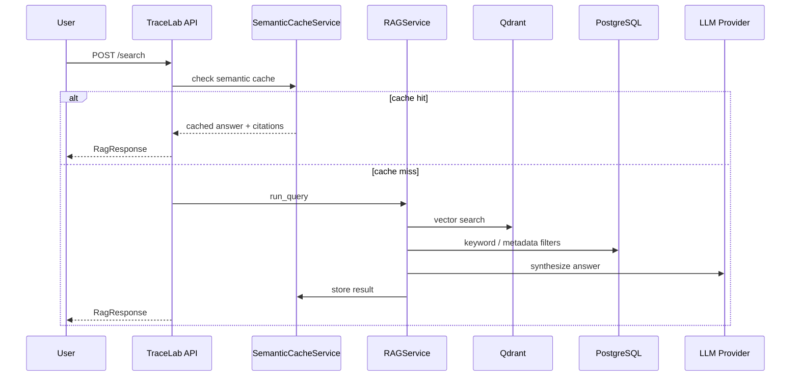
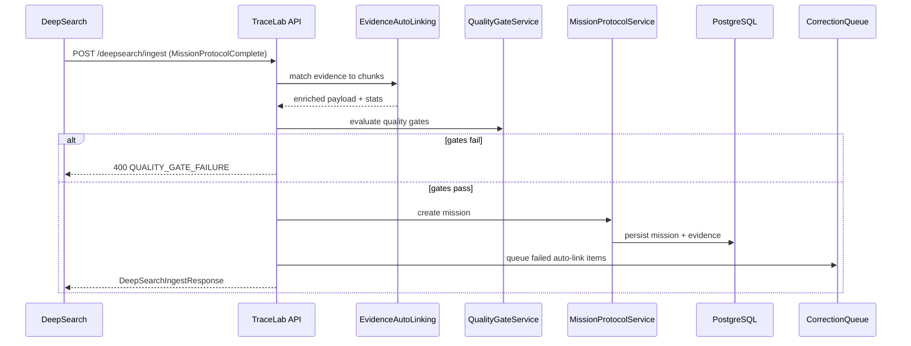

# TraceLab Technical Architecture Deep Dive
Version: 1.0
Date: 2025-12-27
Status: Draft for internal review
Audience: Backend engineers, platform engineers, and research tooling developers

## Table of Contents
- [Executive Summary](#executive-summary)
- [Architecture Principles and Constraints](#architecture-principles-and-constraints)
- [Scope and Non-Goals](#scope-and-non-goals)
- [System Context and Service Boundaries](#system-context-and-service-boundaries)
- [TraceLab Component Architecture](#tracelab-component-architecture)
- [Deployment Architecture (Railway and Cloudflare)](#deployment-architecture-railway-and-cloudflare)
- [Security and Access Control](#security-and-access-control)
- [Core Data Model (PostgreSQL)](#core-data-model-postgresql)
- [Vector Store Architecture (Qdrant)](#vector-store-architecture-qdrant)
- [Ingestion Pipeline](#ingestion-pipeline)
- [Retrieval and RAG Pipeline](#retrieval-and-rag-pipeline)
- [PEDR Search Integration](#pedr-search-integration)
- [Mission Protocol and Validation Framework](#mission-protocol-and-validation-framework)
- [Quality Gates and Automation](#quality-gates-and-automation)
- [Telemetry, Monitoring, and Ops](#telemetry-monitoring-and-ops)
- [Operational Workflows and Failure Modes](#operational-workflows-and-failure-modes)
- [API Contract Reference](#api-contract-reference)
- [Appendix A: Diagram Sources](#appendix-a-diagram-sources)
- [Appendix B: Reference Docs](#appendix-b-reference-docs)

---

## Executive Summary

TraceLab is a three-service research platform that enforces Mission Protocol rigor, maintains evidence-level traceability, and delivers quality-aware search at production latency targets. The system consists of:

- DeepSearch: an external research agent that executes missions and emits Mission Protocol payloads.
- TraceLab: the system of record that validates, stores, and operationalizes research artifacts.
- PEDR: the protocol-enhanced search service that fuses lexical, semantic, syntactic, pragmatic, governance, and graph layers with Reciprocal Rank Fusion (RRF).

This document focuses on the TraceLab service architecture, including its PostgreSQL schema, Qdrant collections, ingestion pipeline, RAG and PEDR search flows, Mission Protocol validation framework, and deployment topology. It also provides a full API contract reference for every `/api/v1` endpoint.

---

## Architecture Principles and Constraints

TraceLab architecture is built around a small number of constraints that shape every subsystem. These are not aspirational; they are enforced through schema validation, quality gates, and operational runbooks.

### Principle 1: Evidence before synthesis

All synthesized output must be traceable to evidence chunks. If an insight cannot be mapped to a source chunk, it fails quality gates. This principle drives:

- `Evidence.chunk_id` requirements in the Mission Protocol.
- `insight_sources` table to bind insights to chunk IDs.
- Evidence auto-linking for DeepSearch payloads.

### Principle 2: Protocol is the contract

Mission Protocol is a shared schema between TraceLab and DeepSearch. Any payload that violates the schema or required gates is rejected. The contract is enforced by:

- Pydantic validation (`MissionProtocolDraft` and `MissionProtocolComplete`).
- Quality gate evaluation on create/update.
- JSONB CHECK constraints generated from the schema.

### Principle 3: Quality is not optional

Quality gating is a blocking requirement for completion. Missions cannot be marked complete if gates fail. This protects search quality and prevents stale or unverified data from polluting the retrieval index.

### Principle 4: Modular services

Each subsystem can evolve independently as long as it respects the Mission Protocol contract and persistence semantics. This is why TraceLab treats PEDR as a service boundary even when it is deployed with the same FastAPI instance.

### Principle 5: Operational transparency

Telemetry is a first-class output. Every quality gate evaluation, automation run, cache summary, and correction retry emits structured telemetry. These events are used in CMOS missions and in production monitoring dashboards.

### Principle 6: Parity and Single Sources of Truth

TraceLab maintains two authoritative stores depending on context:

- PostgreSQL is the system of record for application data and runtime search.
- SQLite (CMOS) is the system of record for mission orchestration and agent telemetry.

File exports and mirrors exist for readability, but runtime systems always read from the databases. This reduces drift between planning artifacts and production workflows.

### Constraints and Tradeoffs

Several explicit constraints shape implementation choices:

- Retrieval must remain fast enough for interactive use, which favors caching and pre-warming strategies.
- Quality gates must be deterministic and explainable; heuristic automation is separated and non-blocking.
- Evidence traceability must survive updates and promotions, which requires both relational links and payload-level IDs.

These constraints prioritize trust and reproducibility over raw throughput and favor a design that is auditable and operator-friendly.
They also drive cautious defaults today.

---

## Scope and Non-Goals

### In Scope
- TraceLab service architecture and implementation details.
- Database schema and vector store configuration.
- Data ingestion and search pipelines.
- Mission Protocol validation and quality gates.
- Deployment topology (Railway, Cloudflare, Qdrant Cloud).
- Full API contract reference for `/api/v1`.

### Out of Scope
- DeepSearch internal implementation details (covered by DeepSearch.Alpha case study).
- PEDR algorithmic deep dive (covered by the PEDR Technical Deep Dive mission).
- UI/UX design system specifics (see `docs/frontend_architecture.md`).

---

## System Context and Service Boundaries

TraceLab treats research as a pipeline that starts with discovery and ends with validated, reusable knowledge. The platform is intentionally modular so each service can evolve independently while maintaining a consistent Mission Protocol contract.

### Service Roles

1. DeepSearch (External Agent)
- Accepts research missions from TraceLab or human operators.
- Executes web research or document review.
- Emits Mission Protocol payloads and optional auto-linking metadata.

2. TraceLab (Validated Library)
- Validates Mission Protocol payloads and enforces quality gates.
- Stores research artifacts in PostgreSQL and embeddings in Qdrant.
- Provides APIs for documents, missions, reports, collections, and search.

3. PEDR (Protocol-Enhanced Search)
- Runs multi-layer retrieval and governance-aware ranking.
- Uses RRF fusion to stabilize results across layers.
- Exposes preflight queries and related-entity expansion.

### System Context Diagram

Source: `artifacts/documentation/architecture-diagrams/system-context.mmd`



### Interaction Patterns

- TraceLab owns the system of record (PostgreSQL) and the vector index (Qdrant).
- DeepSearch writes into TraceLab using `POST /api/v1/deepsearch/ingest` and can also receive status updates via webhooks.
- PEDR reads from TraceLab data stores and does not mutate them.
- The frontend primarily communicates with TraceLab, not with PEDR directly, unless a PEDR-specific UX flow is needed.

### Data Ownership and Contracts

- Mission Protocol schema is authoritative and shared.
- TraceLab is responsible for evidence traceability and persistence.
- PEDR consumes quality gate data but does not enforce protocol logic.

---

## TraceLab Component Architecture

TraceLab is a FastAPI application backed by PostgreSQL for structured data and Qdrant for vector retrieval. The service implements several specialized domains:

- Document ingestion (parsing, redaction, chunking, embeddings)
- Mission Protocol validation (draft/complete models, quality gates, automation)
- Search services (RAG, retrieval, PEDR)
- Synthesis and report generation
- Telemetry and monitoring

### Internal Component Diagram

Source: `artifacts/documentation/architecture-diagrams/tracelab-components.mmd`



### API Layer

The FastAPI layer is intentionally thin. Each router delegates to a service module that encapsulates the domain logic. Example patterns:

- `app/api/v1/documents.py` calls `DocumentIngestionService` and `DocumentQueryService`.
- `app/api/v1/missions.py` calls `MissionService` and `MissionProtocolService`.
- `app/api/v1/pedr_search.py` calls `create_pedr_orchestrator()`.

This keeps validation and orchestration logic testable and reusable.

### Service Layer

Services are grouped by domain:

- Ingestion: file parsing, redaction, chunking, embedding, audit trail.
- Mission Protocol: validation, quality gates, YAML import/export.
- Search: retrieval, RAG, PEDR orchestration, and preflight checks.
- Quality automation: deterministic checks that persist audit trails.
- Synthesis: LLM summarization and report generation.

Each service favors explicit dependencies and can be injected for testing.

### Service Deep Dive

This section summarizes the most important services, their responsibilities, and how they interact.

#### DocumentIngestionService and DocumentParser
- `DocumentIngestionService` orchestrates ingestion stages: parsing, redaction, chunking, embedding, and persistence.
- `DocumentParser` performs format detection and delegates to format-specific parsers (PDF, DOCX, PPTX, CSV, XLSX, MD, TXT, JSON, XML, YAML).
- Parsing output and errors are recorded in `document_processing_statuses` for auditability.

#### PresidioRedactionService
- Redaction runs before chunking so PII does not enter the retrieval corpus.
- Redaction metadata is stored in the processing status audit trail.
- The redaction service is also exposed directly via `/api/v1/redaction/redact`.

#### Chunking and Embedding
- Chunking converts extracted text into retrieval-friendly segments.
- Each chunk records `chunk_index`, `token_count`, and source offsets for traceability.
- Embeddings are generated with the configured model and stored in Qdrant.
- `document_chunks.embedding_id` links relational chunks to vector IDs.

#### DocumentQueryService and Soft Deletes
- `DocumentQueryService` handles list and retrieval endpoints with pagination.
- Soft deletes are enforced by default to preserve data lineage.
- `DocumentSoftDeleteService` enables restore operations without data loss.

#### MissionService vs MissionProtocolService
- `MissionService` handles CRUD operations, queueing, and status transitions.
- `MissionProtocolService` validates Mission Protocol payloads and enforces quality gates.
- Mission Protocol validation is cached and reused for repeated payloads.

#### EvidenceAutoLinkingService and CorrectionQueue
- Evidence auto-linking attempts to match DeepSearch evidence summaries to existing chunks.
- Unmatched items are queued for retry and inspection via the correction endpoints.
- Correction telemetry is exposed to dashboards and CMOS audits.

#### QualityGateService and QualityAutomationService
- `QualityGateService` runs blocking checks and emits per-gate telemetry events.
- `QualityAutomationService` runs heuristic detectors and persists `quality_checks`.
- Automation runs are triggered on mission create/update and can be invoked manually.

#### RAGService and RetrievalService
- `RetrievalService` performs vector search with metadata filters.
- `RAGService` orchestrates retrieval, quality scoring, and LLM synthesis.
- `SemanticCacheService` is invoked to reuse high-similarity results.

#### PEDR Orchestrator
- `create_pedr_orchestrator()` wires the PEDR layers and RRF fusion logic.
- Hybrid mode uses lexical search first and semantic reranking second.
- Graph expansion uses BFS over `graph_edges` with decay scoring.

#### SynthesisService and ReportService
- `SynthesisService` generates LLM summaries from collections or chunk sets.
- `ReportService` persists synthesis outputs and records sources.
- Report export supports Markdown, PDF, and DOCX.

### Data Layer

- PostgreSQL stores structured entities, audit trails, and mission data JSON.
- Qdrant stores vectors (documents, cache embeddings).
- TTL caches optimize list endpoints and quality gate responses.

---

## Deployment Architecture (Railway and Cloudflare)

TraceLab is designed to run on Railway for application and PostgreSQL hosting, with Qdrant Cloud as the preferred vector store. Cloudflare provides TLS termination, DNS routing, and edge caching for the frontend. The primary production topology is:

- Railway FastAPI service (TraceLab backend)
- Railway PostgreSQL addon
- Qdrant Cloud cluster (vector store)
- DeepSearch worker (Railway service or external worker)
- Cloudflare reverse proxy in front of frontend and API domains

### Deployment Diagram

Source: `artifacts/documentation/architecture-diagrams/deployment-railway-cloudflare.mmd`

```mermaid
flowchart LR
  User[User / Agent]
  Cloudflare[Cloudflare Edge + TLS]
  Frontend[Railway Frontend (Next.js)]
  API[Railway TraceLab API]
  PG[(Railway PostgreSQL)]
  QD[(Qdrant Cloud)]
  DeepSearch[DeepSearch Worker]

  User --> Cloudflare
  Cloudflare --> Frontend
  Cloudflare --> API

  API --> PG
  API --> QD
  DeepSearch --> API
  API --> DeepSearch
```

### Railway Service Configuration

- FastAPI service uses `uvicorn app.main:app` with `PORT` injected by Railway.
- PostgreSQL is provisioned as a Railway addon; connection strings are injected as `DATABASE_URL`.
- Migrations are run via Alembic at deploy time.

### Qdrant Cloud Integration

- Qdrant Cloud is the production baseline for vector storage.
- `QDRANT_URL` and `QDRANT_API_KEY` are stored as Railway secrets.
- Qdrant collection must be initialized post-deploy via `/api/v1/admin/init-qdrant`.

### Cloudflare and DNS

- Cloudflare proxies both the frontend domain and API domain.
- TLS mode must be Full (Strict).
- `CORS_ALLOWED_ORIGINS_PROD` must include all Cloudflare hostnames.

### Operational Dependencies

- Pre-warm Qdrant connection on startup to avoid 60s cold start.
- Qdrant health checks at `/api/v1/admin/health` should be part of deployment runbooks.
- Use `docs/qdrant-railway-setup.md` for any Qdrant provisioning changes.

### Deployment Workflow and Runtime Assumptions

Deployment follows a predictable sequence to ensure database and vector stores stay aligned:

1. Provision Railway services
- Create the FastAPI service and PostgreSQL addon.
- Configure environment variables: `DATABASE_URL`, `QDRANT_URL`, `QDRANT_API_KEY`.

2. Run migrations
- Apply Alembic migrations on deploy (`alembic upgrade head`).
- Railway can be configured to run migrations automatically before boot.

3. Initialize Qdrant collections
- Run `POST /api/v1/admin/init-qdrant` after initial deploy.
- Use `write_optimized=true` only for bulk ingestion phases.

4. Validate readiness
- `/api/v1/health/ready` should return ready before traffic is routed.
- `/api/v1/admin/health` confirms vector schema alignment.

5. Frontend routing
- Cloudflare CNAME proxies route to the Railway frontend URL.
- `CORS_ALLOWED_ORIGINS_PROD` must include Cloudflare hostnames.

Runtime assumptions:
- TraceLab is stateful with respect to PostgreSQL and Qdrant.
- The FastAPI service expects Qdrant to be reachable and the collection to exist.
- Cold-start latency is mitigated by pre-warming Qdrant on startup.

Scaling considerations:
- FastAPI is horizontally scalable because state is externalized to PostgreSQL and Qdrant.
- Qdrant performance depends on HNSW parameters and memory budgets.
- Large bulk ingests should enable write-optimized Qdrant configuration.

---

## Security and Access Control

TraceLab uses a layered security model that balances simplicity with operational safety.

### Authentication

- JWT authentication via `/api/v1/auth/login` and `/api/v1/auth/refresh`.
- API keys are supported for MCP and automation integrations.

### Authorization

- Most `/api/v1` endpoints are protected by `require_authenticated_user` dependency.
- Webhooks use HMAC signature verification (`X-DeepSearch-Signature`).

### Idempotency

- Onboarding endpoints support `Idempotency-Key` headers for safe retries.
- Idempotency responses are stored in `idempotency_records` for replay.

### Data Security Controls

- PII redaction uses Presidio, with audit trails stored in `document_processing_statuses`.
- Quality gates prevent unvalidated research from entering completed states.

### Credential Management

- Credentials are loaded from environment variables via `Settings` in `app/core/config.py`.
- Production passwords are stored as hashes; `auth_password_hash` takes precedence over `auth_password`.
- JWTs use `HS256` with a configurable `secret_key` and expiration window.

### API Key Storage

- API keys are stored as bcrypt hashes (`key_hash`) and never persisted in plaintext.
- `key_prefix` exposes only the first few characters for display and audit.
- Each API key can include an optional expiration timestamp.

### Webhook Integrity

- Webhook requests are signed with HMAC-SHA256.
- `X-DeepSearch-Signature` and `X-DeepSearch-Timestamp` headers are validated to prevent replay.
- Invalid signatures return `401` with a structured error response.

### CORS and Proxy Handling

- CORS is configured through `CORS_ALLOWED_ORIGINS_DEV` and `CORS_ALLOWED_ORIGINS_PROD`.
- The proxy middleware trusts `X-Forwarded-Proto` and `X-Forwarded-Host` to keep redirects and auth headers consistent behind Cloudflare and Railway.

### Audit Logging

- Document processing events are appended to `document_processing_statuses`.
- Quality gate evaluations emit structured telemetry events for external audits.
- Search history and saved searches provide a light-weight activity trail for usage analytics.

---

## Core Data Model (PostgreSQL)

TraceLab uses PostgreSQL for structured research artifacts, audit trails, and operational metadata. The schema is centered on projects, documents, chunks, missions, reports, and quality checkpoints.

### Primary Entities

Projects (`projects`)
- Workspaces for missions and documents.
- Key fields: `name`, `description`, `research_type`, `methodology`, `status`.
- Soft delete support via `SoftDeleteMixin`.

Documents (`documents`)
- Uploaded or ingested research files.
- Key fields: `file_path`, `file_type`, `mime_type`, `source_type`, `processed`, `chunked`, `embedded`.
- Provenance fields: `source_origin`, `source_report_id`, `source_mission_id`.

Document Chunks (`document_chunks`)
- Tokenized segments used for retrieval.
- Key fields: `content`, `chunk_index`, `embedding_id`, `content_tsv`.
- FTS uses `content_tsv` computed column.

Missions (`missions`)
- Mission Protocol payloads and DeepSearch execution tracking.
- Key fields: `mission_id`, `title`, `objective`, `success_criteria`, `status`.
- Stores mission payload in `mission_data` JSON.

Reports (`reports` + `report_sources`)
- Synthesized outputs with provenance back to collections or chunks.
- `ReportSource` records each collection or chunk used.

Insights (`insights` + `insight_sources`)
- Optional manual or automated insights tied to chunks.
- `insight_sources` is the traceability link.

Graph Edges (`graph_edges`)
- Semantic Protocol edges for PEDR L6 graph traversal.
- Stores URN relationships with weight and metadata.

Quality Checks (`quality_checks`)
- Audit trail for automated quality checks.
- Stored with `check_type`, `status`, and `details` JSON.

### Supporting Entities

- `collections` and `collection_items`: group chunks for synthesis.
- `tags` and `document_tags`: taxonomy for filtering.
- `search_history` and `saved_searches`: query logs and replay.
- `synthesis_cache`: cached LLM outputs.
- `ingestion_jobs`: onboarding ingestion tasks.
- `api_keys`: authentication keys.
- `idempotency_records`: idempotent response cache.
- `sync_states`: PEDR delta sync tracking.

### ER Diagram (PostgreSQL)

Source: `artifacts/documentation/architecture-diagrams/postgres-erd.mmd`



### Schema Design Highlights

- `documents` and `projects` support soft delete; deletes are reversible.
- `document_chunks` uses a unique constraint on `(document_id, chunk_index)`.
- `missions` enforces JSON schema constraints based on Mission Protocol models.
- `graph_edges` uses composite uniqueness on `(from_urn, to_urn, edge_type, direction)`.

### Detailed Table Reference

The following summaries capture the most important columns and constraints for the core tables. This section is intended as a quick reference for developers who need to reason about data lineage, indexing, and integrity rules without reading the ORM classes.

#### projects
- `id` (UUID, PK): primary identifier used by documents, missions, and reports.
- `name` (string, required): human-readable project label.
- `description` (text, optional): free-form description.
- `research_type` (string, constrained): strategic, tactical, generative, evaluative.
- `methodology` (string, optional): qualitative, quantitative, mixed.
- `status` (string, default active): active, archived, completed.
- Soft delete: `deleted_at` via `SoftDeleteMixin`.

#### documents
- `id` (UUID, PK), `project_id` (FK): ownership link to projects.
- `file_path`, `file_type`, `mime_type`: storage and format metadata.
- `processed`, `chunked`, `embedded`: ingestion state flags.
- `validation_status` (string): pending, validated, flagged.
- `source_origin` (string): upload, synthesized, imported.
- `source_report_id`, `source_mission_id` (FKs): provenance for promoted content.
- Soft delete: `deleted_at` via `SoftDeleteMixin`.
- Indexes: project_id, file_type, source_type, collection_date, source_origin.

#### document_chunks
- `id` (UUID, PK), `document_id` (FK): chunk ownership.
- `chunk_index` (int): ordering within a document.
- `content` (text): raw chunk text.
- `content_tsv` (tsvector): computed for PostgreSQL FTS.
- `embedding_id` (string): Qdrant vector ID.
- `prev_chunk_id`, `next_chunk_id`: navigation across chunks.
- Unique constraint: `(document_id, chunk_index)`.

#### document_processing_statuses
- `id` (UUID, PK), `document_id` (FK).
- `stage` (string): uploaded, extracted, redacted, chunked, pipeline.
- `status` (string): in_progress, succeeded, failed.
- `details` (JSON): stage-specific metadata.

#### collections
- `id` (UUID, PK), `name` (string), `description` (text).
- Timestamped via `created_at`, `updated_at`.

#### collection_items
- `id` (UUID, PK), `collection_id` (FK), `chunk_id` (FK).
- `notes` (text): optional annotation.
- Unique constraint: `(collection_id, chunk_id)` to prevent duplicate entries.

#### reports
- `id` (UUID, PK), `project_id` (FK).
- `title` (string, required), `content` (text).
- `report_type` (string): summary, report, bullets.
- `status` (string): draft, final.
- `parent_id` (UUID): version lineage.

#### report_sources
- `report_id` (FK), `source_type` (string): collection or chunk.
- `source_id` (UUID): ID of the source entity.

#### missions
- `mission_id` (string, unique): human-readable ID (e.g., B16.1).
- `title`, `objective`, `success_criteria` (JSON array).
- `mission_data` (JSON): Mission Protocol payload.
- `status` (string): draft, queued, in_progress, completed, blocked, cancelled.
- DeepSearch metadata: `deepsearch_job_id`, `execution_metadata`, `result_protocol`.
- Check constraint: success criteria array is non-empty.

#### insights
- `id` (UUID, PK), `project_id` (FK).
- `title` (string), `content` (text).
- `insight_type` (string): finding, contradiction, recommendation.
- `validated` (bool), `validation_date`.

#### insight_sources
- `insight_id` (FK), `chunk_id` (FK): composite PK.
- `relevance_score` (numeric): 0.0 to 1.0 weighting.

#### quality_checks
- `entity_type` (string): mission, document, project.
- `entity_id` (UUID).
- `check_type` (string): bias_detection, traceability, rigor, synthesis_quality.
- `status` (string): passed, failed, warning.
- `details` and `recommendations` stored as JSON.

#### search_history
- `query_text` (text), `search_mode` (string).
- `filters` (JSON), `top_chunks` (JSON), `metadata_payload` (JSON).
- `cache_hit` (bool), `duration_ms` (int).

#### saved_searches
- `name`, `description`, `query_text`.
- `search_mode`, `filters`, `top_k`.
- Unique constraint: `(owner, name)` to avoid duplicates.

#### synthesis_cache
- `input_hash` (unique), `content`, `citations`.
- `tokens_used`, `hit_count`, `last_hit_at`.

#### api_keys
- `name`, `key_hash`, `key_prefix`.
- `expires_at`, `last_used_at`.

#### idempotency_records
- `key` (PK), `method`, `path`, `request_hash`.
- `status_code`, `response_data`, `error_message`.

#### ingestion_jobs
- `project_id`, `document_id` (FKs).
- `status`: PENDING, IN_PROGRESS, COMPLETED, FAILED.
- `started_at`, `completed_at`.

#### graph_edges
- `from_urn`, `to_urn` (indexed strings).
- `edge_type`, `direction`, `weight`.
- `evidence` (JSON) for provenance.

#### sync_states
- `entity_type` (string, unique): mission, document, insight.
- `last_sync_at`, `sync_count`, `last_entity_id`.

#### tags and document_tags
- `tags` stores taxonomy data (`name`, `category`, `color`).
- `document_tags` links documents to tags with composite PK.

### Indexing and Query Patterns

PostgreSQL indexes are designed around the most common query paths:

- Project scoping: most list endpoints filter by `project_id`, so `projects`, `documents`, `missions`, and `reports` include project indexes.
- Chunk retrieval: `document_chunks.document_id` and `chunk_index` are indexed to support pagination and adjacency reconstruction.
- Search history: `search_history` includes time-based indexes for fast recency queries.
- Status filtering: `missions.status` and `reports.status` are indexed for queueing workflows.
- Soft delete filtering: `deleted_at` is enforced in query services to exclude soft-deleted records by default.

Full-text search relies on `content_tsv` in `document_chunks`. This field is computed using `to_tsvector('english', content)` and is indexed by Postgres for fast lexical search. Query patterns that combine FTS with metadata filters (project, document type, source type) are executed through the hybrid search pipeline and are the foundation for PEDR lexical ranking.

In addition to relational indexes, Qdrant payload indexes are used to filter vector searches. This avoids retrieving irrelevant vectors and reduces Qdrant memory and latency overhead.

---

## Vector Store Architecture (Qdrant)

TraceLab uses Qdrant for two collections:

1. `research_chunks`
- Primary embedding store for document chunks.
- Vector size: `1536` (OpenAI `text-embedding-3-small`).
- Payload fields: `content`, `document_id`, `project_id`, `chunk_index`, `source_type`, `source_origin`.
- Indexed payload fields: `project_id`, `document_id`, `source_type`, `source_origin`.

2. `semantic_cache`
- Semantic cache for RAG responses.
- Stores query embeddings and payload containing answer, sources, and metadata.
- Indexed payload fields: `project_id`, `document_id`, `source_type`, `filters_signature`.

### Qdrant Collection Diagram

Source: `artifacts/documentation/architecture-diagrams/qdrant-collection.mmd`



### HNSW and Quantization Defaults

From `app/services/qdrant_service.py`:
- HNSW `m=16`, `ef_construct=100` (write optimized uses 32).
- `full_scan_threshold=20_000` in standard mode.
- Scalar quantization enabled post-ingest with `INT8` and `quantile=0.99`.
- Default search ef: `qdrant_hnsw_ef_default=64`.

These settings balance latency and recall; see `docs/qdrant-optimization.md` and `docs/architecture/PEDR-search.md` for tuning guidance.

### Semantic Cache Mechanics

The semantic cache stores prior answers as a vector and payload. It supports:

- Similarity threshold lookup (`semantic_cache_similarity_threshold`).
- TTL eviction (`semantic_cache_ttl_seconds`).
- Max cache items (`semantic_cache_max_items`).

Each payload includes the `filters_signature` so that cached answers are only reused when filter contexts match.

### Payload and Filter Mapping

Qdrant payload fields are intentionally aligned with query filters so that both semantic search and cache lookups can be scoped consistently. Examples:

- `project_id` and `document_id` enable multi-tenant filtering.
- `source_type` and `source_origin` allow search scoping by document provenance.
- `filters_signature` in semantic cache ensures queries with different filters do not collide.

This mapping is crucial for deterministic reuse of cached answers and for PEDR governance filters that must exclude sensitive or low-quality content.

### Upsert and Search Semantics

- Chunk upserts use `PointStruct` with `id` equal to the chunk UUID.
- Payloads include both metadata and content to allow retrieval without additional Postgres lookups.
- Searches use `search_params={"hnsw_ef": effective_hnsw_ef}` for recall tuning.
- `with_vectors=false` by default to reduce payload size; vectors are returned only when explicitly requested.

### Collection Lifecycle

The Qdrant admin endpoints provide safe operational controls:

- `/api/v1/admin/init-qdrant` ensures collection existence and payload index creation.
- `/api/v1/qdrant-admin/stats` returns memory estimates and HNSW configuration.
- `/api/v1/qdrant-admin/config/hnsw` updates HNSW and quantization parameters at runtime.

These endpoints replace manual Qdrant UI operations and keep configuration consistent across environments.

---

## Ingestion Pipeline

The ingestion pipeline converts raw research files into chunked, traceable assets. It is triggered via `/api/v1/documents/upload`, onboarding endpoints, or DeepSearch ingestion workflows.

### Entry Points

- `POST /api/v1/documents/upload` for binary uploads.
- `POST /api/v1/documents` in onboarding workflow for file-path registration.
- `POST /api/v1/documents/{id}/process` to explicitly run ingestion.

### Supported Formats

Supported MIME types map to parsers:

- PDF: pdfminer.six or PyPDF2
- DOCX: python-docx
- PPTX: python-pptx
- CSV/XLSX: pandas/openpyxl
- MD/TXT: plain text parser
- JSON/XML/YAML: structured parser

### Processing Stages

1. Parse and extract
- `DocumentParser` detects type and extracts text.
- Extraction metadata is recorded in `document_processing_statuses`.

2. Redact PII
- `PresidioRedactionService` identifies PII and replaces with pseudonyms.
- Redaction output is appended to processing status.

3. Chunk and embed
- Chunks are created with metadata such as token counts and offsets.
- Embeddings are generated and stored in Qdrant.

4. Persist and audit
- `document_chunks` rows created.
- `document_processing_statuses` updated with success/failure.

### Ingestion Sequence Diagram

Source: `artifacts/documentation/architecture-diagrams/ingestion-sequence.mmd`



### Ingestion Data Flow

Source: `artifacts/documentation/architecture-diagrams/ingestion-dataflow.mmd`



### Error Handling

- Parser failures result in `document_processing_statuses` entries with `status=failed`.
- The ingestion service surface returns `500` with explicit error detail.
- Soft delete protects original assets from accidental deletion.

### Onboarding Jobs

The onboarding workflow uses `ingestion_jobs` to decouple ingestion from document registration. It supports:

- Idempotent registration (`Idempotency-Key`).
- Background processing with status polling via `/api/v1/jobs/{id}`.

### Processing Status Semantics

`document_processing_statuses` is the authoritative audit trail for ingestion stages. It captures:

- `stage`: uploaded, extracted, redacted, chunked, pipeline.
- `status`: in_progress, succeeded, failed.
- `details`: structured metadata, error messages, and counts.

These records are used for debugging ingestion pipelines, surfacing UI state, and validating ingestion coverage across formats.

### Chunking and Embedding Strategy

Chunking balances retrieval recall with precision. Important design choices:

- Chunk size is tuned for embedding model token limits and for RAG synthesis context windows.
- Each chunk captures `start_char` and `end_char` offsets to preserve traceability.
- `prev_chunk_id` and `next_chunk_id` allow adjacency reconstruction for context windows.
- Chunks are indexed in Postgres with `content_tsv` for lexical search and in Qdrant for semantic search.

Embedding is handled through configurable LLM embeddings. The embedding dimension must match Qdrant vector size (1536 by default). Misalignment causes ingestion failures and is detected via Qdrant admin health checks.

### Ingestion Telemetry and Retries

Ingestion stages emit telemetry events that include duration, token counts, and error summaries. These are aggregated in operational dashboards to detect format regressions or parser failures.

Retry strategy is explicit:

- Failed parse or redaction stages are not auto-retried to avoid repeated errors.
- Operators can re-run ingestion by calling `/api/v1/documents/{id}/process` after fixing the underlying issue.
- Background ingestion jobs expose status so downstream systems can poll until completion.

### End-to-End Knowledge Lifecycle

TraceLab treats ingestion as the first step of a broader lifecycle that ends with reusable, validated knowledge. The typical path looks like this:

1. Source acquisition
- A researcher uploads a document or registers a file path via onboarding.
- TraceLab records document metadata and creates an audit trail entry.

2. Processing and indexing
- Documents are parsed, redacted, chunked, and embedded.
- Chunks are stored in PostgreSQL and indexed in Qdrant.

3. Mission creation
- Missions are created via API or imported from DeepSearch.
- Mission Protocol payloads are validated and quality gates executed.

4. Research execution
- DeepSearch (or human researchers) populate evidence and synthesis sections.
- Evidence auto-linking fills chunk IDs when possible.

5. Quality enforcement
- Blocking gates determine whether the mission can be completed.
- Automated checks generate audit records and recommendations.

6. Retrieval and reuse
- PEDR and RAG pipelines make validated evidence searchable.
- Search history and saved searches preserve retrieval context.

7. Synthesis and promotion
- Collections of chunks are synthesized into reports.
- Reports can be promoted back into the document corpus, closing the loop.

8. Graph enrichment
- Mission and document relationships are materialized in `graph_edges`.
- PEDR graph expansion uses these edges to surface related context.

This lifecycle ensures that every insight is anchored to evidence and that the knowledge base improves over time.

---

## Retrieval and RAG Pipeline

TraceLab provides two primary retrieval interfaces:

1. `/api/v1/search` (RAG)
- Runs semantic, keyword, or hybrid search.
- Generates an LLM answer with citations.
- Uses `RAGService` and `SemanticCacheService`.

2. `/api/v1/retrieval/search` (semantic only)
- Returns ranked chunks without synthesis.

### RAG Query Sequence Diagram

Source: `artifacts/documentation/architecture-diagrams/rag-query-sequence.mmd`



### Search Modes

- `semantic`: vector search only.
- `keyword`: PostgreSQL full-text search.
- `hybrid`: weighted fusion of lexical + semantic results.

### Quality Scoring and Routing

RAG queries return more than raw retrieval results. The response includes:

- A synthesized answer with inline citations.
- Source chunks with relevance scores and metadata.
- A quality score (composite of linguistic integrity, provenance, and coverage).
- Routing metadata describing which LLM tier was used.

Quality scoring is applied before the response is returned to ensure the system can downgrade or flag low-confidence answers. The routing layer chooses between the default chat model and an escalation model when the quality score falls below a configured threshold.

### Semantic Cache Payload

Semantic cache entries store:

- The query embedding and filter signature.
- Answer text, citations, and source chunk IDs.
- TTL expiration metadata and hit counters.

Cache hits are surfaced in the `RagResponse.cache` object and are recorded in cache metrics for operational dashboards.

### LLM Routing and Quality Assessment

RAG synthesis is not a blind call to the LLM. It includes a quality assessment pass that scores the retrieval and synthesis output. The routing decision uses:

- A composite quality score that weighs linguistic integrity, provenance coverage, and evidence depth.
- A configurable escalation threshold that determines when to switch to a higher-tier model.
- Routing metrics recorded per query to monitor escalation rates.

This approach ensures that weak evidence or ambiguous retrieval results can trigger escalation, while high-confidence queries remain on the default model to control cost.

### RAG Response Schema

`RagResponse` includes several layers of metadata that downstream systems can use:

- `answer`: synthesized response text.
- `sources`: list of chunk-level references with relevance scores.
- `citations`: mapping of inline references to source chunks.
- `quality`: composite score and sub-scores for integrity and provenance.
- `routing`: selected model, escalation status, and decision context.
- `cache`: hit status and cache diagnostics.

This structured response is designed to preserve traceability and to allow UIs to explain why a result is trustworthy.

### Query Filters

Supported filters across RAG and retrieval endpoints:

- `project_id`, `document_id`
- `source_type`, `document_types`, `source_types`
- `date_from`, `date_to`
- `tags`
- `min_quality_gates`, `status_filters`, `allow_pii`

These filters map to PostgreSQL predicates and Qdrant payload filters.

### Filter Mapping to Storage

Filters are applied differently depending on the retrieval layer:

- Lexical queries rely on PostgreSQL predicates and FTS ranking. Filters are translated into SQL where clauses against `documents`, `document_chunks`, and related metadata tables.
- Semantic queries use Qdrant payload filters. Only fields that are indexed in the Qdrant collection can be used efficiently.
- Governance filters (quality gates and PII) are applied after retrieval so results remain safe for consumption.

Because of this split, filters must be kept consistent across Postgres and Qdrant. For example, `source_type` is stored in both `documents` (relational) and `research_chunks` (payload) so that both lexical and semantic layers can respect the same constraints.

### Caching Layers

- Semantic cache (Qdrant): caches answers by embedding similarity and filter signature.
- TTL caches: store list endpoints and quality gate results.
- Search history: stored in `search_history` for replay and analytics.

### Search History and Saved Searches

- `/api/v1/search/history` returns recent search entries with metadata.
- `/api/v1/saved-searches/{id}/execute` runs a stored query and returns both semantic and RAG responses.

---

## PEDR Search Integration

PEDR (Protocol-Enhanced Deep Research) adds a multi-layer retrieval stack with RRF fusion and optional graph expansion. It is accessed via `/api/v1/pedr/search` and `/api/v1/pedr/related/{urn}`.

### Layer Summary

1. Lexical (PostgreSQL FTS)
- Uses `content_tsv` for fast query evaluation.
- Best for exact term matches.

2. Semantic (Qdrant HNSW)
- Vector similarity search on `research_chunks`.
- Provides high recall for conceptual queries.

3. Syntactic (element type detection)
- Detects query type (statistic, finding, recommendation).
- Applies boosts or filters by element types.

4. Pragmatic (query intent classification)
- Classifies intent (factual, exploratory, comparative).
- Adjusts ranking weights accordingly.

5. Governance (quality gates and PII filters)
- Filters results by gate counts and status.
- Excludes PII unless explicitly allowed.

6. Graph (optional BFS traversal)
- Expands results using `graph_edges` relationships.
- Applies decay scoring by hop depth.

### Layer Mechanics and Inputs

Lexical layer:
- Inputs: `query`, `document_types`, `source_types`, `tags`.
- Uses `to_tsvector` and `tsquery` operations in PostgreSQL.
- Produces ranked candidates with lexeme match scores.

Semantic layer:
- Inputs: query embedding, `project_id`, `document_id`, `source_type`.
- Uses Qdrant HNSW search with `hnsw_ef` tuning.
- Produces top-k chunks with cosine similarity scores.

Syntactic layer:
- Inputs: `element_type` or auto-detected element types.
- Boosts results matching recognized content structures (quotes, stats, recommendations).

Pragmatic layer:
- Inputs: query intent classification, optional intent boosts.
- Adjusts scoring to align results with user intent (factual vs exploratory).

Governance layer:
- Inputs: `min_quality_gates`, `status_filters`, `allow_pii`.
- Filters out low-quality or unverified content before fusion.

Graph layer:
- Inputs: `enable_graph`, `graph_depth`, `graph_decay`, `graph_edge_types`.
- Traverses `graph_edges` to expand context and uses decay scoring per hop.

### RRF Fusion

RRF score:

```
RRF_score(d) = sum(weight_i / (k + rank_i(d)))
```

- Default `k` = 60.
- Layer weights normalized across enabled layers.
- Graph layer weight defaults to `0.08` when enabled.

### Configuration Defaults

PEDR exposes explicit tuning parameters so operators can adjust quality vs latency tradeoffs:

- `top_k`: number of results returned to the caller.
- `candidate_pool`: used in hybrid mode to bound the initial lexical set.
- `layer_weights`: optional overrides for lexical, semantic, syntactic, pragmatic, governance, and graph.
- `hnsw_ef`: controls recall in vector search.
- `graph_depth` and `graph_decay`: control BFS expansion cost and score decay.

When graph is enabled, base layer weights are scaled down to preserve the overall weight budget, ensuring RRF does not overvalue graph expansions.

### Hybrid Mode

`rerank_mode=hybrid` uses a two-phase search:

1. Lexical search to build a candidate pool.
2. Semantic re-ranking of candidates.

This path targets lower latency while retaining semantic relevance.

### Related Entity Expansion

`GET /api/v1/pedr/related/{urn}` traverses `graph_edges` using BFS and returns related entities with depth and relation metadata.

### Preflight Queries

- `POST /api/v1/pedr/preflight` checks for existing research.
- Returns `reuse`, `review`, or `proceed` decisions based on similarity and quality thresholds.

### URN and Graph Edge Construction

Graph traversal relies on a consistent URN format so entities across systems can be referenced uniformly. The canonical format is:

- `urn:research:{entity_type}:{id}`

Examples:

- `urn:research:mission:<uuid>`
- `urn:research:document:<uuid>`
- `urn:research:chunk:<uuid>`

`graph_edges` can be constructed from multiple sources:

- Mission Protocol payloads that explicitly include URNs.
- Relational joins that infer relationships (mission to report, report to chunks, document to chunks).
- External semantic protocol manifests imported into TraceLab.

The graph layer resolves URNs back to chunk IDs whenever possible so that RRF can merge graph-expanded results with lexical and semantic layers. This resolution preserves provenance because both URN and chunk ID are returned in the result payload.

---

## Mission Protocol and Validation Framework

Mission Protocol is the canonical contract for research missions and outputs. TraceLab enforces the schema at multiple layers to prevent drift between evidence and synthesis.

### Schema Overview

Defined in `tracelab_schemas/mission_protocol.py` and re-exported via `app/models/mission_protocol.py`.

Key objects:
- `ResearchStatement`: topic, objective, scope, audience, methodology.
- `KeyQuestion`: question, status, answer, confidence.
- `Evidence`: evidence_id, summary, source, chunk_id, insight_id.
- `Synthesis`: key insights, contradictions, recommendations, next steps.
- `QualityCheckpoint`: gate, status, validated_by.
- `MethodologyDetails`: participant segments, consent, validation steps.

Mission states:
- Draft: partial fields allowed.
- Complete: required fields enforced and quality gates must pass.

### Field Map and Required Elements

The Mission Protocol schema is intentionally strict for completed missions:

- `mission_id`: human-readable mission identifier.
- `title`: required for completed missions.
- `research_statement`: required with `topic`, `objective`, and `scope`.
- `key_questions`: at least one question must be answered for completion.
- `evidence`: at least one evidence entry with chunk-level traceability.
- `synthesis`: must include key insights plus recommendations and next steps.
- `quality_checkpoints`: all required gates must be marked `pass`.

Optional fields enrich quality automation:

- `discussion_guide`: used by bias detection to flag leading questions.
- `methodology_details`: used by rigor checks to verify participant balance.

### Evidence Linking and Traceability

Evidence entries can be linked to chunks in two ways:

- Direct linking: `chunk_id` supplied in the payload.
- Auto-linking: TraceLab matches evidence summaries to existing chunks.

Evidence links are persisted in `insight_sources` to keep insight-to-chunk traceability durable even if mission payloads are later updated.

### Evidence Auto-Linking Details

Auto-linking uses string similarity between evidence summaries and stored chunk content. The workflow is:

- Fetch recent chunks scoped by project.
- Score each evidence summary against candidate chunks using a similarity threshold.
- Inject `chunk_id` and `relevance_score` when a match is above threshold.

Failed matches are queued in the correction queue. Operators can inspect queue health via `/api/v1/deepsearch/corrections` and trigger retries with tighter or looser thresholds. This design keeps TraceLab strict on evidence traceability while still allowing external agents to submit incomplete payloads.
### Validation Error Handling

Validation errors are transformed into structured API responses:

- Pydantic validation errors return HTTP 422 with detailed field errors.
- Quality gate failures return HTTP 400 with failing gate names and metadata.
- Errors include a `next_hint` to guide remediation.

### Progress Evaluation and Status Derivation

Mission progress is computed using `MissionProgressSnapshot`:

- `completion_percentage` is derived from the presence of required Mission Protocol fields.
- `quality_gates` are merged with any overrides supplied in mission updates.
- `derive_status` maps the snapshot plus requested status into the final persisted status.

This mechanism ensures that missions cannot be marked complete unless the payload is structurally sound and quality gates pass. It also enables partial work to be captured without violating the overall protocol.

### Validation Stack

1. API Layer
- Pydantic validation on request bodies (`MissionProtocolDraft`).

2. Service Layer
- `MissionProtocolService` ensures draft coercion, runs quality gates, and derives status.
- Evidence auto-linking may inject `chunk_id` before gate evaluation.

3. Database Layer
- JSONB check constraint derived from Mission Protocol JSON schema.

See `docs/mission_protocol_validation.md` for the full stack.

### YAML Import/Export

- YAML import parses and validates into `MissionProtocolDraft`.
- Export renders mission data into Mission Protocol YAML.

### Status Transitions

- Status is derived by `MissionProgressSnapshot` and `derive_status`.
- If quality gates fail, explicit `complete` or `review` requests are rejected.
- Implicit completion may be downgraded to `review` if gates fail.

### Report Promotion and Knowledge Loop

Completed missions can be promoted back into the document corpus so that synthesized knowledge becomes searchable alongside raw evidence. The promotion flow is:

1. A mission reaches `completed` status with either `result_report_id` or `result_markdown`.
2. The `/api/v1/missions/{id}/promote-report` endpoint creates a new `documents` row.
3. The promoted document is re-ingested (chunked and embedded) so it participates in RAG and PEDR retrieval.
4. Provenance fields (`source_mission_id`, `source_report_id`, `source_origin`) are populated to preserve lineage.

This feedback loop enables TraceLab to treat synthesis outputs as first-class assets without losing the connection to the original evidence. It also allows PEDR graph traversal to surface relationships between missions, reports, and derived documents.

---

## Quality Gates and Automation

TraceLab enforces two quality layers:

1. Blocking Quality Gates (deterministic)
2. Quality Automation (heuristic checks)

### Blocking Quality Gates

Implemented in `app/services/quality_gates.py` and orchestrated by `QualityGateService`.

Gate logic summary:
- `research_statement`: topic, scope, objective required.
- `evidence_links`: each insight must map to chunk-backed evidence (default >=1 per insight).
- `contradictions_resolved`: contradictions must have resolution notes.
- `synthesis_quality`: insights must be detailed, plus recommendations and next steps.
- `traceability`: evidence entries must include chunk_id; if insight_sources exist, each insight must link to chunks.

Decision logic:
- All gates must pass for completion or review.
- Failing gates return `400` on explicit completion requests.
- Auto-derived completion is downgraded to `review` if any gate fails.

### Gate Metadata and Thresholds

Each gate reports structured metadata to support audits and analytics:

- `research_statement`: missing field list.
- `evidence_links`: insight count, evidence count, average sources per insight.
- `contradictions_resolved`: contradictions vs resolved counts.
- `synthesis_quality`: short insights list and insight counts.
- `traceability`: missing evidence IDs or missing insight-source links.

The default evidence threshold is one chunk per insight. It can be configured by instantiating `QualityGateService` with a custom threshold when needed for specific programs.

### Automation Check Outputs

Quality automation results persist to `quality_checks` with:

- `entity_type` and `entity_id` for traceability.
- `check_type` identifying the detector.
- `status` with `passed`, `warning`, or `failed`.
- `details` and `recommendations` payloads for remediation.

These checks do not block mission completion by themselves, but are surfaced in dashboards and reports to guide quality improvements.

### Quality Automation

Automated checks are triggered on mission create/update and stored in `quality_checks`.

Automators:
- Bias detection (`bias_detection.py`)
- Traceability validation (`traceability_validator.py`)
- Methodology rigor (`methodology_rigor.py`)
- Synthesis analysis (`synthesis_analyzer.py`)

API endpoints:
- `POST /api/v1/quality/automated/run`
- `GET /api/v1/quality/automated/history/{mission_id}`

### Mission Validation Sequence Diagram

Source: `artifacts/documentation/architecture-diagrams/mission-validation-sequence.mmd`



---

## Telemetry, Monitoring, and Ops

TraceLab emits telemetry for operational visibility and quality enforcement.

Key telemetry streams:
- `telemetry/events/quality-gates.jsonl` for gate evaluations.
- `telemetry/events/quality-automation.jsonl` for automated checks.
- `telemetry/events/testing-summary.json` for integration test runs.
- `telemetry/events/database-health.jsonl` for Qdrant and DB health snapshots.

Monitoring endpoints:
- `GET /api/v1/monitoring/costs`
- `GET /api/v1/monitoring/performance`
- `GET /api/v1/admin/dashboard` (HTML)
- `GET /api/v1/admin/dashboard/data`

Operational guardrails:
- Pre-warm Qdrant connection on startup to avoid 60s cold-start latency.
- Use `/api/v1/admin/init-qdrant` after fresh deployments.
- Run `python cmos/scripts/validate_foundational_refs.py` after documentation changes.

### Metrics Aggregation

The monitoring dashboard aggregates the following signals:

- OpenAI cost metrics (token usage and cost per day).
- Cache hit/miss ratios for semantic cache and TTL caches.
- Routing metrics for RAG escalation decisions.

These metrics are exposed as JSON via `/api/v1/monitoring/performance` and are also rendered in the admin HTML dashboard for quick inspection.

---

## Operational Workflows and Failure Modes

### Qdrant Collection Missing

Symptom:
- `/api/v1/admin/health` returns `collection_missing`.

Resolution:
- Run `/api/v1/admin/init-qdrant` to create collection and payload indexes.
- Verify `qdrant_hnsw_ef_default` and vector size match configuration.

### Mission Protocol Validation Failures

Symptom:
- `POST /api/v1/deepsearch/ingest` returns `QUALITY_GATE_FAILURE`.

Resolution:
- Inspect failing gate names and metadata.
- Ensure evidence entries include chunk IDs or enable auto-linking with sufficient similarity thresholds.

### Ingestion Pipeline Errors

Symptom:
- `document_processing_statuses` contains `status=failed`.

Resolution:
- Confirm format support and parser dependencies.
- Verify redaction service health.
- Re-run `POST /documents/{id}/process` after remediation.

### Cache Performance Issues

Symptom:
- Low hit rate in `/api/v1/monitoring/performance`.

Resolution:
- Validate semantic cache thresholds and TTL settings.
- Ensure query filters are consistent (filters_signature mismatch can invalidate cache reuse).

### Correction Queue Backlog

Symptom:
- `/api/v1/deepsearch/corrections` reports a growing pending or failed queue.

Resolution:
- Trigger manual retries with `POST /api/v1/deepsearch/corrections` (force_retry when needed).
- Inspect dead-letter items via `/api/v1/deepsearch/corrections/dead-letter`.
- Validate evidence auto-linking thresholds to reduce mismatch rates.

### Auth or CORS Failures

Symptom:
- `401` responses on authenticated endpoints or browser CORS errors.

Resolution:
- Confirm JWT issuance via `/api/v1/auth/login` and token expiry settings.
- Ensure `CORS_ALLOWED_ORIGINS_PROD` includes all Cloudflare hostnames.
- Verify Cloudflare forwards `Authorization` headers (no stripping at the edge).

### Schema Drift and Migration Errors

Symptom:
- Alembic migration failures or Mission Protocol validation errors after deploy.

Resolution:
- Re-run migrations using the exact revision pinned to the release.
- Validate Mission Protocol schema package version in `tracelab_schemas`.
- Review JSONB check constraints for `missions.mission_data` alignment.

### Qdrant Degraded State

Symptom:
- `/api/v1/qdrant-admin/health` returns `degraded` due to memory or quantization issues.

Resolution:
- Review HNSW settings and vector count vs memory limit.
- Enable quantization if disabled after bulk loads.
- Re-run collection diagnostics to confirm payload indexes exist.

### Data Retention and Backups

TraceLab relies on platform-level backups for persistence:

- Railway PostgreSQL provides automated backups; operators should validate backup cadence in Railway settings.
- Qdrant Cloud provides snapshot tooling for vector collections; schedule snapshots during low-traffic windows.
- When restoring, ensure that Postgres and Qdrant collections are consistent so chunk IDs and vector IDs remain aligned.

---

## API Contract Reference

This section documents every `/api/v1` endpoint. Paths are grouped by domain. All endpoints are authenticated unless explicitly noted.

### API Conventions and Common Patterns

- Authentication: All endpoints except health and webhooks require JWT or API key authentication.
- Pagination: List endpoints expose `page` and `page_size` query parameters, returning a `pagination` block.
- Soft deletes: `projects` and `documents` delete endpoints require `confirm=true` and preserve records for restore.
- Error responses: validation errors return HTTP 422, business rule violations return HTTP 400 or 409.
- Idempotency: onboarding endpoints honor the `Idempotency-Key` header and store responses for replay.

### Health

| Method | Endpoint | Request | Response | Notes |
| --- | --- | --- | --- | --- |
| GET | `/api/v1/health` | None | `{status}` | Liveness check |
| GET | `/api/v1/health/db` | None | `{status, database}` | DB connectivity |
| GET | `/api/v1/health/qdrant` | None | `{status, collections}` | Qdrant health |
| GET | `/api/v1/health/ready` | None | `{status, database, qdrant}` | Readiness gate |

### Auth and API Keys

| Method | Endpoint | Request | Response | Notes |
| --- | --- | --- | --- | --- |
| POST | `/api/v1/auth/login` | `LoginRequest` | `TokenResponse` | JWT issuance |
| POST | `/api/v1/auth/refresh` | None | `TokenResponse` | Requires JWT |
| POST | `/api/v1/auth/api-keys` | `APIKeyCreate` | `APIKeyResponse` | Returns full key once |
| GET | `/api/v1/auth/api-keys` | None | `APIKeyList` | Lists keys |
| DELETE | `/api/v1/auth/api-keys/{key_id}` | None | `APIKeyDeleted` | Revokes key |

#### Auth Payload Highlights

- `LoginRequest` includes `username` and `password` and returns `access_token` plus expiry metadata.
- `TokenResponse` is reused for refresh; clients should replace tokens atomically.
- `APIKeyCreate` can include `expires_in_days` for expiring credentials.
- Key deletion is permanent and cannot be reversed; use for compromised keys.

### Admin and Qdrant Admin

| Method | Endpoint | Request | Response | Notes |
| --- | --- | --- | --- | --- |
| POST | `/api/v1/admin/init-qdrant` | `{write_optimized}` | `QdrantInitResponse` | Initializes collection |
| GET | `/api/v1/admin/health` | None | `QdrantHealthResponse` | Qdrant readiness |
| GET | `/api/v1/admin/dashboard` | None | HTML | Dashboard view |
| GET | `/api/v1/admin/dashboard/data` | None | JSON | Dashboard metrics |
| GET | `/api/v1/admin/dashboard/export` | `format=json|csv` | JSON/CSV | Export metrics |
| GET | `/api/v1/qdrant-admin/stats` | None | `QdrantStatsResponse` | Collection stats |
| GET | `/api/v1/qdrant-admin/health` | None | `QdrantHealthResponse` | Health snapshot |
| POST | `/api/v1/qdrant-admin/config/hnsw` | `HnswUpdateRequest` | `ConfigUpdateResponse` | Apply tuning |

#### Admin Payload Highlights

- `QdrantInitResponse` echoes the collection name and write mode for auditing.
- `QdrantHealthResponse` compares expected vs actual vector size and distance metrics.
- `QdrantStatsResponse` includes memory estimates to guard against RAM budget overruns.
- HNSW updates are applied in-place; use with caution during active ingestion.

### Cache and Monitoring

| Method | Endpoint | Request | Response | Notes |
| --- | --- | --- | --- | --- |
| GET | `/api/v1/cache/stats` | None | `CacheStatsResponse` | TTL cache stats |
| POST | `/api/v1/cache/clear` | `CacheClearRequest` | `CacheClearResponse` | Clears caches |
| GET | `/api/v1/monitoring/costs` | None | JSON | Cost summary |
| GET | `/api/v1/monitoring/performance` | None | JSON | Cache + routing metrics |

#### Monitoring Payload Highlights

- Cost summaries include day-level token usage and model spend.
- Performance payloads include cache hit ratios and routing escalation counts.
- TTL cache statistics expose per-cache hit/miss and invalidation counts.

### Redaction

| Method | Endpoint | Request | Response | Notes |
| --- | --- | --- | --- | --- |
| POST | `/api/v1/redaction/redact` | `RedactionRequest` | `RedactionResponse` | Presidio redaction |
| GET | `/api/v1/redaction/health` | None | `{status}` | Redaction health |

### Projects (Standard CRUD)

| Method | Endpoint | Request | Response | Notes |
| --- | --- | --- | --- | --- |
| GET | `/api/v1/projects` | Query params | `PaginatedResponse[ProjectRead]` | Supports search, include_deleted |
| GET | `/api/v1/projects/{project_id}` | None | `ProjectRead` | Cached metadata |
| POST | `/api/v1/projects` | `ProjectCreate` | `ProjectRead` | Standard create |
| PUT | `/api/v1/projects/{project_id}` | `ProjectUpdate` | `ProjectRead` | Standard update |
| DELETE | `/api/v1/projects/{project_id}` | `confirm=true` | `{status}` | Soft delete |
| POST | `/api/v1/projects/{project_id}/restore` | None | `{status}` | Restore project |
| GET | `/api/v1/projects/{project_id}/stats` | None | `ProjectStats` | Aggregates |

### Documents (Standard)

| Method | Endpoint | Request | Response | Notes |
| --- | --- | --- | --- | --- |
| GET | `/api/v1/documents` | Query params | `PaginatedResponse[DocumentListItem]` | Filters + pagination |
| POST | `/api/v1/documents/upload` | multipart form | `DocumentRead` | Upload binary |
| POST | `/api/v1/documents/{document_id}/process` | None | `{status}` | Ingestion pipeline |
| GET | `/api/v1/documents/{document_id}` | None | `DocumentRead` | Includes preview + stats |
| GET | `/api/v1/documents/{document_id}/download` | None | File | Original binary |
| GET | `/api/v1/documents/{document_id}/chunks` | Query params | `PaginatedResponse[DocumentChunkRead]` | Chunk list |
| DELETE | `/api/v1/documents/{document_id}` | `confirm=true` | `{status}` | Soft delete |
| POST | `/api/v1/documents/{document_id}/restore` | None | `{status}` | Restore document |
| GET | `/api/v1/documents/coverage/report` | None | JSON | Coverage report |
| GET | `/api/v1/documents/service/health` | None | JSON | Ingestion health |

#### Projects and Documents Payload Highlights

- `ProjectCreate` accepts `name`, `description`, `research_type`, `methodology`, and `status`.
- `ProjectRead` includes `quality_score` and `last_quality_check` for analytics.
- `DocumentRead` includes derived fields: `chunk_count`, `total_tokens`, `word_count`, and `preview`.
- Document ingestion flags (`processed`, `chunked`, `embedded`) are used for UI state and pipeline audits.
- `DocumentCreate` in onboarding requires `file_path` and `project_id` to register a file without uploading it.

### Onboarding (Idempotent)

Onboarding endpoints share paths with standard CRUD but add idempotency semantics. Use the `Idempotency-Key` header for safe retries.

| Method | Endpoint | Request | Response | Notes |
| --- | --- | --- | --- | --- |
| POST | `/api/v1/projects` | `ProjectCreate` | `ProjectRead` | Idempotent create |
| PATCH | `/api/v1/projects/{project_id}` | `ProjectUpdate` | `ProjectRead` | Idempotent patch |
| POST | `/api/v1/documents` | `DocumentCreate` | `DocumentRead` | Register by file_path |
| PATCH | `/api/v1/documents/{document_id}` | `DocumentUpdate` | `DocumentRead` | Idempotent patch |
| GET | `/api/v1/documents/{document_id}` | None | `DocumentRead` | Onboarding read |
| POST | `/api/v1/jobs` | `document_id` param | `JobRead` | Enqueue ingestion |
| GET | `/api/v1/jobs/{job_id}` | None | `JobRead` | Job status |
| GET | `/api/v1/jobs` | None | `JobRead[]` | List jobs |

### Collections

| Method | Endpoint | Request | Response | Notes |
| --- | --- | --- | --- | --- |
| GET | `/api/v1/collections` | None | `CollectionListResponse` | List collections |
| POST | `/api/v1/collections` | `CollectionCreate` | `CollectionResponse` | Create collection |
| GET | `/api/v1/collections/{collection_id}` | None | `CollectionDetailResponse` | Includes items |
| GET | `/api/v1/collections/{collection_id}/export` | None | Markdown file | Export bundle |
| PUT | `/api/v1/collections/{collection_id}` | `CollectionUpdate` | `CollectionResponse` | Update |
| DELETE | `/api/v1/collections/{collection_id}` | None | 204 | Delete |
| POST | `/api/v1/collections/{collection_id}/chunks` | `CollectionItemCreate` | `CollectionItemResponse` | Add chunk |
| DELETE | `/api/v1/collections/{collection_id}/chunks/{chunk_id}` | None | 204 | Remove chunk |

#### Collection Payload Highlights

- `CollectionCreate` accepts `name` and optional `description`.
- `CollectionDetailResponse` includes `items` with chunk previews and document IDs.
- Export endpoints return a Markdown bundle containing chunk metadata for downstream synthesis.

### Reports and Synthesis

| Method | Endpoint | Request | Response | Notes |
| --- | --- | --- | --- | --- |
| POST | `/api/v1/reports` | `ReportCreate` | `ReportResponse` | Create from collection/chunks |
| GET | `/api/v1/reports` | Query params | `ReportListResponse` | Pagination + filters |
| GET | `/api/v1/reports/{report_id}` | None | `ReportDetailResponse` | Includes sources |
| PUT | `/api/v1/reports/{report_id}` | `ReportUpdate` | `ReportDetailResponse` | Update title/status |
| DELETE | `/api/v1/reports/{report_id}` | None | `DeleteResponse` | Delete report |
| POST | `/api/v1/synthesize` | `SynthesizeRequest` | `SynthesizeResponse` | LLM summary |
| GET | `/api/v1/synthesis/cache/stats` | None | `SynthesisCacheStatsResponse` | Cache stats |

#### Report and Synthesis Payload Highlights

- `ReportCreate` accepts `collection_id` or `chunk_ids` plus optional `project_id` and `prompt`.
- `ReportDetailResponse` includes `sources` referencing the origin chunks or collections.
- `SynthesizeRequest` supports `format`, `save_as_report`, and `report_title`.
- `SynthesizeResponse` returns `citations` with chunk IDs and excerpts for traceability.

### Search and Retrieval

| Method | Endpoint | Request | Response | Notes |
| --- | --- | --- | --- | --- |
| POST | `/api/v1/search` | `RagQuery` | `RagResponse` | RAG answer |
| POST | `/api/v1/retrieval/search` | `RetrievalQuery` | `RetrievalResponse` | Semantic-only |
| POST | `/api/v1/facets` | `FacetRequest` | `FacetResponse` | Filter metadata |
| GET | `/api/v1/search/history` | `limit` | `SearchHistoryListResponse` | Recent searches |
| DELETE | `/api/v1/search/history` | None | `{deleted}` | Clear history |
| POST | `/api/v1/search/replay/{history_id}` | None | `SearchReplayResponse` | Re-run search |
| GET | `/api/v1/saved-searches` | None | `SavedSearchListResponse` | List saved |
| POST | `/api/v1/saved-searches` | `SavedSearchCreateRequest` | `SavedSearchResponse` | Create saved |
| PUT | `/api/v1/saved-searches/{id}` | `SavedSearchUpdateRequest` | `SavedSearchResponse` | Update saved |
| DELETE | `/api/v1/saved-searches/{id}` | None | 204 | Delete saved |
| POST | `/api/v1/saved-searches/{id}/execute` | None | `SavedSearchExecuteResponse` | Execute saved |

#### Search Payload Highlights

- `RagQuery` supports `query`, `top_k`, `search_mode`, and temperature controls.
- Filter fields include `project_id`, `document_id`, `source_types`, `tags`, and date ranges.
- `RagResponse` returns `answer`, `sources`, `citations`, `latency_ms`, `quality`, and `routing` metadata.
- `RetrievalQuery` mirrors filter options but omits synthesis parameters.
- `FacetRequest` returns distributions for projects, document types, source types, tags, and date ranges to drive UI filters.

### Missions and Relationships

| Method | Endpoint | Request | Response | Notes |
| --- | --- | --- | --- | --- |
| GET | `/api/v1/missions` | Query params | `PaginatedResponse[MissionResponse]` | List missions |
| GET | `/api/v1/missions/{mission_id}` | None | `MissionResponse` | Detail |
| POST | `/api/v1/missions` | `MissionCreate` | `MissionResponse` | Create mission |
| PUT | `/api/v1/missions/{mission_id}` | `MissionUpdate` | `MissionResponse` | Update |
| DELETE | `/api/v1/missions/{mission_id}` | None | 204 | Delete |
| POST | `/api/v1/missions/{mission_id}/submit` | None | `MissionSubmitResponse` | Queue DeepSearch |
| POST | `/api/v1/missions/{mission_id}/promote-report` | None | `ReportPromotionResponse` | Promote result |
| GET | `/api/v1/missions/{mission_id}/related` | Query params | `RelationshipContextResponse` | Related entities |
| GET | `/api/v1/missions/{mission_id}/quality` | None | `QualityGateReportResponse` | Gate status |

#### Mission Payload Highlights

- `MissionCreate` requires `mission_id`, `title`, `objective`, and `success_criteria`.
- `MissionUpdate` supports `status` transitions and result payloads (`result_protocol`, `result_markdown`).
- `submit` transitions status to `queued` and signals the DeepSearch worker.
- `promote-report` converts `result_report` or `result_markdown` into a searchable document.
- `quality` re-runs blocking gates and returns per-gate status plus failures.

### DeepSearch and Corrections

| Method | Endpoint | Request | Response | Notes |
| --- | --- | --- | --- | --- |
| POST | `/api/v1/deepsearch/ingest` | `DeepSearchIngestRequest` | `DeepSearchIngestResponse` | Mission Protocol ingest |
| GET | `/api/v1/deepsearch/worker/health` | None | `WorkerHealthResponse` | Worker proxy |
| GET | `/api/v1/deepsearch/corrections` | `limit` | `CorrectionStatusResponse` | Queue status |
| POST | `/api/v1/deepsearch/corrections` | `CorrectionTriggerRequest` | `CorrectionTriggerResponse` | Trigger retries |
| GET | `/api/v1/deepsearch/corrections/telemetry` | None | JSON | Telemetry summary |
| POST | `/api/v1/deepsearch/corrections/process` | `limit` | JSON | Process pending |
| DELETE | `/api/v1/deepsearch/corrections/completed` | None | JSON | Clear completed |
| GET | `/api/v1/deepsearch/corrections/dead-letter` | `limit` | JSON | DLQ view |
| DELETE | `/api/v1/deepsearch/corrections/dead-letter` | None | JSON | Clear DLQ |

#### DeepSearch Payload Highlights

- `DeepSearchIngestRequest` includes `mission` (MissionProtocolComplete), optional `project_id`, and optional `auto_create_project` settings.
- `similarity_threshold` controls evidence auto-linking sensitivity.
- `DeepSearchIngestResponse` includes `quality_gates`, `auto_linking` summary, and optional `corrections` metadata.
- Correction endpoints expose queue stats and can trigger retries or clear dead-letter entries.

### PEDR Search and Preflight

| Method | Endpoint | Request | Response | Notes |
| --- | --- | --- | --- | --- |
| POST | `/api/v1/pedr/search` | `PEDRSearchRequest` | `PEDRSearchResponse` | Multi-layer search |
| GET | `/api/v1/pedr/related/{urn}` | Query params | `GraphExpansionResponse` | Graph expansion |
| POST | `/api/v1/pedr/preflight` | `PreflightQuery` | `PreflightRecommendation` | Reuse check |

#### PEDR Payload Highlights

- `PEDRSearchRequest` supports `rerank_mode`, `layer_weights`, and quality filters.
- Graph expansion parameters include `enable_graph`, `graph_depth`, `graph_decay`, and `graph_edge_types`.
- `PreflightQuery` returns a recommendation object with `action`, `summary`, and match metadata.

### Quality Automation

| Method | Endpoint | Request | Response | Notes |
| --- | --- | --- | --- | --- |
| POST | `/api/v1/quality/automated/run` | `QualityAutomationRunRequest` | `QualityAutomationRunResponse` | Runs checks |
| GET | `/api/v1/quality/automated/history/{mission_id}` | `limit` | `QualityAutomationHistoryResponse` | Audit history |

#### Quality Automation Payload Highlights

- `QualityAutomationRunRequest` includes `mission_id` and optional `performed_by`.
- Responses return a list of `QualityCheckRead` entries with status and recommendations.
- History endpoints return the most recent checks first to support dashboard timelines.

### Webhooks

| Method | Endpoint | Request | Response | Notes |
| --- | --- | --- | --- | --- |
| POST | `/api/v1/webhooks/deepsearch` | `DeepSearchWebhookPayload` | `WebhookResponse` | HMAC auth |

#### Webhook Payload Highlights

- Payload includes `job_id`, `mission_id`, status, and result payloads.
- `result_protocol` is the Mission Protocol output used for validation and promotion.
- Webhooks are idempotent; duplicate events are acknowledged without reprocessing.

---

## Appendix A: Diagram Sources

The following diagram sources are stored under `artifacts/documentation/architecture-diagrams/`:

- `system-context.mmd`
- `tracelab-components.mmd`
- `deployment-railway-cloudflare.mmd`
- `postgres-erd.mmd`
- `qdrant-collection.mmd`
- `ingestion-sequence.mmd`
- `ingestion-dataflow.mmd`
- `rag-query-sequence.mmd`
- `mission-validation-sequence.mmd`

---

## Appendix B: Reference Docs

- `README.md`
- `docs/architecture/PEDR-search.md`
- `docs/mission_protocol_validation.md`
- `docs/quality_gates.md`
- `docs/quality_automation.md`
- `docs/deepsearch-integration.md`
- `docs/deployment.md`
- `docs/qdrant-railway-setup.md`
- `docs/implementation_guide.md`
- `docs/report_export.md`
- `docs/ingestion_pipeline_developer_guide.md`
