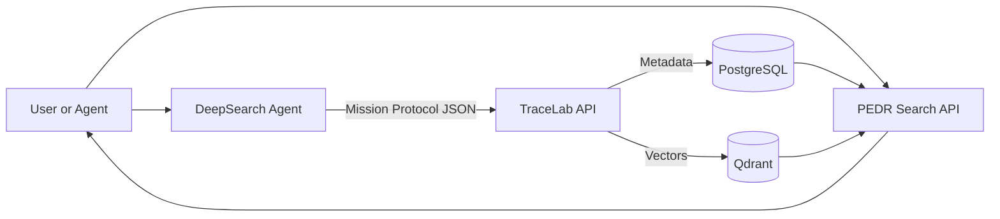
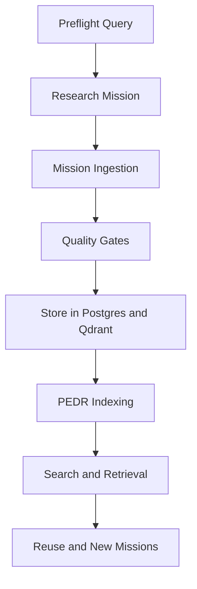

# TraceLab White Paper
## Autonomous Knowledge System for UX Research and Personal Knowledge

Version: 1.0
Date: 2025-12-27
Status: Draft for internal review
Audience: UX researchers, research operations, personal knowledge base users, and autonomous agent builders

## Table of Contents
- [Executive Summary](#executive-summary)
- [Audience and Use Cases](#audience-and-use-cases)
- [The Knowledge Problem](#the-knowledge-problem)
- [Evolution: From UX Research Tool to Autonomous Knowledge Platform](#evolution-from-ux-research-tool-to-autonomous-knowledge-platform)
- [Design Principles](#design-principles)
- [Vision: An Autonomous Knowledge System](#vision-an-autonomous-knowledge-system)
- [Platform Overview](#platform-overview)
- [Knowledge Lifecycle](#knowledge-lifecycle)
- [Core Capabilities](#core-capabilities)
- [DeepSearch Integration and Automation](#deepsearch-integration-and-automation)
- [PEDR Search Layer Deep Dive](#pedr-search-layer-deep-dive)
- [Search Filters and Query Patterns](#search-filters-and-query-patterns)
- [Quality Scoring and Governance Logic](#quality-scoring-and-governance-logic)
- [Document Processing and RAG Pipeline (Detailed)](#document-processing-and-rag-pipeline-detailed)
- [User Experience and Workflow](#user-experience-and-workflow)
- [Value for UX Researchers](#value-for-ux-researchers)
- [Value for Personal Knowledge Base Users](#value-for-personal-knowledge-base-users)
- [Case Studies](#case-studies)
- [Feature Capability Matrix](#feature-capability-matrix)
- [Comparison: Traditional Search vs PEDR](#comparison-traditional-search-vs-pedr)
- [Architecture Summary](#architecture-summary)
- [Operational Playbook and Metrics](#operational-playbook-and-metrics)
- [Security, Governance, and Trust](#security-governance-and-trust)
- [Performance and Scale](#performance-and-scale)
- [Implementation Status and Roadmap](#implementation-status-and-roadmap)
- [Adoption Checklist](#adoption-checklist)
- [Limitations and Known Constraints](#limitations-and-known-constraints)
- [Conclusion](#conclusion)
- [Appendix A: Glossary](#appendix-a-glossary)
- [Appendix B: Mission Protocol Field Map](#appendix-b-mission-protocol-field-map)
- [Appendix C: Reference Docs](#appendix-c-reference-docs)

---

## Executive Summary

TraceLab is a personal scale research repository that turns fragmented research assets into structured, reusable knowledge. It combines a mission driven research protocol, evidence level traceability, and quality aware search so that findings can be trusted and reused. TraceLab operates as part of a three service autonomous knowledge system:

- DeepSearch acts as the external research agent that collects and synthesizes evidence.
- TraceLab is the validated library that stores missions, documents, insights, and evidence links in PostgreSQL and Qdrant.
- PEDR is the protocol enhanced search engine that retrieves high quality results through a six layer hybrid search stack and Reciprocal Rank Fusion.

For UX researchers, TraceLab eliminates the drift between evidence and synthesis. It enforces a structured Mission Protocol, connects findings directly to evidence chunks, and exposes quality gates that prevent weak or untraceable conclusions. Researchers can search by meaning, filter by methodology and quality, and share outputs with a clear audit trail.

For personal knowledge base users, TraceLab provides a reliable alternative to unstructured note systems. It ingests documents, creates semantic chunks, and offers fast search with citations. PEDR makes results quality aware and can be used as a preflight check to prevent duplicated work.

TraceLab is not a monolithic application. It is a system that treats research as a continuous pipeline: discover knowledge, validate it, store it, index it, and reuse it. This white paper documents the architecture, the lifecycle, the quality controls, and the search stack that make the system effective for both professional UX research and personal knowledge work.

---

## Audience and Use Cases

TraceLab is designed for two primary audiences and one secondary audience:

1. UX researchers and research operations teams
   - Manage multiple projects and studies.
   - Require consistent research framing and auditability.
   - Need fast access to prior evidence and insights.

2. Personal knowledge base users
   - Ingest articles, notes, and reports into a personal library.
   - Need reliable answers with citations.
   - Want to avoid repeating work or losing context.

3. Autonomous research agents (secondary)
   - Submit structured mission outputs.
   - Reuse existing research with preflight checks.
   - Repair evidence links through correction loops.

The platform balances rigor with practicality. It supports detailed research workflows, but it also serves as a lightweight knowledge system for individuals who value accuracy and traceability.

---

## The Knowledge Problem

Research teams and individual knowledge workers face a common set of challenges:

- Knowledge is scattered across documents, folders, and tools with no shared structure.
- Search is inconsistent: keyword search misses meaning, and naive vector search ignores quality.
- Evidence traceability is fragile: insights often drift away from the source material.
- Duplicate research is common because teams cannot quickly confirm what already exists.
- AI generated summaries are hard to trust when they lack verifiable citations or quality controls.

These gaps lead to repeated effort, decision making based on weak evidence, and loss of institutional memory. TraceLab addresses these gaps by enforcing a structured research protocol, storing evidence at the chunk level, and applying quality aware search.

---

## Evolution: From UX Research Tool to Autonomous Knowledge Platform

TraceLab began as a UX research repository focused on storing interview transcripts, survey outputs, and synthesis artifacts. Early goals were practical: reduce file sprawl, make interviews searchable, and maintain basic traceability.

As the system matured, three shifts reshaped the platform:

1. Mission Protocol adoption
   - Research outputs were formalized into a consistent schema.
   - Evidence and synthesis moved from ad hoc documents into structured records.
   - Quality gates introduced explicit validation checkpoints.

2. Search evolution
   - Vector search improved recall but still surfaced incomplete or low quality results.
   - PEDR introduced multi layer search with governance and quality scoring.
   - The graph layer expanded context by traversing relationships.

3. Agent integration
   - DeepSearch ingestion enabled fully automated research pipelines.
   - Preflight queries reduced duplicate work.
   - Correction loops repaired evidence links without manual intervention.

These shifts positioned TraceLab as the center of a larger autonomous knowledge system. It now supports both human researchers and automated research agents while maintaining strict evidence and quality controls.

---

## Design Principles

TraceLab is built around a small set of principles that guide architecture and workflow decisions.

1. Trust before automation
   - Systems must prove evidence lineage before they automate synthesis.

2. Structured research beats unstructured notes
   - Protocols and schemas prevent drift between evidence and insight.

3. Quality is not optional
   - Search results should reflect the quality of their sources, not just relevance.

4. Reuse is the goal
   - The system must make prior research easier to reuse than to repeat.

5. Modular services
   - Each service should evolve independently without breaking the full pipeline.

6. Evidence first retrieval
   - Retrieval should always surface citations and provenance, not just answers.

---

## Vision: An Autonomous Knowledge System

TraceLab is part of a broader architecture that treats research as a continuous pipeline. In this system:

- DeepSearch performs external research.
- TraceLab validates and stores research outputs.
- PEDR provides high precision, governance aware retrieval over the entire corpus.

The result is a virtuous knowledge loop: the system builds knowledge, validates it, makes it searchable, and feeds it back to researchers and agents to avoid repetition.

Key goals:

- Automate research to protocol: transform raw research into structured, validated missions.
- Preserve evidence and traceability: every insight ties to specific source chunks.
- Enforce quality at ingestion and retrieval: quality gates and governance filters ensure trust.
- Maintain modularity: each service can evolve independently without a monolithic lock in.

---

## Platform Overview

TraceLab is anchored by three services that specialize in different parts of the research lifecycle.

### Service roles

- DeepSearch (external researcher)
  - Executes research missions on the public web.
  - Synthesizes findings into Mission Protocol payloads.
  - Submits results to TraceLab for validation and storage.

- TraceLab (validated library)
  - Validates mission payloads with Pydantic schemas and quality gates.
  - Stores structured research in PostgreSQL and embeddings in Qdrant.
  - Provides APIs for documents, missions, evidence, and RAG queries.

- PEDR (protocol enhanced search)
  - Indexes TraceLab data into a multi layer search stack.
  - Applies lexical, semantic, syntactic, pragmatic, governance, and graph layers.
  - Uses Reciprocal Rank Fusion to produce stable, quality aware results.

### Architecture diagram (Mermaid)

TraceLab is the system of record. PEDR reads from TraceLab, and DeepSearch writes into TraceLab. This separation prevents knowledge silos while keeping each service focused on its role.

---
## Knowledge Lifecycle

TraceLab is designed around a repeatable lifecycle that turns research into reusable knowledge. Each stage is explicit, observable, and linked to quality controls.

1. Preflight check
   - Query PEDR to see if similar high quality research already exists.
   - Receive a recommendation to reuse, review, or proceed.

2. Research mission execution
   - A human researcher or DeepSearch agent gathers evidence.
   - Findings are organized around specific questions and objectives.

3. Mission ingestion
   - Results are submitted as Mission Protocol data.
   - TraceLab validates schema shape and required fields.

4. Quality gates
   - Research statement, evidence links, synthesis quality, traceability, and contradiction resolution are evaluated.
   - Missions cannot be marked complete until required gates pass.

5. Storage and indexing
   - Structured metadata lives in PostgreSQL.
   - Evidence chunks and embeddings live in Qdrant.
   - PEDR indexes metadata and embeddings for multi layer retrieval.

6. Retrieval and reuse
   - Users and agents retrieve results through PEDR search or TraceLab RAG queries.
   - Evidence citations remain attached to answers and reports.

### Lifecycle diagram (Mermaid)

This lifecycle enables an autonomous knowledge loop where each mission adds durable value to the knowledge base rather than creating isolated artifacts.

---

## Core Capabilities

### 1. Mission Protocol: structured research

TraceLab uses a Mission Protocol schema to define research missions with consistent structure and validation. Each mission includes:

- Research statement: topic, objective, scope, audience, methodology, risks, success metrics.
- Key questions with status tracking and confidence scores.
- Evidence items with source summaries and optional chunk IDs.
- Synthesis with insights, recommendations, contradictions, and next steps.
- Quality checkpoints that must pass before completion.

This structure turns research into a portable, auditable asset that is safe for reuse. It also provides a shared vocabulary so that both people and agents can contribute to the same knowledge system.

Example elements of a mission:

- Mission ID: DRM.0.5
- Research statement: "Identify friction points in onboarding for mobile users"
- Key question: "What causes drop off in step 2?"
- Evidence: interview summary linked to chunk ID
- Synthesis: key insights and recommendations

### 2. Evidence traceability and quality gates

Traceability is central. Every insight can link to specific document chunks. Quality gates ensure that missions do not pass without the essential building blocks of research rigor.

Required gates for completion:

- Research statement defined
- Evidence links present
- Synthesis quality confirmed
- Traceability verified
- Contradictions resolved

These gates are not optional. They protect the integrity of the knowledge base and ensure that AI generated synthesis remains grounded in evidence.

### 3. Document ingestion pipeline

TraceLab ingestion converts raw documents into searchable, traceable knowledge. The pipeline executes in deterministic stages and records audit events for each step:

- Extracted: content parsed and validated
- Redacted: optional privacy redaction step (skipped if not configured)
- Chunked: text split into overlapping chunks
- Persisted: chunk metadata stored in PostgreSQL
- Embedded: embeddings generated and upserted to Qdrant

Each stage records its status so the system can prove that embedding and indexing actually happened. This supports transparency for both researchers and operations teams.

### 4. PEDR multi layer search

PEDR replaces single mode search with a six layer retrieval stack. Each layer contributes a partial ranking, and Reciprocal Rank Fusion combines them into a final list.

Layer overview:

- Lexical layer: PostgreSQL full text search for exact terms and boolean queries.
- Semantic layer: vector similarity search in Qdrant for meaning based retrieval.
- Syntactic layer: boosts by detected element type (finding, statistic, method, quote).
- Pragmatic layer: adjusts ranking by query intent (factual, exploratory, comparative, procedural).
- Governance layer: filters by quality gates, mission status, and PII flags.
- Graph layer: optional relationship traversal that expands context through connected entities.

Reciprocal Rank Fusion uses a rank based formula:

RRF_score(d) = sum(weight_i / (k + rank_i(d)))

The approach is robust to outliers and avoids the need to normalize scores from different systems.

### 5. Graph layer context expansion

The graph layer is an optional sixth layer that expands context by traversing relationships between missions, documents, and insights. It uses BFS traversal, decays scores per hop, and fuses results back into the final ranking. This is valuable when researchers want to move beyond direct matches into connected context.

Key behaviors:

- Seeds can be explicit URNs or top lexical and semantic results.
- Graph traversal depth is configurable (1 to 5).
- Scores decay per hop and are fused via RRF.
- Results include chunk IDs for ranking and URNs for provenance.

### 6. RAG queries with citations

TraceLab exposes RAG endpoints for quick answers that cite document and chunk IDs. This supports fast synthesis while preserving evidence traceability.

Typical RAG flow:

- Query embedding generated
- Semantic cache check
- Vector retrieval of top chunks
- Optional quality and governance filters
- LLM generation with cited sources
- Response cached for reuse

### 7. Preflight and correction loops

DeepSearch integration adds automation safeguards:

- Preflight queries check PEDR for existing high quality research and recommend reuse, review, or proceed.
- Correction loops retry evidence auto linking failures using a small backoff schedule and telemetry events.

Preflight thresholds (default):

- Reuse when similarity >= 0.85 and quality gates >= 4
- Review when similarity >= 0.70 and mission is complete
- Proceed when no qualifying matches are found

Correction loop behavior:

- Error taxonomy includes low similarity, no chunks, no embedding, timeout, and validation failures.
- Retry schedule uses exponential backoff (5s, 30s) with a max of two retries.
- Success and failure callbacks can be delivered via webhook.

### 8. Observability and telemetry

TraceLab records structured telemetry for ingestion status, search latency, and quality gate evaluation. This makes it possible to audit the pipeline and verify that system behaviors match expectations. Telemetry also supports benchmarking, regression detection, and operational reporting.

### 9. Reports and exports

TraceLab supports report exports in Markdown, PDF, and DOCX formats. Exports include gate status, evidence listings, and cited summaries so reports remain auditable when shared outside the system.

---

## DeepSearch Integration and Automation

DeepSearch integration turns TraceLab into the landing pad for autonomous research. The integration has four main steps that mirror the lifecycle.

1. Preflight query
   - The agent checks PEDR for existing research before running a new mission.
   - The response recommends reuse, review, or proceed based on similarity and quality gates.

2. Evidence retrieval during research
   - The agent can query PEDR search to retrieve internal evidence while researching.
   - Filters allow scoping by project, source type, and quality gate thresholds.

3. Mission ingestion
   - The agent submits a Mission Protocol payload to the DeepSearch ingestion endpoint.
   - TraceLab validates schema structure, quality gates, and evidence requirements.
   - If auto linking is enabled, TraceLab attempts to match evidence summaries to chunk IDs.

4. Correction loop for auto linking
   - When auto linking fails, the correction loop classifies the failure and queues retries.
   - A small retry window with exponential backoff avoids manual cleanup while keeping latency reasonable.
   - Telemetry records retries, success rates, and error taxonomy distribution.

This integration allows DeepSearch to operate as the research executor while TraceLab enforces the contract and quality boundaries. The design keeps data ownership and validation centralized in TraceLab, even when research is automated.

---

## PEDR Search Layer Deep Dive

PEDR is not a single algorithm. It is a layered retrieval system designed for research content where quality and provenance matter as much as relevance.

### Lexical layer

The lexical layer uses PostgreSQL full text search to capture exact terms, boolean queries, and phrase matches. It excels at:

- Product names and identifiers
- Exact phrasing from transcripts
- Regulated terms and policy language

Lexical results often provide the most precise anchors, especially when the query contains uncommon terms that are unlikely to appear in embeddings.

### Semantic layer

The semantic layer uses vector similarity search to capture meaning and intent. It retrieves chunks that are conceptually related even when wording differs. This layer is critical for research questions phrased in natural language, such as "What do users struggle with during onboarding?" It is backed by Qdrant with HNSW indexing and is tuned for recall under tight latency targets.

### Syntactic layer

The syntactic layer detects the type of content requested and applies boosts to matching elements. If a user asks for statistics, the layer boosts chunks labeled as statistics. If a user requests recommendations, it boosts recommendation type content. This adds precision to search results without excluding relevant content.

### Pragmatic layer

The pragmatic layer classifies the intent of a query and adjusts ranking accordingly. Intent categories include factual, exploratory, comparative, procedural, and evaluative. This is especially useful for research contexts where a question can imply very different desired outputs. A procedural query should surface how to guidance, while a comparative query should highlight tradeoffs and contrast.

### Governance layer

The governance layer enforces quality and compliance rules. It filters or boosts results based on quality gates and mission status. It can also exclude results flagged for PII handling. This layer is the primary defense against low quality or non validated results dominating search results.

### Graph layer

The graph layer is optional and adds relational context by traversing links between missions, documents, and insights. It is useful when direct lexical or semantic matches are too narrow, and the researcher needs adjacent context. The graph layer is controlled by depth, decay, edge type filters, and an explicit weight in the fusion step.

### Fusion and ranking

PEDR uses Reciprocal Rank Fusion to combine rankings from all layers. It is resistant to outliers and does not require score normalization. Weights can be tuned to emphasize quality, semantic relevance, or lexical precision depending on the use case.

---

## Search Filters and Query Patterns

PEDR and TraceLab search endpoints expose filters that allow researchers to tune precision, quality, and scope. These filters turn search from a generic text query into a research tool.

### Core filters

Core filters scope the search space before ranking occurs:

- project_id: restrict results to a single project or study.
- document_id: isolate results to a specific document.
- source_type: filter by data type such as interview, survey, or report.
- source_origin: restrict to uploaded, synthesized, or imported sources.
- date range filters: apply time bounds to research coverage.
- tags: narrow results to a specific taxonomy or theme.

These filters ensure that search results remain relevant to the current research context, especially in multi project repositories.

### PEDR specific filters

PEDR adds filters that reflect its multi layer architecture:

- element_type or element_types: request statistics, findings, recommendations, or quotes.
- auto_detect_type: let PEDR infer the element type based on query text.
- intent boost flags: adjust ranking for factual, comparative, or procedural intent.
- layer weights: tune the balance between lexical and semantic layers.
- graph parameters: enable graph expansion, control depth, and apply decay.

These filters help researchers express intent more precisely, which is critical in research repositories where different content types have very different value.

### Governance filters

Quality and governance filters enforce trust boundaries at query time:

- min_quality_gates: require a minimum number of passing gates.
- status filters: limit results to complete or review status missions.
- allow_pii: exclude PII flagged items by default.

These controls ensure that incomplete or sensitive content does not dominate results.

### Example query patterns

1. Statistical evidence
   - Query: "What percentage of users abandon onboarding step two?"
   - Filters: element_type=statistic, min_quality_gates=4

2. Comparative research
   - Query: "Compare onboarding flows across recent studies"
   - Filters: intent_boost_enabled=true, status=complete

3. Rapid reuse check
   - Query: "Passwordless authentication patterns"
   - Endpoint: /api/v1/pedr/preflight
   - Filters: min_quality_gates=4, status=complete

By making filters explicit, TraceLab ensures that search results are aligned with research needs rather than generic relevance alone.

---

## Quality Scoring and Governance Logic

Quality scoring is applied at retrieval time to ensure that complete and validated missions rank above drafts. The scoring model works as follows:

- Base score: number of passing gates divided by total gates (five in the Mission Protocol).
- Status boost: complete missions receive the highest boost, followed by review, in progress, and draft.
- Validation boost: additional boost when every gate is marked validated.
- Final multiplier: base score multiplied by (1 + total boost) and clamped to a safe range.

This multiplier applies directly to chunk ranking and is also included in response metadata. The result is consistent behavior across both PEDR search and RAG queries. A mission that is well validated will appear higher in search results even if its raw lexical or semantic scores are similar to less complete content.

Governance logic extends beyond scoring. Filters allow consumers to specify minimum gate counts, allowed statuses, and whether PII flagged items are permitted. This is essential for research teams who need to enforce compliance or quality policies at query time.

---

## Document Processing and RAG Pipeline (Detailed)

TraceLab ingestion is deterministic and stage based. Each stage records status in the processing audit trail so that users can verify what happened during ingestion.

### Stage overview

- Extracted: format validation and parsing.
- Redacted: optional PII redaction step. Skipped if not configured.
- Chunked: text split into overlapping chunks for retrieval.
- Persisted: chunk metadata and relationships stored in PostgreSQL.
- Embedded: embeddings generated and upserted to Qdrant.

### Embedding and indexing

Embedding generation is executed through the configured embedding service. If embedding is disabled or misconfigured, the embedded stage is marked as skipped rather than failing the entire pipeline. This provides clear telemetry about what is and is not indexed. The same telemetry is surfaced in the UI and API so researchers can confirm that the knowledge base reflects the latest uploads.

### RAG flow

RAG queries use the same retrieval foundation as search, but add LLM synthesis on top of retrieved chunks. The system follows a clear flow:

- Generate query embedding
- Check semantic cache
- Retrieve top chunks with optional quality filters
- Generate a response with citations
- Persist response and cache key

This flow makes it possible to trace every answer back to evidence and to reuse cached responses when a similar query repeats.

---

## User Experience and Workflow

TraceLab supports both a browser based workspace and a CLI. The system is designed so that both paths can complete the same workflow without losing quality or traceability.

### Browser workflow (high level)

1. Authenticate and select a project.
2. Upload documents and trigger processing.
3. Review processing status to confirm chunking and embeddings.
4. Create or update a mission and fill in the Mission Protocol fields.
5. Search for evidence and attach relevant chunks to the mission.
6. Review quality gate status and resolve missing items.
7. Export the mission report for sharing.

### CLI workflow (high level)

1. Authenticate with the CLI.
2. Create a project or reuse an existing one.
3. Upload and process documents with the ingestion pipeline.
4. Run semantic or PEDR search to find evidence.
5. Attach evidence to missions and export reports.

This dual interface approach supports different research styles. A team can use the UI for review and collaboration while automation pipelines and agents use the CLI or API.

---

## Value for UX Researchers

TraceLab was built to support end to end UX research workflows. It helps researchers maintain rigor while reducing operational overhead.

### Key benefits

- Consistent framing: research statements and key questions anchor each mission.
- Evidence traceability: every insight can be traced back to source chunks.
- Quality controls: gates prevent incomplete or low quality reports.
- Search reliability: results are ranked by both relevance and quality.
- Reuse support: preflight queries reduce duplicate studies.

### Common UX research scenarios

1. Multi study synthesis
   - A researcher needs to synthesize findings across several studies.
   - PEDR surfaces completed missions first, with quality gates and status.
   - Insights remain linked to their original evidence, enabling verification.

2. Rapid research validation
   - Teams can quickly check whether a similar study already exists.
   - Preflight queries return reuse or review recommendations.
   - This prevents expensive repeated interviews.

3. Stakeholder reporting
   - Exported reports include evidence listings and gate status.
   - Stakeholders can trace conclusions back to data.
   - Reports remain portable across teams and tools.

### Example workflow: onboarding friction study

- A team uploads interview transcripts, survey results, and support notes.
- Documents are processed into chunks, embeddings are stored in Qdrant.
- The mission is defined with explicit objectives and key questions.
- PEDR search is used to find related prior missions and evidence.
- Insights are written and linked to the supporting evidence chunks.
- Quality gates are checked, contradictions are resolved, and the mission is marked complete.
- A report is exported in PDF or Markdown for review.

### Research ops impact

- Reduced time spent on manual evidence linking.
- Standardized research outputs that are easier to audit.
- A centralized repository that scales across projects.

---

## Value for Personal Knowledge Base Users

Personal knowledge systems often fail when information is not trustworthy or not findable. TraceLab focuses on evidence and quality so that personal knowledge can be trusted and reused.

### Key benefits

- Ingest diverse content: notes, articles, PDFs, reports, and transcripts.
- Search with meaning and quality filters.
- Generate cited summaries for review and recall.
- Avoid duplication with preflight checks.
- Maintain a traceable history of decisions and learning.

### Example workflow: personal research library

1. A user collects articles, notes, and reports on a topic.
2. TraceLab processes and embeds the content.
3. The user runs a PEDR search with quality filters to find the most reliable sources.
4. The user asks a RAG query for a summary, and receives citations.
5. The summary is saved as a mission or insight for future reuse.

### Example workflow: decision log

- A knowledge worker tracks decisions across months of notes.
- PEDR search surfaces the most complete and validated entries.
- Linked evidence makes it clear why a decision was made.
- The system prevents drift by connecting new decisions to old evidence.

---

## Case Studies

### Case Study 1: Onboarding Friction in a SaaS Product

A mid size SaaS team needed to understand why onboarding completion dropped after a product redesign. The evidence lived in multiple places: interview transcripts, support tickets, and analytics notes. Historically, the team created separate slide decks for each study, and evidence links were scattered across files. The research lead created a project in TraceLab and ingested all sources, including PDFs and Markdown notes. The ingestion pipeline generated chunks, embeddings, and a clear processing audit trail.

Before starting a new round of interviews, the team used PEDR preflight queries to check for existing research on onboarding friction. The preflight response surfaced a complete mission from the prior quarter, with four out of five quality gates passed. The team reviewed it and decided to reuse several insights, but also discovered gaps in the new onboarding flow. A new mission was created with a fresh research statement and updated key questions.

During synthesis, researchers used PEDR search filters to surface statistics and direct quotes. Syntactic filtering made it easy to isolate metrics and evidence snippets that addressed the key questions. Each insight was linked to chunk IDs, and contradictions were documented in the synthesis section. Quality gates remained visible in the mission detail view, so the team could see which gates were still pending before finalizing.

The final output was a report that included citations and explicit evidence links. Stakeholders were able to review the conclusions and trace every recommendation back to source materials. Because the mission was stored in TraceLab with quality metadata, future teams were able to find and reuse the results without repeating the study. The preflight check in the next quarter immediately suggested reuse instead of launching a duplicate research cycle.

### Case Study 2: Personal Knowledge Base for Policy Research

A policy analyst maintained a personal archive of regulatory updates, research papers, and internal memos. The archive had grown to hundreds of documents, and keyword search was no longer sufficient. The analyst moved the archive into TraceLab, uploading PDF reports and notes collected over years. TraceLab processed the documents into chunks and created embeddings, allowing semantic search across the entire archive.

The analyst created missions for each policy topic with explicit research statements and key questions. PEDR search surfaced the most complete missions first, which prevented the analyst from relying on outdated or draft notes. When asked to produce a summary for a stakeholder meeting, the analyst used the RAG endpoint to generate a cited answer. The citations made it possible to validate each claim quickly, even under tight deadlines.

Over time, the archive became more reliable. Each mission accumulated evidence links and quality gate metadata. The analyst used preflight queries before starting new research, which reduced duplication and prevented redundant summaries. The knowledge base shifted from a collection of notes to a structured system with verifiable reasoning paths.

### Case Study 3: Competitive Analysis with DeepSearch

A product strategy team wanted a competitive analysis of emerging collaboration tools. Rather than manually collecting sources, they launched a DeepSearch mission. The agent executed external research and synthesized findings into a Mission Protocol payload, including key questions, evidence summaries, and recommendations. The payload was submitted to the DeepSearch ingestion endpoint in TraceLab.

TraceLab validated the payload and attempted to auto link evidence summaries to existing chunks. A portion of the evidence failed to link because the evidence summaries referenced sources that had not yet been ingested. The correction loop queued retries and flagged the failures with an error taxonomy that identified missing chunks. The team ingested the missing sources, reran the correction loop, and achieved a clean evidence linking state.

The final mission was marked complete once all quality gates passed. PEDR search then made the competitive analysis discoverable to other teams, ranked by quality and completeness. When a second group asked for a similar analysis, a preflight query recommended reuse, and the team saved weeks of duplicated effort. The case study illustrates how TraceLab can coordinate human teams and autonomous agents within a single knowledge system.

---

## Feature Capability Matrix

The table below summarizes how TraceLab capabilities map to UX research, personal knowledge, and agent workflows.

| Capability | UX Research Example | Personal Knowledge Example | Agent or Automation Example |
| --- | --- | --- | --- |
| Mission Protocol | Define study objectives and key questions | Structure a reading project with scope and goals | DeepSearch submits completed missions in protocol format |
| Evidence linking | Link interview quotes to insights | Connect notes to source documents | Auto link evidence chunks during ingestion |
| Quality gates | Require traceability before reporting | Flag incomplete or low confidence notes | Block completion until required gates pass |
| PEDR search | Surface validated insights across studies | Find the strongest note across an archive | Preflight query to reuse prior research |
| Graph context | Expand from a study to related documents | Traverse notes, people, and themes | Add relationship context to RAG prompts |
| RAG with citations | Summarize findings for stakeholders | Get a cited answer from past notes | Provide evidence summaries to agents |
| Telemetry and audit | Track research completeness and gate status | Track ingestion status and embedding coverage | Record correction loop outcomes |
| Exports | Share mission reports with citations | Export a knowledge summary to PDF | Automated reporting via API |

---

## Comparison: Traditional Search vs PEDR

Traditional keyword search and baseline vector search both fail in predictable ways. They either miss meaning or ignore quality. PEDR addresses these weaknesses by combining multiple retrieval layers and fusing them with quality aware logic.

### Comparison table

| Dimension | Keyword Search | Baseline Vector Search | PEDR Multi Layer Search |
| --- | --- | --- | --- |
| Meaning capture | Low | High | High |
| Quality awareness | None | None | Strong |
| Traceability | Manual | Manual | Built in |
| Governance filters | None | Limited | Built in |
| Relationship context | None | None | Optional graph layer |
| Reuse prevention | Weak | Weak | Strong via preflight |

### Why this matters

- Research repositories are not just collections of text. They are collections of evidence and conclusions.
- PEDR treats quality as a first class signal, so completed and validated missions rise above drafts.
- The graph layer adds relational context that is invisible to vector or keyword search.

---

## Architecture Summary

TraceLab is implemented as a FastAPI service backed by PostgreSQL 15 and Qdrant. It exposes a REST API that covers missions, documents, search, and DeepSearch integration. PEDR search is implemented in the application layer and is available through dedicated endpoints.

### Key components

- FastAPI application layer for routing, auth, and validation.
- Mission Protocol schemas enforced with Pydantic.
- PostgreSQL for mission, document, and evidence metadata.
- Qdrant for vector embeddings and semantic retrieval.
- PEDR search orchestrator with six layer retrieval and RRF fusion.
- Optional graph layer for relationship traversal.
- CMOS SQLite for mission orchestration and telemetry in agent workflows.

### Data model at a glance

TraceLab centers on a small set of core entities:

- Projects: containers for research work.
- Documents: source files and raw content.
- Document chunks: normalized units for retrieval.
- Insights: synthesized findings linked to evidence.
- Missions: structured research payloads with quality gates.
- Evidence links: records that connect insights to chunks.

Mission Protocol data is stored in JSON fields within PostgreSQL, enabling schema evolution while preserving structured validation at the API layer.

### API surface overview

- /api/v1/missions for Mission Protocol ingestion and updates.
- /api/v1/documents for upload and processing.
- /api/v1/pedr/search for multi layer search.
- /api/v1/pedr/preflight for duplication checks.
- /api/v1/deepsearch/ingest for agent submission.

### Deployment model

TraceLab runs in Docker Compose for local development and can be deployed to managed infrastructure such as Railway. PostgreSQL and Qdrant can be hosted locally or remotely, but the API enforces configuration checks to ensure secure connections when API keys are used.

### Cost and scale considerations

The architecture is designed for personal scale or small team usage. It supports thousands of documents and hundreds of thousands of chunks with responsive search latency. Vector storage costs are managed through Qdrant configuration and optional quantization strategies.

---

## Operational Playbook and Metrics

A knowledge system is only as reliable as its operational habits. TraceLab is designed to make operations observable so research teams can track quality and system health.

### Core metrics to monitor

- Ingestion success rate: percentage of documents that complete embedding without failures.
- Embedding coverage: ratio of processed documents with non zero chunk counts.
- Search latency: total response time for PEDR and RAG queries.
- Quality gate pass rate: percentage of missions that reach complete status with all gates passing.
- Preflight reuse rate: how often preflight queries result in reuse instead of new research.
- Correction loop success rate: percentage of evidence items linked after retries.

### Validation rhythm

Research operations teams can adopt a lightweight validation rhythm:

- Daily or weekly sampling of new missions to confirm evidence links.
- Regular review of ingestion telemetry for skipped embedding stages.
- Monitoring of search latency and cache hit rates to detect regressions.
- Periodic audits of quality gate distribution to identify bottlenecks in the research process.

### Governance for teams

TraceLab supports governance rules at query time through quality filters and status constraints. Teams can standardize these rules, for example:

- Only allow complete missions to appear in stakeholder facing queries.
- Require a minimum number of quality gates for internal reuse.
- Enforce PII filters when the audience is external.

Operational consistency ensures that the knowledge base remains trustworthy even as it scales.

---

## Security, Governance, and Trust

TraceLab is built with trust in mind:

- JWT authentication protects all APIs except health checks.
- Mission Protocol validation ensures structured, complete submissions.
- Quality gates enforce research rigor before completion.
- Governance filters in PEDR allow filtering by quality status and PII flags.
- Audit trails record ingestion and quality events.

Current state note: the redaction endpoint exists but the ingestion pipeline currently records redaction as skipped when not configured. This is explicitly tracked in processing status events. The platform is designed to support full PII redaction when enabled.

Trust is enforced at both ingestion and retrieval. By combining structured validation with quality aware search, TraceLab reduces the risk of low quality results being mistaken for validated insight.

---

## Performance and Scale

TraceLab targets performance suitable for personal scale and small team repositories:

- PEDR search: 100 to 300 ms typical latency for full mode.
- Hybrid search: sub 200 ms target latency.
- PEDR cache: 5 minute TTL with LRU eviction to reduce repeated queries.
- Graph layer baseline: depth 1 and depth 2 expansions can run in tens of milliseconds for small graphs.
- Document ingestion: deterministic pipeline with telemetry for every stage.

These targets align with the needs of UX teams and personal knowledge bases where latency must remain interactive but not ultra low.

Additional performance considerations:

- Vector search tuning: default HNSW settings are selected to preserve recall while keeping latency under human noticeable thresholds. For typical corpora, ef_search is tuned to balance accuracy and speed rather than maximizing one at the expense of the other.
- Graph layer scaling: graph expansion cost grows with depth and edge count. Benchmarks in small graphs show depth 1 and 2 expansions in the tens of milliseconds, while deeper traversals can increase latency sharply. This makes graph expansion best suited for opt in investigative queries rather than every search.
- Caching behavior: PEDR cache and RAG semantic cache reduce repeated query costs. Cache hit rates are corpus dependent but can reduce latency to single digit milliseconds for repeated queries.
- Storage envelope: the architecture is sized for thousands of documents and hundreds of thousands of chunks, which is consistent with many UX research libraries and personal archives. This envelope can expand with careful Qdrant configuration and optional quantization, but the focus remains on reliability rather than massive scale.

These considerations provide a practical balance: fast enough for daily research work, transparent enough for audits, and stable enough for long term reuse.

---

## Implementation Status and Roadmap

### Implemented today

- Mission Protocol schema validation and quality gates.
- FastAPI service with project, document, mission, and search endpoints.
- Document processing pipeline with embedding support and audit telemetry.
- PEDR five layer search with RRF fusion and caching.
- Graph layer addendum (optional L6 layer).
- Preflight queries and DeepSearch ingestion endpoints.
- Evidence auto linking with correction loop and telemetry.

### In progress or planned

- Full PII redaction pipeline re enabled for ingestion.
- Expanded graph edge types and tuning for faster traversal.
- Automated benchmarking and publication grade reports.
- Deeper integration between TraceLab and PEDR for event driven indexing.

---

## Adoption Checklist

Teams adopting TraceLab can move quickly if they establish a consistent baseline. The checklist below captures a pragmatic adoption path.

1. Define the research scope
   - Identify the projects and time windows that should be migrated first.
   - Decide which research outputs must meet full quality gate standards.

2. Configure core infrastructure
   - Stand up PostgreSQL and Qdrant with stable credentials.
   - Confirm ingestion health and embedding configuration.

3. Establish taxonomy and tags
   - Define tags for research methods, personas, and themes.
   - Use a shared tag vocabulary to keep search filters effective.

4. Ingest the baseline corpus
   - Import core documents and verify processing status events.
   - Run a small set of validation queries to confirm search behavior.

5. Train on Mission Protocol usage
   - Align on research statement templates and key question formats.
   - Agree on how contradictions and recommendations are recorded.

6. Set quality gate thresholds
   - Decide which gates are required for internal reuse versus external reporting.
   - Document governance rules for PII handling and status filters.

7. Establish reporting cadence
   - Export and review mission reports on a regular schedule.
   - Use telemetry and quality gate metrics to track progress.

Adoption is not only technical. The most successful teams treat TraceLab as a shared research system rather than a file repository, which requires discipline and shared expectations.

---

## Limitations and Known Constraints

TraceLab is designed for personal scale and small team use. It favors rigor, transparency, and quality over large scale automation. That focus comes with tradeoffs that are important to acknowledge.

### Scope and scale

- TraceLab is optimized for individual researchers and small teams. It is not a multi tenant enterprise platform.
- Ingestion is synchronous today, which simplifies auditability but limits throughput for massive backfills.
- PEDR indexing is designed for periodic or event driven updates rather than continuous stream indexing at very large scale.

### Data handling limitations

- PII redaction is optional and not always enabled by default. Teams handling sensitive data must confirm redaction configuration and policies before ingestion.
- Quality gate rules are explicit but still require human oversight to resolve contradictions and validate synthesis quality.

### Search limitations

- Graph layer expansion is optional and disabled by default. It requires graph edges to be defined and tuned for each corpus.
- Semantic retrieval quality depends on embedding configuration and corpus quality. Poor source materials produce weaker results even with quality gates.

### Operational constraints

- The platform expects stable configuration for PostgreSQL and Qdrant. Misconfiguration can result in skipped embedding stages rather than silent failures, but operational vigilance is still required.
- Cache settings trade freshness for speed. Some use cases may require stricter cache invalidation patterns.

### Human responsibility

TraceLab does not replace research judgment. It makes evidence and synthesis more transparent, but humans remain responsible for interpreting data and making decisions. The system is designed to support rigorous workflows, not automate decision making.

Recognizing these constraints is part of using TraceLab responsibly. The platform is built to surface its own limits through telemetry and explicit status reporting rather than hiding uncertainty.

---

## Conclusion

TraceLab turns research outputs into a durable knowledge asset. By combining Mission Protocol rigor, evidence traceability, and a quality aware search stack, it addresses the weaknesses of traditional research repositories and personal knowledge bases. The system is designed for reuse: it helps researchers find what already exists, validates what is new, and makes trusted knowledge available to both humans and autonomous agents.

Looking ahead, TraceLab provides a foundation for deeper automation without sacrificing trust. Its explicit quality signals and telemetry make it possible to measure improvement, detect drift, and refine research practice over time. The same pipeline that serves UX teams can support individual knowledge workers who want a durable personal archive. The long term value is not just faster search, but a higher standard for research reuse: every insight can be verified, every recommendation can be traced, and every new mission starts with an understanding of what already exists. It is a system that grows more valuable with every validated mission and reused insight.

---

## Appendix A: Glossary

- DeepSearch: External research agent that executes missions and submits structured results.
- TraceLab: Validated research repository service built on FastAPI and PostgreSQL.
- PEDR: Protocol Enhanced Deep Research search engine with multi layer retrieval.
- Mission Protocol: Schema that defines how research is structured, validated, and stored.
- Quality gates: Checkpoints that enforce research rigor before completion.
- Evidence linking: Mechanism that connects insights to specific document chunks.
- RRF: Reciprocal Rank Fusion, a rank based fusion algorithm used in PEDR.
- RAG: Retrieval Augmented Generation, used for cited summaries.

---

## Appendix B: Mission Protocol Field Map

The Mission Protocol schema is the foundation of TraceLab research structure. The fields below summarize the core elements that appear in complete mission payloads.

- Identification
  - mission_id
  - version
  - title
  - project_id

- Status and ownership
  - status (review or complete)
  - owner

- Research statement
  - topic
  - objective
  - scope
  - audience
  - methodology
  - success_metrics
  - risks

- Key questions
  - question
  - status
  - answer
  - confidence
  - owner

- Evidence
  - evidence_id
  - source
  - summary
  - chunk_id
  - source_type
  - relevance_score
  - tags

- Synthesis
  - key_insights
  - surprising_findings
  - contradictory_information
  - contradiction_resolutions
  - recommendations
  - next_steps

- Quality checkpoints
  - research_statement
  - evidence_links
  - synthesis_quality
  - traceability
  - contradictions_resolved

---

## Appendix C: Reference Docs

- docs/architecture/mission-protocol.md
- docs/architecture/PEDR-search.md
- docs/pedr-search.md
- docs/preflight-queries.md
- docs/correction-loop.md
- docs/document-processing.md
- docs/quality-aware-search.md
- docs/workflows.md
- README.md
- cmos/foundational-docs/technical_architecture.md
